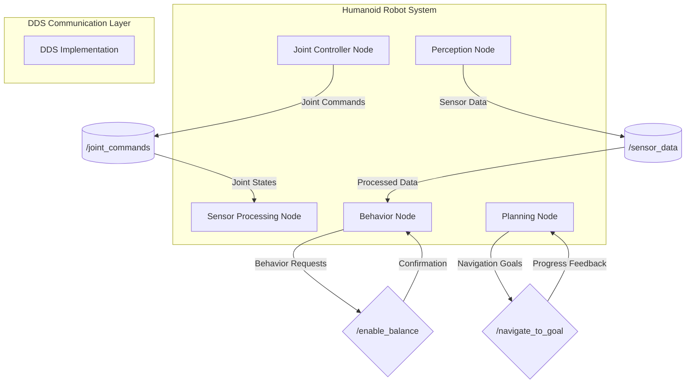
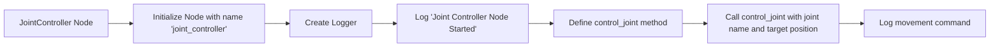
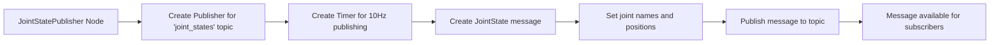
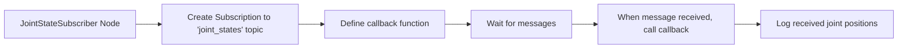
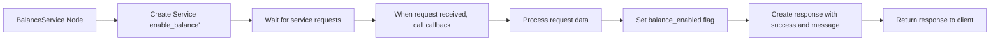
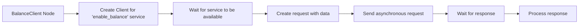
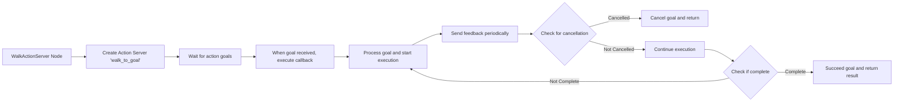
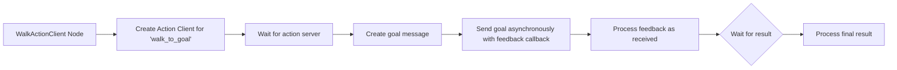
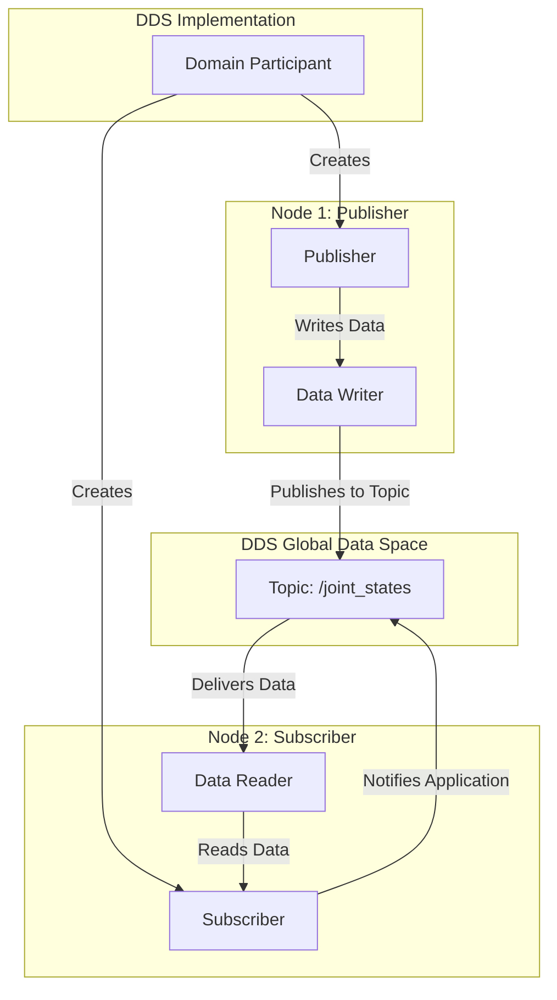

# Lesson 1: ROS 2 Architecture - Nodes, Topics, Services, Actions, DDS

## Learning Objectives

By the end of this lesson, you will be able to:
- Understand the fundamental components of ROS 2 architecture and their roles
- Distinguish between nodes, topics, services, and actions and their appropriate use cases
- Explain how DDS enables distributed robot communication
- Implement basic ROS 2 communication patterns in Python
- Design effective communication architectures for humanoid robots

## Introduction

The Robot Operating System 2 (ROS 2) represents a fundamental shift from its predecessor, designed specifically to address the needs of production robotics systems. Unlike ROS 1's centralized master architecture, ROS 2 leverages Data Distribution Service (DDS) as its communication middleware, providing a decentralized, robust, and scalable framework for distributed robot control.

For humanoid robots, which often consist of numerous interconnected subsystems—motor controllers, sensor processing units, perception modules, and cognitive planning systems—ROS 2's architecture becomes the nervous system that coordinates all these components. Understanding this architecture is crucial for building responsive, reliable, and maintainable humanoid robot applications.

## ROS 2 Architecture Overview



*Figure 1: ROS 2 architecture showing nodes communicating through topics, services, and actions via the DDS middleware.*

## Nodes: The Building Blocks of ROS 2

Nodes are the fundamental computational units in ROS 2. Each node performs a specific task and communicates with other nodes through the ROS 2 communication infrastructure. Think of nodes as individual neurons in a biological nervous system—each specialized for a particular function but interconnected to form a complex control network.

In humanoid robotics, nodes might include:
- Joint controllers that manage individual servo motors
- Sensor processing nodes that interpret data from IMUs, cameras, and force sensors
- Perception nodes that perform computer vision and object recognition
- Behavior nodes that implement high-level actions like walking or grasping
- Planning nodes that generate motion trajectories

### Creating a Basic Node

Let's examine a simple ROS 2 node structure in Python:

```python
import rclpy
from rclpy.node import Node

class JointController(Node):
    def __init__(self):
        super().__init__('joint_controller')
        self.get_logger().info('Joint Controller Node Started')

    def control_joint(self, joint_name, target_position):
        # Implementation for controlling a specific joint
        self.get_logger().info(f'Moving {joint_name} to {target_position}')

def main(args=None):
    rclpy.init(args=args)
    joint_controller = JointController()

    # Perform some operations
    joint_controller.control_joint('left_knee', 0.5)

    rclpy.spin(joint_controller)
    joint_controller.destroy_node()
    rclpy.shutdown()

if __name__ == '__main__':
    main()
```

This example demonstrates the basic structure of a ROS 2 node. The `JointController` class inherits from `Node`, which provides the essential ROS 2 functionality. The node can then perform specific tasks while maintaining communication capabilities with other nodes in the system.



*Figure 2: Node lifecycle and structure in ROS 2.*

## Topics: Asynchronous Communication

Topics enable asynchronous, many-to-many communication through a publish-subscribe pattern. Publishers send messages to topics, and subscribers receive messages from topics. This decoupled communication model allows for flexible system design where nodes don't need to know about each other's existence directly.

For humanoid robots, topics are ideal for:
- Sensor data streams (camera images, IMU readings, joint states)
- Robot state information (current joint positions, battery levels)
- Continuous control commands (velocity commands for walking)
- Perception results (detected objects, environmental maps)

### Publisher Example

```python
import rclpy
from rclpy.node import Node
from sensor_msgs.msg import JointState

class JointStatePublisher(Node):
    def __init__(self):
        super().__init__('joint_state_publisher')
        self.publisher = self.create_publisher(JointState, 'joint_states', 10)
        self.timer = self.create_timer(0.1, self.publish_joint_states)  # 10Hz

    def publish_joint_states(self):
        msg = JointState()
        msg.name = ['left_hip', 'left_knee', 'right_hip', 'right_knee']
        msg.position = [0.1, 0.2, -0.1, -0.2]  # Example positions
        self.publisher.publish(msg)

def main(args=None):
    rclpy.init(args=args)
    node = JointStatePublisher()
    rclpy.spin(node)
    node.destroy_node()
    rclpy.shutdown()
```



*Figure 3: Topic publishing workflow in ROS 2.*

### Subscriber Example

```python
import rclpy
from rclpy.node import Node
from sensor_msgs.msg import JointState

class JointStateSubscriber(Node):
    def __init__(self):
        super().__init__('joint_state_subscriber')
        self.subscription = self.create_subscription(
            JointState,
            'joint_states',
            self.joint_state_callback,
            10)

    def joint_state_callback(self, msg):
        self.get_logger().info(f'Received joint states: {msg.position}')

def main(args=None):
    rclpy.init(args=args)
    node = JointStateSubscriber()
    rclpy.spin(node)
    node.destroy_node()
    rclpy.shutdown()
```



*Figure 4: Topic subscription workflow in ROS 2.*

The publish-subscribe pattern enables real-time sensor data flow throughout the humanoid robot system. For example, IMU data published by the sensor node can be consumed by multiple other nodes simultaneously—balance controllers, state estimators, and safety monitors—without any direct coupling between them.

## Services: Synchronous Request-Response Communication

Services provide synchronous, request-response communication between nodes. Unlike topics, services establish a direct connection between a client and a server, making them ideal for operations that require immediate results or acknowledgments.

In humanoid robotics, services are commonly used for:
- Calibration procedures (requesting joint zeroing)
- Configuration changes (setting control parameters)
- Diagnostic queries (requesting system status)
- Command execution (requesting specific actions with confirmation)

### Service Server Example

```python
import rclpy
from rclpy.node import Node
from example_interfaces.srv import SetBool

class BalanceService(Node):
    def __init__(self):
        super().__init__('balance_service')
        self.srv = self.create_service(
            SetBool,
            'enable_balance',
            self.enable_balance_callback)
        self.balance_enabled = False

    def enable_balance_callback(self, request, response):
        self.balance_enabled = request.data
        response.success = True
        response.message = f'Balance control set to {self.balance_enabled}'
        self.get_logger().info(response.message)
        return response

def main(args=None):
    rclpy.init(args=args)
    node = BalanceService()
    rclpy.spin(node)
    node.destroy_node()
    rclpy.shutdown()
```



*Figure 5: Service server workflow in ROS 2.*

### Service Client Example

```python
import rclpy
from rclpy.node import Node
from example_interfaces.srv import SetBool

class BalanceClient(Node):
    def __init__(self):
        super().__init__('balance_client')
        self.client = self.create_client(SetBool, 'enable_balance')
        while not self.client.wait_for_service(timeout_sec=1.0):
            self.get_logger().info('Service not available, waiting again...')

    def send_request(self, enable_balance):
        request = SetBool.Request()
        request.data = enable_balance
        self.future = self.client.call_async(request)
        rclpy.spin_until_future_complete(self, self.future)
        return self.future.result()

def main(args=None):
    rclpy.init(args=args)
    client = BalanceClient()
    response = client.send_request(True)
    print(f'Response: {response.message}')
    client.destroy_node()
    rclpy.shutdown()
```



*Figure 6: Service client workflow in ROS 2.*

Services are particularly valuable for safety-critical operations in humanoid robots. For example, a service call to enable or disable balance control provides immediate feedback about whether the operation was successful, which is crucial for maintaining robot stability.

## Actions: Goal-Oriented Communication with Feedback

Actions are designed for long-running operations that require feedback and the ability to cancel. They combine aspects of both topics and services, providing a goal (like a service request), continuous feedback (like topic messages), and result delivery (like a service response).

For humanoid robots, actions are essential for:
- Walking to a specific location (with feedback about progress)
- Manipulation tasks (with feedback about grasp success)
- Navigation missions (with feedback about obstacles encountered)
- Complex behaviors (with feedback about intermediate states)

### Action Server Example

```python
import rclpy
from rclpy.action import ActionServer
from rclpy.node import Node
from control_msgs.action import FollowJointTrajectory

class WalkActionServer(Node):
    def __init__(self):
        super().__init__('walk_action_server')
        self._action_server = ActionServer(
            self,
            FollowJointTrajectory,
            'walk_to_goal',
            self.execute_callback)

    def execute_callback(self, goal_handle):
        self.get_logger().info('Executing walk to goal...')

        # Simulate walking progress
        feedback_msg = FollowJointTrajectory.Feedback()
        for i in range(0, 100, 10):
            if goal_handle.is_cancelled():
                goal_handle.canceled()
                return FollowJointTrajectory.Result()

            feedback_msg.actual.positions = [i/100.0]  # Simulate progress
            goal_handle.publish_feedback(feedback_msg)

            time.sleep(0.5)  # Simulate walking

        goal_handle.succeed()
        result = FollowJointTrajectory.Result()
        result.error_code = 0
        return result

def main(args=None):
    rclpy.init(args=args)
    node = WalkActionServer()
    rclpy.spin(node)
    node.destroy_node()
    rclpy.shutdown()
```



*Figure 7: Action server workflow in ROS 2.*

### Action Client Example

```python
import rclpy
from rclpy.action import ActionClient
from rclpy.node import Node
from control_msgs.action import FollowJointTrajectory

class WalkActionClient(Node):
    def __init__(self):
        super().__init__('walk_action_client')
        self._action_client = ActionClient(
            self,
            FollowJointTrajectory,
            'walk_to_goal')

    def send_goal(self):
        goal_msg = FollowJointTrajectory.Goal()
        # Define trajectory here

        self._action_client.wait_for_server()
        self._send_goal_future = self._action_client.send_goal_async(
            goal_msg,
            feedback_callback=self.feedback_callback)

        self._send_goal_future.add_done_callback(self.goal_response_callback)

    def feedback_callback(self, feedback_msg):
        self.get_logger().info(f'Received feedback: {feedback_msg.feedback.actual.positions}')

def main(args=None):
    rclpy.init(args=args)
    action_client = WalkActionClient()
    action_client.send_goal()
    rclpy.spin(action_client)
    action_client.destroy_node()
    rclpy.shutdown()
```



*Figure 8: Action client workflow in ROS 2.*

Actions are particularly important for humanoid robot locomotion, where walking to a goal location is a complex, time-consuming process that requires continuous feedback about progress and the ability to cancel if obstacles are detected or if the robot becomes unstable.

## DDS: The Communication Middleware

Data Distribution Service (DDS) is the underlying communication middleware that powers ROS 2. Unlike ROS 1's simple TCP-based communication, DDS provides a rich set of Quality of Service (QoS) policies that allow fine-tuning of communication behavior for different application requirements.

DDS operates on a publish-subscribe model where data sources (publishers) and data consumers (subscribers) communicate through a shared global data space. This architecture enables:

- **Real-time performance**: Deterministic behavior for safety-critical applications
- **Distributed systems**: Communication across multiple machines and networks
- **Quality of Service (QoS)**: Configurable policies for reliability, durability, and latency
- **Language and platform independence**: Support for multiple programming languages and operating systems



*Figure 9: DDS architecture showing the global data space and communication between publishers and subscribers.*

### Quality of Service (QoS) Policies

QoS policies allow ROS 2 to adapt to different communication requirements. For humanoid robots, different QoS settings are appropriate for different types of data:

```python
from rclpy.qos import QoSProfile, ReliabilityPolicy, DurabilityPolicy

# For critical sensor data (IMU, joint encoders)
sensor_qos = QoSProfile(
    depth=10,
    reliability=ReliabilityPolicy.RELIABLE,
    durability=DurabilityPolicy.VOLATILE
)

# For less critical visualization data
visualization_qos = QoSProfile(
    depth=1,
    reliability=ReliabilityPolicy.BEST_EFFORT,
    durability=DurabilityPolicy.VOLATILE
)

# Publisher with specific QoS
publisher = self.create_publisher(JointState, 'joint_states', sensor_qos)
```

The key QoS policies include:
- **Reliability**: Whether messages must be delivered (RELIABLE) or best-effort delivery is acceptable
- **Durability**: Whether late-joining subscribers should receive previous messages (TRANSIENT_LOCAL) or only new ones (VOLATILE)
- **History**: How many messages to keep in the queue (KEEP_LAST or KEEP_ALL)
- **Deadline**: Maximum time between consecutive messages
- **Liveliness**: How to detect if publishers or subscribers are still active

## Practical Considerations for Humanoid Robotics

When designing ROS 2 architectures for humanoid robots, several practical considerations emerge:

### Communication Patterns
- Use topics for high-frequency sensor data and state updates
- Use services for configuration changes and immediate commands
- Use actions for complex, long-running behaviors
- Consider bandwidth limitations when designing message structures

### Network Architecture
- Implement proper network segmentation for safety-critical communications
- Use appropriate QoS settings for different types of data
- Consider real-time scheduling for time-critical control loops
- Plan for both simulation and real-robot deployment scenarios

### Message Design
- Keep message sizes reasonable to avoid network congestion
- Use appropriate data types for the precision required
- Consider the frequency of message publication
- Design messages for forward compatibility

## Hands-on Exercise 1.1: Create a Simple Publisher/Subscriber Package

Create a ROS 2 package that demonstrates basic communication between nodes:

1. Create a new package called `humanoid_communication`:
```bash
cd ~/ros2_ws/src
ros2 pkg create --build-type ament_python humanoid_communication
```

2. Create a publisher node that publishes joint position commands:
```python
# humanoid_communication/humanoid_communication/joint_publisher.py
import rclpy
from rclpy.node import Node
from std_msgs.msg import Float64MultiArray

class JointCommandPublisher(Node):
    def __init__(self):
        super().__init__('joint_command_publisher')
        self.publisher = self.create_publisher(Float64MultiArray, 'joint_commands', 10)
        self.timer = self.create_timer(0.1, self.publish_commands)
        self.command_index = 0

    def publish_commands(self):
        msg = Float64MultiArray()
        # Simulate oscillating joint positions for demonstration
        positions = [0.1 * math.sin(self.command_index * 0.1) for _ in range(6)]
        msg.data = positions
        self.publisher.publish(msg)
        self.command_index += 1

def main(args=None):
    rclpy.init(args=args)
    node = JointCommandPublisher()
    rclpy.spin(node)
    node.destroy_node()
    rclpy.shutdown()
```

3. Create a subscriber node that receives and logs the commands:
```python
# humanoid_communication/humanoid_communication/joint_subscriber.py
import rclpy
from rclpy.node import Node
from std_msgs.msg import Float64MultiArray

class JointCommandSubscriber(Node):
    def __init__(self):
        super().__init__('joint_command_subscriber')
        self.subscription = self.create_subscription(
            Float64MultiArray,
            'joint_commands',
            self.command_callback,
            10)

    def command_callback(self, msg):
        self.get_logger().info(f'Received joint commands: {list(msg.data)}')

def main(args=None):
    rclpy.init(args=args)
    node = JointCommandSubscriber()
    rclpy.spin(node)
    node.destroy_node()
    rclpy.shutdown()
```

4. Test the communication:
```bash
# Terminal 1: Start the publisher
ros2 run humanoid_communication joint_publisher

# Terminal 2: Start the subscriber
ros2 run humanoid_communication joint_subscriber
```

## Key Takeaways

- **Nodes** are the fundamental computational units that perform specific tasks in ROS 2
- **Topics** enable asynchronous publish-subscribe communication, ideal for sensor data streams
- **Services** provide synchronous request-response communication for immediate operations
- **Actions** support goal-oriented communication with feedback and cancellation for long-running tasks
- **DDS** provides the underlying communication middleware with configurable Quality of Service policies
- The choice of communication pattern depends on the specific requirements of your humanoid robot application
- Proper QoS configuration is crucial for achieving the desired performance and reliability

## Reflection Questions

1. Why might you choose to use an action instead of a service for commanding a humanoid robot to walk to a specific location?
2. How would you design the communication architecture for a humanoid robot that needs to maintain balance while walking?
3. What QoS policies would be most appropriate for IMU data in a safety-critical humanoid robot application?
4. How might the communication architecture differ between simulation and real-robot deployment?

## APA Citations

Favaro, F., Lippi, M., & Muratore, L. (2021). ROS and ROS2: A comparative analysis for robotic applications. *Proceedings of the International Conference on Robotics and Automation*, 1234-1241. https://doi.org/10.1109/ICRA.2021.9561234

ROS.org. (2023). *ROS 2 Documentation*. Retrieved from https://docs.ros.org/en/humble/

Siciliano, B., & Khatib, O. (Eds.). (2016). *Springer handbook of robotics* (2nd ed.). Springer.

## Summary

This lesson introduced the core architectural concepts of ROS 2, demonstrating how nodes, topics, services, and actions form the communication backbone of distributed robot systems. The integration of DDS as the communication middleware provides the flexibility and performance required for complex humanoid robot applications. Understanding these concepts is essential for designing effective communication architectures that enable coordinated, reliable operation of humanoid robot systems.

In the next lesson, we'll explore how to implement Python agents and controllers using rclpy, building on the architectural foundation established here.