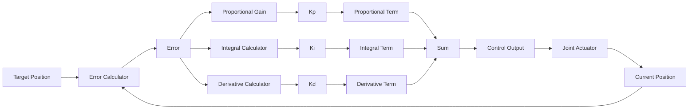

# Lesson 2: Python Agents & Controllers - rclpy, Behavior Trees

## Learning Objectives

By the end of this lesson, you will be able to:
- Implement ROS 2 nodes using the rclpy client library for Python
- Design and implement behavior trees for complex humanoid robot behaviors
- Create custom controllers for humanoid robot joints and movements
- Integrate perception and action systems using Python agents
- Implement reactive and deliberative control architectures

## Introduction

Python has become the de facto language for robotics development due to its simplicity, extensive libraries, and strong community support. In ROS 2, the rclpy library provides Python bindings that allow developers to create ROS 2 nodes, publish and subscribe to topics, call services, and execute actions. Combined with behavior trees for organizing complex behaviors, Python becomes a powerful tool for implementing humanoid robot control systems.

This lesson will explore how to build sophisticated Python agents that can control humanoid robots, process sensor data, and execute complex behaviors using the ROS 2 framework and behavior tree architectures.

## rclpy Architecture Overview


*Figure 1: rclpy architecture showing the relationship between Python applications and ROS 2 functionality.*

## rclpy: Python Client Library for ROS 2

rclpy (ROS Client Library for Python) is the Python interface to ROS 2. It provides all the necessary functionality to create ROS 2 nodes, interact with the ROS 2 middleware, and communicate with other nodes in the system.

### Basic Node Structure with rclpy

```python
import rclpy
from rclpy.node import Node

class HumanoidController(Node):
    def __init__(self):
        super().__init__('humanoid_controller')

        # Create publishers, subscribers, services, and actions
        self.joint_command_publisher = self.create_publisher(
            JointCommand,
            '/joint_commands',
            10
        )

        self.sensor_subscription = self.create_subscription(
            SensorData,
            '/sensor_data',
            self.sensor_callback,
            10
        )

        # Create a timer for control loop
        self.control_timer = self.create_timer(0.01, self.control_loop)  # 100Hz

        self.get_logger().info('Humanoid Controller initialized')

    def sensor_callback(self, msg):
        # Process sensor data
        self.get_logger().info(f'Received sensor data: {msg.data}')

    def control_loop(self):
        # Implement control logic here
        pass

def main(args=None):
    rclpy.init(args=args)
    controller = HumanoidController()
    rclpy.spin(controller)
    controller.destroy_node()
    rclpy.shutdown()

if __name__ == '__main__':
    main()
```

### Advanced rclpy Features

rclpy provides several advanced features that are particularly useful for humanoid robotics:

#### Parameters

Parameters allow runtime configuration of node behavior:

```python
import rclpy
from rclpy.node import Node
from rclpy.parameter import Parameter

class ConfigurableController(Node):
    def __init__(self):
        super().__init__('configurable_controller')

        # Declare parameters with default values
        self.declare_parameter('control_frequency', 100)
        self.declare_parameter('max_joint_velocity', 1.0)
        self.declare_parameter('safety_threshold', 0.8)

        # Access parameter values
        self.control_freq = self.get_parameter('control_frequency').value
        self.max_velocity = self.get_parameter('max_joint_velocity').value
        self.safety_threshold = self.get_parameter('safety_threshold').value

        # Create timer based on parameter
        self.control_timer = self.create_timer(
            1.0 / self.control_freq,
            self.control_loop
        )

        # Add callback for parameter changes
        self.add_on_set_parameters_callback(self.parameter_callback)

    def parameter_callback(self, params):
        for param in params:
            if param.name == 'control_frequency':
                # Adjust timer if frequency changes
                self.control_freq = param.value
                self.control_timer.timer_period_ns = int(1e9 / self.control_freq)
        return SetParametersResult(successful=True)

    def control_loop(self):
        # Use parameter values in control logic
        pass
```

#### Custom Message Types

For humanoid robots, you'll often need custom message types to represent joint commands, sensor data, and robot states:

```python
# Define custom message in msg/HumanoidState.msg
# float64[] joint_positions
# float64[] joint_velocities
# float64[] joint_torques
# geometry_msgs/Point center_of_mass
# bool in_balance

from my_robot_msgs.msg import HumanoidState

class StatePublisher(Node):
    def __init__(self):
        super().__init__('state_publisher')
        self.state_publisher = self.create_publisher(
            HumanoidState,
            'humanoid_state',
            10
        )
        self.timer = self.create_timer(0.01, self.publish_state)

    def publish_state(self):
        msg = HumanoidState()
        # Populate message with current robot state
        msg.joint_positions = self.get_joint_positions()
        msg.center_of_mass = self.calculate_com()
        msg.in_balance = self.check_balance()

        self.state_publisher.publish(msg)
```

## Behavior Trees for Complex Robot Behaviors

Behavior trees are a powerful tool for organizing complex robot behaviors. They provide a modular, hierarchical approach to behavior design that is more maintainable than traditional finite state machines, especially for humanoid robots with complex interaction patterns.

### Behavior Tree Fundamentals

Behavior trees consist of nodes that return one of three states:
- **Success**: The behavior completed successfully
- **Failure**: The behavior failed to complete
- **Running**: The behavior is still executing

The main types of nodes are:
- **Composites**: Control the flow of execution (Sequence, Selector, Parallel)
- **Decorators**: Modify the behavior of child nodes (Inverter, Retry, Timeout)
- **Leaf nodes**: Execute specific actions or conditions


*Figure 2: Example behavior tree structure for humanoid walking behavior.*

### Implementing Behavior Trees in Python

Let's implement a simple behavior tree framework for humanoid robots:

```python
from enum import Enum
from abc import ABC, abstractmethod

class NodeStatus(Enum):
    SUCCESS = "success"
    FAILURE = "failure"
    RUNNING = "running"

class BehaviorNode(ABC):
    def __init__(self, name):
        self.name = name
        self.status = NodeStatus.RUNNING

    @abstractmethod
    def tick(self):
        pass

class ActionNode(BehaviorNode):
    def __init__(self, name, action_func):
        super().__init__(name)
        self.action_func = action_func

    def tick(self):
        return self.action_func()

class ConditionNode(BehaviorNode):
    def __init__(self, name, condition_func):
        super().__init__(name)
        self.condition_func = condition_func

    def tick(self):
        result = self.condition_func()
        return NodeStatus.SUCCESS if result else NodeStatus.FAILURE

class SequenceNode(BehaviorNode):
    def __init__(self, name, children):
        super().__init__(name)
        self.children = children
        self.current_child_idx = 0

    def tick(self):
        while self.current_child_idx < len(self.children):
            child_status = self.children[self.current_child_idx].tick()

            if child_status == NodeStatus.FAILURE:
                self.current_child_idx = 0
                return NodeStatus.FAILURE
            elif child_status == NodeStatus.RUNNING:
                return NodeStatus.RUNNING
            elif child_status == NodeStatus.SUCCESS:
                self.current_child_idx += 1

        # All children succeeded
        self.current_child_idx = 0
        return NodeStatus.SUCCESS

class SelectorNode(BehaviorNode):
    def __init__(self, name, children):
        super().__init__(name)
        self.children = children
        self.current_child_idx = 0

    def tick(self):
        while self.current_child_idx < len(self.children):
            child_status = self.children[self.current_child_idx].tick()

            if child_status == NodeStatus.SUCCESS:
                self.current_child_idx = 0
                return NodeStatus.SUCCESS
            elif child_status == NodeStatus.RUNNING:
                return NodeStatus.RUNNING
            elif child_status == NodeStatus.FAILURE:
                self.current_child_idx += 1

        # All children failed
        self.current_child_idx = 0
        return NodeStatus.FAILURE
```

### Behavior Tree Example: Humanoid Walking

Here's how to implement a behavior tree for humanoid walking:

```python
import rclpy
from rclpy.node import Node
from builtin_interfaces.msg import Duration
from trajectory_msgs.msg import JointTrajectory, JointTrajectoryPoint

class WalkingBehaviorTree(Node):
    def __init__(self):
        super().__init__('walking_behavior_tree')

        # Publishers for joint control
        self.trajectory_publisher = self.create_publisher(
            JointTrajectory,
            '/joint_trajectory_controller/joint_trajectory',
            10
        )

        # Subscribers for sensor feedback
        self.imu_subscription = self.create_subscription(
            Imu,
            '/imu/data',
            self.imu_callback,
            10
        )

        # Initialize behavior tree
        self.init_behavior_tree()

        # Timer for behavior tree execution
        self.bt_timer = self.create_timer(0.1, self.execute_behavior_tree)

        self.imu_data = None
        self.balance_threshold = 0.2

    def init_behavior_tree(self):
        """Initialize the walking behavior tree"""
        # Conditions
        self.balance_ok = ConditionNode(
            "balance_ok",
            self.check_balance
        )

        self.target_reached = ConditionNode(
            "target_reached",
            self.check_target_reached
        )

        # Actions
        self.step_forward = ActionNode(
            "step_forward",
            self.execute_step
        )

        self.adjust_balance = ActionNode(
            "adjust_balance",
            self.adjust_balance_action
        )

        self.stop_walking = ActionNode(
            "stop_walking",
            self.stop_walking_action
        )

        # Behavior tree structure
        # If balance is OK and target not reached, step forward
        # Otherwise, adjust balance or stop
        self.walk_sequence = SequenceNode(
            "walk_sequence",
            [self.balance_ok, self.step_forward]
        )

        self.balance_sequence = SequenceNode(
            "balance_sequence",
            [self.adjust_balance]
        )

        self.main_selector = SelectorNode(
            "main_selector",
            [self.walk_sequence, self.balance_sequence]
        )

    def execute_behavior_tree(self):
        """Execute the behavior tree"""
        status = self.main_selector.tick()
        self.get_logger().debug(f'Behavior tree status: {status}')

    def check_balance(self):
        """Check if robot is within balance limits"""
        if self.imu_data is None:
            return False

        # Check if roll and pitch are within safe limits
        roll = self.imu_data.orientation.x
        pitch = self.imu_data.orientation.y

        return abs(roll) < self.balance_threshold and abs(pitch) < self.balance_threshold

    def check_target_reached(self):
        """Check if walking target has been reached"""
        # Implementation would check current position vs target
        return False  # Simplified for example

    def execute_step(self):
        """Execute a single walking step"""
        # Generate trajectory for next step
        trajectory = JointTrajectory()
        trajectory.joint_names = [
            'left_hip', 'left_knee', 'left_ankle',
            'right_hip', 'right_knee', 'right_ankle'
        ]

        point = JointTrajectoryPoint()
        # Calculate next step positions (simplified)
        point.positions = [0.1, 0.2, 0.0, -0.1, -0.2, 0.0]
        point.time_from_start = Duration(sec=0, nanosec=500000000)  # 0.5 seconds

        trajectory.points.append(point)
        self.trajectory_publisher.publish(trajectory)

        return NodeStatus.SUCCESS

    def adjust_balance_action(self):
        """Adjust robot balance"""
        # Implement balance adjustment logic
        self.get_logger().info('Adjusting balance...')
        return NodeStatus.SUCCESS

    def stop_walking_action(self):
        """Stop walking behavior"""
        self.get_logger().info('Stopping walking behavior')
        return NodeStatus.SUCCESS

    def imu_callback(self, msg):
        self.imu_data = msg
```

## Advanced Controller Design

### PID Controllers for Joint Control

For precise control of humanoid robot joints, PID (Proportional-Integral-Derivative) controllers are commonly used:

```python
class JointPIDController:
    def __init__(self, kp=1.0, ki=0.1, kd=0.05, dt=0.01):
        self.kp = kp
        self.ki = ki
        self.kd = kd
        self.dt = dt

        self.prev_error = 0.0
        self.integral = 0.0

    def compute(self, target_position, current_position):
        error = target_position - current_position

        # Proportional term
        p_term = self.kp * error

        # Integral term
        self.integral += error * self.dt
        i_term = self.ki * self.integral

        # Derivative term
        derivative = (error - self.prev_error) / self.dt
        d_term = self.kd * derivative

        # Store error for next iteration
        self.prev_error = error

        # Compute output
        output = p_term + i_term + d_term

        return output



*Figure 3: PID controller diagram showing the feedback control loop for joint position control.*

```python
class JointControllerNode(Node):
    def __init__(self):
        super().__init__('joint_controller')

        # Create PID controllers for each joint
        self.joint_controllers = {
            'left_hip': JointPIDController(kp=2.0, ki=0.5, kd=0.1),
            'right_hip': JointPIDController(kp=2.0, ki=0.5, kd=0.1),
            'left_knee': JointPIDController(kp=1.5, ki=0.3, kd=0.08),
            'right_knee': JointPIDController(kp=1.5, ki=0.3, kd=0.08),
        }

        # Publishers and subscribers
        self.joint_state_sub = self.create_subscription(
            JointState,
            '/joint_states',
            self.joint_state_callback,
            10
        )

        self.joint_command_pub = self.create_publisher(
            JointCommand,
            '/joint_commands',
            10
        )

        self.target_sub = self.create_subscription(
            JointState,
            '/joint_targets',
            self.target_callback,
            10
        )

        self.control_timer = self.create_timer(0.01, self.control_loop)

        self.current_positions = {}
        self.target_positions = {}

    def joint_state_callback(self, msg):
        for name, pos in zip(msg.name, msg.position):
            self.current_positions[name] = pos

    def target_callback(self, msg):
        for name, pos in zip(msg.name, msg.position):
            self.target_positions[name] = pos

    def control_loop(self):
        if not self.current_positions or not self.target_positions:
            return

        command_msg = JointCommand()
        command_msg.name = []
        command_msg.effort = []  # Using effort control

        for joint_name in self.joint_controllers:
            if (joint_name in self.current_positions and
                joint_name in self.target_positions):

                current_pos = self.current_positions[joint_name]
                target_pos = self.target_positions[joint_name]

                # Compute control effort using PID
                effort = self.joint_controllers[joint_name].compute(
                    target_pos,
                    current_pos
                )

                command_msg.name.append(joint_name)
                command_msg.effort.append(effort)

        self.joint_command_pub.publish(command_msg)
```

### Model Predictive Control for Humanoid Balance

For more sophisticated control, Model Predictive Control (MPC) can be used to predict and optimize future behavior:

```python
import numpy as np
from scipy.optimize import minimize

class MPCBalanceController:
    def __init__(self, horizon=10, dt=0.1):
        self.horizon = horizon  # Prediction horizon
        self.dt = dt
        self.nx = 4  # State: [x, vx, y, vy] (CoM position and velocity)
        self.nu = 2  # Control: [Fx, Fy] (forces in x and y)

    def predict_dynamics(self, state, control, dt):
        """Simple inverted pendulum dynamics"""
        x, vx, y, vy = state
        fx, fy = control

        # Simplified dynamics: double integrator with gravity compensation
        new_vx = vx + fx * dt
        new_x = x + new_vx * dt

        new_vy = vy + fy * dt
        new_y = y + new_vy * dt

        return np.array([new_x, new_vx, new_y, new_vy])

    def cost_function(self, controls_flat, initial_state, reference_trajectory):
        """Cost function for MPC optimization"""
        controls = controls_flat.reshape((self.horizon, self.nu))
        state = initial_state.copy()

        total_cost = 0.0

        for k in range(self.horizon):
            # Predict next state
            state = self.predict_dynamics(state, controls[k], self.dt)

            # Tracking cost
            state_error = state - reference_trajectory[k]
            tracking_cost = np.dot(state_error, state_error)

            # Control effort cost
            control_cost = np.dot(controls[k], controls[k])

            total_cost += tracking_cost + 0.1 * control_cost

        return total_cost

    def solve_mpc(self, current_state, reference_trajectory):
        """Solve MPC optimization problem"""
        # Initial guess for controls
        initial_controls = np.zeros(self.horizon * self.nu)

        # Constraints (simplified - in practice you'd have more complex constraints)
        constraints = []

        # Bounds on controls (force limits)
        bounds = [(-50, 50)] * (self.horizon * self.nu)  # ±50N force limits

        # Optimize
        result = minimize(
            self.cost_function,
            initial_controls,
            args=(current_state, reference_trajectory),
            method='SLSQP',
            bounds=bounds,
            constraints=constraints
        )

        if result.success:
            optimal_controls = result.x.reshape((self.horizon, self.nu))
            # Return first control action
            return optimal_controls[0]
        else:
            # Return zero control if optimization failed
            return np.zeros(self.nu)

class MPCBalanceNode(Node):
    def __init__(self):
        super().__init__('mpc_balance_controller')

        self.mpc_controller = MPCBalanceController()

        # Subscriptions
        self.imu_sub = self.create_subscription(
            Imu, '/imu/data', self.imu_callback, 10
        )

        self.force_pub = self.create_publisher(
            Wrench, '/balance_forces', 10
        )

        self.control_timer = self.create_timer(0.05, self.mpc_control_loop)

        self.current_state = np.zeros(4)  # [x, vx, y, vy]
        self.reference_trajectory = np.zeros((10, 4))  # Future reference states


*Figure 4: Model Predictive Control loop showing the receding horizon optimization process.*

    def imu_callback(self, msg):
        # Update current state from IMU and other sensors
        # This is simplified - in practice you'd fuse multiple sensors
        pass

    def mpc_control_loop(self):
        # Generate reference trajectory (e.g., maintain balance at origin)
        self.reference_trajectory = np.zeros((10, 4))

        # Solve MPC problem
        optimal_force = self.mpc_controller.solve_mpc(
            self.current_state,
            self.reference_trajectory
        )

        # Publish balance forces
        force_msg = Wrench()
        force_msg.force.x = optimal_force[0]
        force_msg.force.y = optimal_force[1]
        self.force_pub.publish(force_msg)
```

## Hands-on Exercise 2.1: Implement a Simple Behavior Tree

Create a Python package that implements a behavior tree for a simple humanoid robot task:

1. Create a new package called `humanoid_behavior_trees`:
```bash
cd ~/ros2_ws/src
ros2 pkg create --build-type ament_python humanoid_behavior_trees
```

2. Create a behavior tree for a humanoid robot to approach an object and grasp it:
```python
# humanoid_behavior_trees/humanoid_behavior_trees/grasp_behavior.py
import rclpy
from rclpy.node import Node
from sensor_msgs.msg import Image
from geometry_msgs.msg import Point
from std_msgs.msg import Bool

class GraspBehavior(Node):
    def __init__(self):
        super().__init__('grasp_behavior')

        # Publishers and subscribers
        self.image_sub = self.create_subscription(
            Image, '/camera/image_raw', self.image_callback, 10
        )

        self.grasp_pub = self.create_publisher(Bool, '/execute_grasp', 10)
        self.approach_pub = self.create_publisher(Point, '/approach_target', 10)

        # Initialize behavior tree
        self.init_behavior_tree()

        # Timer for behavior execution
        self.timer = self.create_timer(0.1, self.execute_behavior)

        self.object_detected = False
        self.object_position = None
        self.at_approach_position = False

    def init_behavior_tree(self):
        # Define behavior tree nodes
        self.detect_object = ConditionNode("detect_object", self.check_object_detected)
        self.move_to_object = ActionNode("move_to_object", self.execute_approach)
        self.grasp_object = ActionNode("grasp_object", self.execute_grasp)
        self.check_position = ConditionNode("check_position", self.check_approach_position)

        # Sequence: detect -> approach -> grasp
        self.grasp_sequence = SequenceNode("grasp_sequence", [
            self.detect_object,
            self.move_to_object,
            self.check_position,
            self.grasp_object
        ])

    def image_callback(self, msg):
        # Simplified object detection
        # In practice, you'd use computer vision algorithms
        self.object_detected = True  # For demonstration
        self.object_position = Point(x=1.0, y=0.0, z=0.5)  # Detected position

    def check_object_detected(self):
        return self.object_detected and self.object_position is not None

    def execute_approach(self):
        if self.object_position:
            self.approach_pub.publish(self.object_position)
            self.get_logger().info(f'Approaching object at {self.object_position}')
            # Simulate approach completion after some time
            self.at_approach_position = True
            return NodeStatus.SUCCESS
        return NodeStatus.FAILURE

    def check_approach_position(self):
        return self.at_approach_position

    def execute_grasp(self):
        grasp_msg = Bool()
        grasp_msg.data = True
        self.grasp_pub.publish(grasp_msg)
        self.get_logger().info('Executing grasp')
        return NodeStatus.SUCCESS

    def execute_behavior(self):
        status = self.grasp_sequence.tick()
        self.get_logger().info(f'Grasp behavior status: {status}')

def main(args=None):
    rclpy.init(args=args)
    node = GraspBehavior()
    rclpy.spin(node)
    node.destroy_node()
    rclpy.shutdown()
```

## Key Takeaways

- **rclpy** provides the Python interface to ROS 2, enabling creation of nodes, publishers, subscribers, services, and actions
- **Behavior trees** offer a modular approach to organizing complex robot behaviors with better maintainability than finite state machines
- **PID controllers** are essential for precise joint control in humanoid robots
- **Advanced control techniques** like Model Predictive Control can improve balance and stability
- **Parameter management** allows runtime configuration of robot behaviors
- **Custom message types** enable specialized communication for humanoid-specific data

## Reflection Questions

1. How would you modify the behavior tree structure to handle unexpected obstacles during walking?
2. What are the advantages and disadvantages of using behavior trees versus finite state machines for humanoid robot control?
3. How might you integrate sensor feedback into the PID control loop to improve performance?
4. What safety mechanisms would you implement in the behavior tree to prevent dangerous robot states?

## APA Citations

Brooks, R. A. (1986). A robust layered control system for a mobile robot. *IEEE Journal on Robotics and Automation*, 2(1), 14-23. https://doi.org/10.1109/JRA.1986.1087032

Kober, J., Bagnell, J. A., & Peters, J. (2013). Reinforcement learning in robotics: A survey. *The International Journal of Robotics Research*, 32(11), 1238-1274. https://doi.org/10.1177/0278364913495721

Siciliano, B., & Khatib, O. (Eds.). (2016). *Springer handbook of robotics* (2nd ed.). Springer.

## Summary

This lesson explored the implementation of Python agents and controllers for humanoid robots using rclpy and behavior trees. We covered the fundamentals of rclpy for creating ROS 2 nodes, implemented behavior trees for organizing complex behaviors, and demonstrated advanced control techniques including PID and Model Predictive Control. These tools provide the foundation for building sophisticated humanoid robot control systems that can handle complex tasks while maintaining safety and stability.

The next lesson will focus on Humanoid URDF (Unified Robot Description Format), where we'll learn how to model humanoid robot structures for simulation and control.