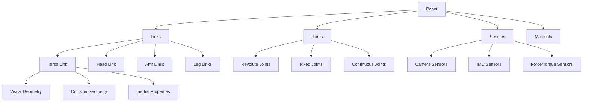
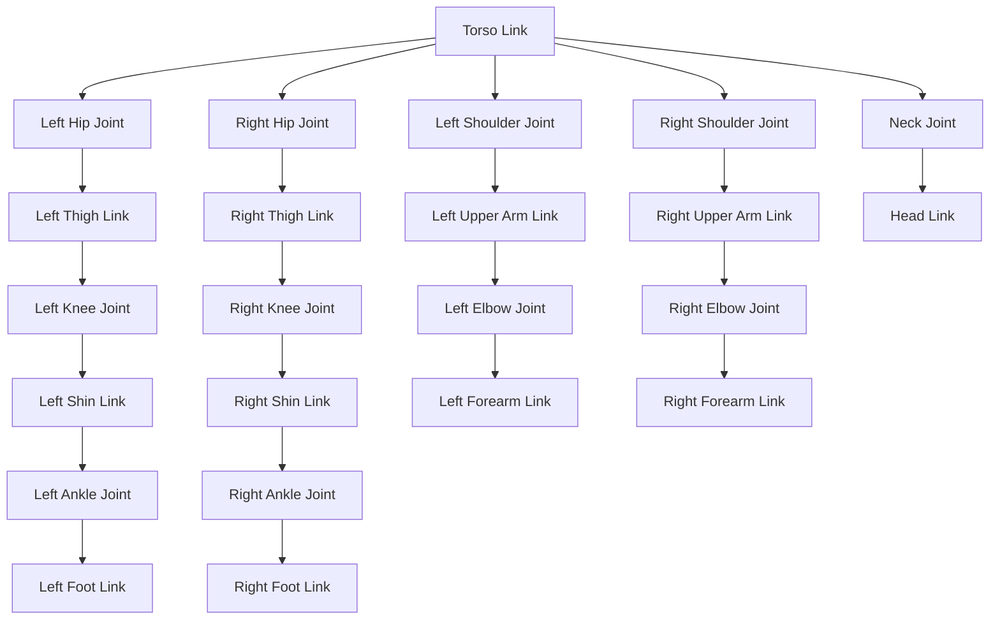
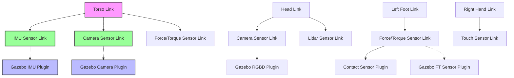

# Lesson 3: Humanoid URDF - Links, Joints, Sensors

## Learning Objectives

By the end of this lesson, you will be able to:
- Create comprehensive URDF models for humanoid robots with proper kinematic structure
- Define appropriate links, joints, and transmissions for humanoid robot components
- Integrate sensors into URDF models for perception capabilities
- Configure inertial properties and visual/collision geometries for realistic simulation
- Generate and validate URDF models for use in ROS 2 and simulation environments

## Introduction

The Unified Robot Description Format (URDF) is an XML-based format used in ROS to describe robot models. For humanoid robots, URDF serves as the blueprint that defines the physical structure, kinematic relationships, and sensor placements. A well-designed URDF model is crucial for accurate simulation, visualization, and control of humanoid robots in both virtual and real environments.

This lesson will explore the components of URDF, focusing on how to model humanoid robots with proper links for body segments, joints for articulation, and sensors for perception. We'll cover best practices for creating realistic models that can be used in simulation environments like Gazebo and Isaac Sim.

## URDF Structure Overview



*Figure 1: URDF structure showing the main components of a robot description.*

## URDF Fundamentals

URDF is an XML format that describes robot models by defining:

- **Links**: Rigid bodies with visual, collision, and inertial properties
- **Joints**: Connections between links that allow relative motion
- **Transmissions**: Mapping between actuators and joints
- **Materials**: Visual appearance properties
- **Gazebo plugins**: Simulation-specific configurations

The basic structure of a URDF file follows this pattern:

```xml
<?xml version="1.0"?>
<robot name="humanoid_robot">
  <!-- Define materials -->
  <material name="blue">
    <color rgba="0.0 0.0 1.0 1.0"/>
  </material>

  <!-- Define links -->
  <link name="base_link">
    <visual>
      <geometry>
        <box size="0.5 0.5 0.5"/>
      </geometry>
      <material name="blue"/>
    </visual>
    <collision>
      <geometry>
        <box size="0.5 0.5 0.5"/>
      </geometry>
    </collision>
    <inertial>
      <mass value="1.0"/>
      <inertia ixx="0.1" ixy="0" ixz="0" iyy="0.1" iyz="0" izz="0.1"/>
    </inertial>
  </link>

  <!-- Define joints -->
  <joint name="base_to_torso" type="fixed">
    <parent link="base_link"/>
    <child link="torso_link"/>
    <origin xyz="0 0 0.5" rpy="0 0 0"/>
  </joint>

  <link name="torso_link">
    <!-- Link definition -->
  </link>
</robot>
```

## Links: The Building Blocks of Robot Structure

Links represent rigid bodies in the robot model. Each link can have multiple elements:

- **Visual**: How the link appears in visualization
- **Collision**: How the link interacts in collision detection
- **Inertial**: Physical properties for dynamics simulation

### Link Structure

```xml
<link name="link_name">
  <visual>
    <origin xyz="0 0 0" rpy="0 0 0"/>
    <geometry>
      <!-- Shape definition -->
    </geometry>
    <material name="material_name"/>
  </visual>

  <collision>
    <origin xyz="0 0 0" rpy="0 0 0"/>
    <geometry>
      <!-- Shape definition -->
    </geometry>
  </collision>

  <inertial>
    <mass value="1.0"/>
    <origin xyz="0 0 0" rpy="0 0 0"/>
    <inertia ixx="0.1" ixy="0" ixz="0" iyy="0.1" iyz="0" izz="0.1"/>
  </inertial>
</link>
```

### Visual and Collision Properties

For humanoid robots, it's important to define both visual and collision geometries appropriately:

```xml
<link name="humanoid_torso">
  <visual>
    <!-- Detailed visual mesh for rendering -->
    <geometry>
      <mesh filename="package://humanoid_description/meshes/torso_visual.dae" scale="1 1 1"/>
    </geometry>
    <material name="light_grey"/>
  </visual>

  <collision>
    <!-- Simplified collision geometry for physics -->
    <geometry>
      <box size="0.3 0.25 0.5"/>
    </geometry>
  </collision>

  <inertial>
    <mass value="5.0"/>
    <origin xyz="0 0 0" rpy="0 0 0"/>
    <!-- Inertia tensor for box shape -->
    <inertia ixx="0.26" ixy="0" ixz="0" iyy="0.325" iyz="0" izz="0.065"/>
  </inertial>
</link>
```

## Joints: Connecting Robot Components

Joints define the kinematic relationships between links, specifying how they can move relative to each other. For humanoid robots, proper joint definitions are crucial for realistic movement and control.

### Joint Types

Common joint types for humanoid robots:

- **revolute**: Rotational joint with limits (e.g., knee, elbow)
- **continuous**: Rotational joint without limits (e.g., wheel)
- **prismatic**: Linear sliding joint (e.g., linear actuator)
- **fixed**: No movement (e.g., sensor mounting)
- **floating**: 6DOF movement (for base link in some applications)
- **planar**: Movement in a plane

### Joint Structure

```xml
<joint name="joint_name" type="joint_type">
  <origin xyz="x y z" rpy="roll pitch yaw"/>
  <parent link="parent_link_name"/>
  <child link="child_link_name"/>

  <!-- For revolute and prismatic joints -->
  <axis xyz="x y z"/>
  <limit lower="-1.57" upper="1.57" effort="100" velocity="1.0"/>

  <!-- Optional: joint properties -->
  <dynamics damping="0.1" friction="0.0"/>
</joint>
```

### Humanoid Joint Examples



*Figure 2: Humanoid kinematic tree showing the hierarchical structure of links and joints.*

```xml
<!-- Hip joint (spherical joint approximation using multiple revolute joints) -->
<joint name="left_hip_yaw" type="revolute">
  <origin xyz="0.0 0.15 -0.05" rpy="0 0 0"/>
  <parent link="torso_link"/>
  <child link="left_thigh_link"/>
  <axis xyz="0 0 1"/>
  <limit lower="-0.5" upper="0.5" effort="200" velocity="2.0"/>
  <dynamics damping="1.0" friction="0.1"/>
</joint>

<joint name="left_hip_roll" type="revolute">
  <origin xyz="0 0 0" rpy="0 0 0"/>
  <parent link="left_thigh_link"/>
  <child link="left_thigh_roll_link"/>
  <axis xyz="1 0 0"/>
  <limit lower="-0.4" upper="1.0" effort="200" velocity="2.0"/>
  <dynamics damping="1.0" friction="0.1"/>
</joint>

<joint name="left_hip_pitch" type="revolute">
  <origin xyz="0 0 -0.1" rpy="0 0 0"/>
  <parent link="left_thigh_roll_link"/>
  <child link="left_thigh_pitch_link"/>
  <axis xyz="0 1 0"/>
  <limit lower="-2.5" upper="0.7" effort="200" velocity="2.0"/>
  <dynamics damping="1.0" friction="0.1"/>
</joint>

<!-- Knee joint -->
<joint name="left_knee" type="revolute">
  <origin xyz="0 0 -0.3" rpy="0 0 0"/>
  <parent link="left_thigh_pitch_link"/>
  <child link="left_shin_link"/>
  <axis xyz="0 1 0"/>
  <limit lower="0" upper="2.3" effort="200" velocity="2.0"/>
  <dynamics damping="1.0" friction="0.1"/>
</joint>

<!-- Ankle joint -->
<joint name="left_ankle_pitch" type="revolute">
  <origin xyz="0 0 -0.3" rpy="0 0 0"/>
  <parent link="left_shin_link"/>
  <child link="left_ankle_link"/>
  <axis xyz="0 1 0"/>
  <limit lower="-0.8" upper="0.8" effort="100" velocity="2.0"/>
  <dynamics damping="0.5" friction="0.05"/>
</joint>

<joint name="left_ankle_roll" type="revolute">
  <origin xyz="0 0 0" rpy="0 0 0"/>
  <parent link="left_ankle_link"/>
  <child link="left_foot_link"/>
  <axis xyz="1 0 0"/>
  <limit lower="-0.4" upper="0.4" effort="100" velocity="2.0"/>
  <dynamics damping="0.5" friction="0.05"/>
</joint>
```

## Complete Humanoid URDF Example

Here's a more complete example of a simplified humanoid robot URDF:

```xml
<?xml version="1.0"?>
<robot name="simple_humanoid" xmlns:xacro="http://www.ros.org/wiki/xacro">

  <!-- Materials -->
  <material name="black">
    <color rgba="0.0 0.0 0.0 1.0"/>
  </material>
  <material name="blue">
    <color rgba="0.0 0.0 0.8 1.0"/>
  </material>
  <material name="green">
    <color rgba="0.0 0.8 0.0 1.0"/>
  </material>
  <material name="grey">
    <color rgba="0.5 0.5 0.5 1.0"/>
  </material>
  <material name="orange">
    <color rgba="1.0 0.42352941176 0.03921568627 1.0"/>
  </material>
  <material name="brown">
    <color rgba="0.87058823529 0.81176470588 0.76470588235 1.0"/>
  </material>
  <material name="red">
    <color rgba="0.8 0.0 0.0 1.0"/>
  </material>
  <material name="white">
    <color rgba="1.0 1.0 1.0 1.0"/>
  </material>

  <!-- Base link -->
  <link name="base_link">
    <inertial>
      <mass value="10.0"/>
      <origin xyz="0 0 0"/>
      <inertia ixx="0.1" ixy="0.0" ixz="0.0" iyy="0.1" iyz="0.0" izz="0.1"/>
    </inertial>
    <visual>
      <origin xyz="0 0 0" rpy="0 0 0"/>
      <geometry>
        <box size="0.1 0.1 0.1"/>
      </geometry>
      <material name="white"/>
    </visual>
    <collision>
      <origin xyz="0 0 0" rpy="0 0 0"/>
      <geometry>
        <box size="0.1 0.1 0.1"/>
      </geometry>
    </collision>
  </link>

  <!-- Torso -->
  <joint name="torso_joint" type="fixed">
    <origin xyz="0 0 0.15" rpy="0 0 0"/>
    <parent link="base_link"/>
    <child link="torso_link"/>
  </joint>

  <link name="torso_link">
    <inertial>
      <mass value="5.0"/>
      <origin xyz="0 0 0.25"/>
      <inertia ixx="0.3" ixy="0.0" ixz="0.0" iyy="0.3" iyz="0.0" izz="0.1"/>
    </inertial>
    <visual>
      <origin xyz="0 0 0.25" rpy="0 0 0"/>
      <geometry>
        <box size="0.3 0.25 0.5"/>
      </geometry>
      <material name="grey"/>
    </visual>
    <collision>
      <origin xyz="0 0 0.25" rpy="0 0 0"/>
      <geometry>
        <box size="0.3 0.25 0.5"/>
      </geometry>
    </collision>
  </link>

  <!-- Head -->
  <joint name="head_joint" type="revolute">
    <origin xyz="0 0 0.5" rpy="0 0 0"/>
    <parent link="torso_link"/>
    <child link="head_link"/>
    <axis xyz="0 1 0"/>
    <limit lower="-0.5" upper="0.5" effort="10" velocity="1.0"/>
  </joint>

  <link name="head_link">
    <inertial>
      <mass value="1.0"/>
      <origin xyz="0 0 0.1"/>
      <inertia ixx="0.01" ixy="0.0" ixz="0.0" iyy="0.01" iyz="0.0" izz="0.01"/>
    </inertial>
    <visual>
      <origin xyz="0 0 0.1" rpy="0 0 0"/>
      <geometry>
        <sphere radius="0.1"/>
      </geometry>
      <material name="orange"/>
    </visual>
    <collision>
      <origin xyz="0 0 0.1" rpy="0 0 0"/>
      <geometry>
        <sphere radius="0.1"/>
      </geometry>
    </collision>
  </link>

  <!-- Left Arm -->
  <joint name="left_shoulder_pitch" type="revolute">
    <origin xyz="0.15 0 0.4" rpy="0 0 0"/>
    <parent link="torso_link"/>
    <child link="left_upper_arm_link"/>
    <axis xyz="0 1 0"/>
    <limit lower="-1.57" upper="1.57" effort="50" velocity="2.0"/>
  </joint>

  <link name="left_upper_arm_link">
    <inertial>
      <mass value="1.0"/>
      <origin xyz="0 0 -0.15"/>
      <inertia ixx="0.01" ixy="0.0" ixz="0.0" iyy="0.01" iyz="0.0" izz="0.005"/>
    </inertial>
    <visual>
      <origin xyz="0 0 -0.15" rpy="0 0 0"/>
      <geometry>
        <cylinder radius="0.05" length="0.3"/>
      </geometry>
      <material name="blue"/>
    </visual>
    <collision>
      <origin xyz="0 0 -0.15" rpy="0 0 0"/>
      <geometry>
        <cylinder radius="0.05" length="0.3"/>
      </geometry>
    </collision>
  </link>

  <joint name="left_elbow" type="revolute">
    <origin xyz="0 0 -0.3" rpy="0 0 0"/>
    <parent link="left_upper_arm_link"/>
    <child link="left_forearm_link"/>
    <axis xyz="0 0 1"/>
    <limit lower="-1.57" upper="1.57" effort="30" velocity="2.0"/>
  </joint>

  <link name="left_forearm_link">
    <inertial>
      <mass value="0.5"/>
      <origin xyz="0 0 -0.1"/>
      <inertia ixx="0.005" ixy="0.0" ixz="0.0" iyy="0.005" iyz="0.0" izz="0.002"/>
    </inertial>
    <visual>
      <origin xyz="0 0 -0.1" rpy="0 0 0"/>
      <geometry>
        <cylinder radius="0.04" length="0.2"/>
      </geometry>
      <material name="blue"/>
    </visual>
    <collision>
      <origin xyz="0 0 -0.1" rpy="0 0 0"/>
      <geometry>
        <cylinder radius="0.04" length="0.2"/>
      </geometry>
    </collision>
  </link>

  <!-- Right Arm (mirror of left) -->
  <joint name="right_shoulder_pitch" type="revolute">
    <origin xyz="-0.15 0 0.4" rpy="0 0 0"/>
    <parent link="torso_link"/>
    <child link="right_upper_arm_link"/>
    <axis xyz="0 1 0"/>
    <limit lower="-1.57" upper="1.57" effort="50" velocity="2.0"/>
  </joint>

  <link name="right_upper_arm_link">
    <inertial>
      <mass value="1.0"/>
      <origin xyz="0 0 -0.15"/>
      <inertia ixx="0.01" ixy="0.0" ixz="0.0" iyy="0.01" iyz="0.0" izz="0.005"/>
    </inertial>
    <visual>
      <origin xyz="0 0 -0.15" rpy="0 0 0"/>
      <geometry>
        <cylinder radius="0.05" length="0.3"/>
      </geometry>
      <material name="green"/>
    </visual>
    <collision>
      <origin xyz="0 0 -0.15" rpy="0 0 0"/>
      <geometry>
        <cylinder radius="0.05" length="0.3"/>
      </geometry>
    </collision>
  </link>

  <joint name="right_elbow" type="revolute">
    <origin xyz="0 0 -0.3" rpy="0 0 0"/>
    <parent link="right_upper_arm_link"/>
    <child link="right_forearm_link"/>
    <axis xyz="0 0 1"/>
    <limit lower="-1.57" upper="1.57" effort="30" velocity="2.0"/>
  </joint>

  <link name="right_forearm_link">
    <inertial>
      <mass value="0.5"/>
      <origin xyz="0 0 -0.1"/>
      <inertia ixx="0.005" ixy="0.0" ixz="0.0" iyy="0.005" iyz="0.0" izz="0.002"/>
    </inertial>
    <visual>
      <origin xyz="0 0 -0.1" rpy="0 0 0"/>
      <geometry>
        <cylinder radius="0.04" length="0.2"/>
      </geometry>
      <material name="green"/>
    </visual>
    <collision>
      <origin xyz="0 0 -0.1" rpy="0 0 0"/>
      <geometry>
        <cylinder radius="0.04" length="0.2"/>
      </geometry>
    </collision>
  </link>

  <!-- Left Leg -->
  <joint name="left_hip" type="revolute">
    <origin xyz="0.075 0 0" rpy="0 0 0"/>
    <parent link="torso_link"/>
    <child link="left_thigh_link"/>
    <axis xyz="0 1 0"/>
    <limit lower="-1.57" upper="0.785" effort="100" velocity="1.5"/>
  </joint>

  <link name="left_thigh_link">
    <inertial>
      <mass value="2.0"/>
      <origin xyz="0 0 -0.2"/>
      <inertia ixx="0.05" ixy="0.0" ixz="0.0" iyy="0.05" iyz="0.0" izz="0.01"/>
    </inertial>
    <visual>
      <origin xyz="0 0 -0.2" rpy="0 0 0"/>
      <geometry>
        <cylinder radius="0.06" length="0.4"/>
      </geometry>
      <material name="red"/>
    </visual>
    <collision>
      <origin xyz="0 0 -0.2" rpy="0 0 0"/>
      <geometry>
        <cylinder radius="0.06" length="0.4"/>
      </geometry>
    </collision>
  </link>

  <joint name="left_knee" type="revolute">
    <origin xyz="0 0 -0.4" rpy="0 0 0"/>
    <parent link="left_thigh_link"/>
    <child link="left_shin_link"/>
    <axis xyz="0 1 0"/>
    <limit lower="0" upper="1.57" effort="100" velocity="1.5"/>
  </joint>

  <link name="left_shin_link">
    <inertial>
      <mass value="1.5"/>
      <origin xyz="0 0 -0.15"/>
      <inertia ixx="0.03" ixy="0.0" ixz="0.0" iyy="0.03" iyz="0.0" izz="0.01"/>
    </inertial>
    <visual>
      <origin xyz="0 0 -0.15" rpy="0 0 0"/>
      <geometry>
        <cylinder radius="0.05" length="0.3"/>
      </geometry>
      <material name="red"/>
    </visual>
    <collision>
      <origin xyz="0 0 -0.15" rpy="0 0 0"/>
      <geometry>
        <cylinder radius="0.05" length="0.3"/>
      </geometry>
    </collision>
  </link>

  <joint name="left_ankle" type="revolute">
    <origin xyz="0 0 -0.3" rpy="0 0 0"/>
    <parent link="left_shin_link"/>
    <child link="left_foot_link"/>
    <axis xyz="0 1 0"/>
    <limit lower="-0.5" upper="0.5" effort="50" velocity="1.0"/>
  </joint>

  <link name="left_foot_link">
    <inertial>
      <mass value="0.8"/>
      <origin xyz="0.05 0 -0.05"/>
      <inertia ixx="0.01" ixy="0.0" ixz="0.0" iyy="0.01" iyz="0.0" izz="0.01"/>
    </inertial>
    <visual>
      <origin xyz="0.05 0 -0.05" rpy="0 0 0"/>
      <geometry>
        <box size="0.15 0.1 0.05"/>
      </geometry>
      <material name="black"/>
    </visual>
    <collision>
      <origin xyz="0.05 0 -0.05" rpy="0 0 0"/>
      <geometry>
        <box size="0.15 0.1 0.05"/>
      </geometry>
    </collision>
  </link>

  <!-- Right Leg (mirror of left) -->
  <joint name="right_hip" type="revolute">
    <origin xyz="-0.075 0 0" rpy="0 0 0"/>
    <parent link="torso_link"/>
    <child link="right_thigh_link"/>
    <axis xyz="0 1 0"/>
    <limit lower="-1.57" upper="0.785" effort="100" velocity="1.5"/>
  </joint>

  <link name="right_thigh_link">
    <inertial>
      <mass value="2.0"/>
      <origin xyz="0 0 -0.2"/>
      <inertia ixx="0.05" ixy="0.0" ixz="0.0" iyy="0.05" iyz="0.0" izz="0.01"/>
    </inertial>
    <visual>
      <origin xyz="0 0 -0.2" rpy="0 0 0"/>
      <geometry>
        <cylinder radius="0.06" length="0.4"/>
      </geometry>
      <material name="brown"/>
    </visual>
    <collision>
      <origin xyz="0 0 -0.2" rpy="0 0 0"/>
      <geometry>
        <cylinder radius="0.06" length="0.4"/>
      </geometry>
    </collision>
  </link>

  <joint name="right_knee" type="revolute">
    <origin xyz="0 0 -0.4" rpy="0 0 0"/>
    <parent link="right_thigh_link"/>
    <child link="right_shin_link"/>
    <axis xyz="0 1 0"/>
    <limit lower="0" upper="1.57" effort="100" velocity="1.5"/>
  </joint>

  <link name="right_shin_link">
    <inertial>
      <mass value="1.5"/>
      <origin xyz="0 0 -0.15"/>
      <inertia ixx="0.03" ixy="0.0" ixz="0.0" iyy="0.03" iyz="0.0" izz="0.01"/>
    </inertial>
    <visual>
      <origin xyz="0 0 -0.15" rpy="0 0 0"/>
      <geometry>
        <cylinder radius="0.05" length="0.3"/>
      </geometry>
      <material name="brown"/>
    </visual>
    <collision>
      <origin xyz="0 0 -0.15" rpy="0 0 0"/>
      <geometry>
        <cylinder radius="0.05" length="0.3"/>
      </geometry>
    </collision>
  </link>

  <joint name="right_ankle" type="revolute">
    <origin xyz="0 0 -0.3" rpy="0 0 0"/>
    <parent link="right_shin_link"/>
    <child link="right_foot_link"/>
    <axis xyz="0 1 0"/>
    <limit lower="-0.5" upper="0.5" effort="50" velocity="1.0"/>
  </joint>

  <link name="right_foot_link">
    <inertial>
      <mass value="0.8"/>
      <origin xyz="0.05 0 -0.05"/>
      <inertia ixx="0.01" ixy="0.0" ixz="0.0" iyy="0.01" iyz="0.0" izz="0.01"/>
    </inertial>
    <visual>
      <origin xyz="0.05 0 -0.05" rpy="0 0 0"/>
      <geometry>
        <box size="0.15 0.1 0.05"/>
      </geometry>
      <material name="black"/>
    </visual>
    <collision>
      <origin xyz="0.05 0 -0.05" rpy="0 0 0"/>
      <geometry>
        <box size="0.15 0.1 0.05"/>
      </geometry>
    </collision>
  </link>

</robot>
```

## Sensors in URDF

Sensors are crucial for humanoid robots to perceive their environment. In URDF, sensors are typically represented as fixed joints connecting sensor links to the main robot structure.



*Figure 3: Sensor integration in URDF showing how sensor links connect to main robot structure and interface with simulation plugins.*

```xml
<!-- RGB-D Camera -->
<joint name="camera_joint" type="fixed">
  <origin xyz="0.05 0 0.1" rpy="0 0 0"/>
  <parent link="head_link"/>
  <child link="camera_link"/>
</joint>

<link name="camera_link">
  <visual>
    <geometry>
      <box size="0.02 0.04 0.02"/>
    </geometry>
    <material name="black"/>
  </visual>
  <collision>
    <geometry>
      <box size="0.02 0.04 0.02"/>
    </geometry>
  </collision>
  <inertial>
    <mass value="0.1"/>
    <inertia ixx="0.001" ixy="0" ixz="0" iyy="0.001" iyz="0" izz="0.001"/>
  </inertial>
</link>

<!-- Gazebo plugin for camera -->
<gazebo reference="camera_link">
  <sensor type="camera" name="camera1">
    <update_rate>30.0</update_rate>
    <camera name="head_camera">
      <horizontal_fov>1.3962634</horizontal_fov>
      <image>
        <width>800</width>
        <height>600</height>
        <format>R8G8B8</format>
      </image>
      <clip>
        <near>0.02</near>
        <far>300</far>
      </clip>
    </camera>
    <plugin name="camera_controller" filename="libgazebo_ros_camera.so">
      <frame_name>camera_link</frame_name>
      <topic_name>camera/image_raw</topic_name>
    </plugin>
  </sensor>
</gazebo>
```

### IMU Sensor Example

```xml
<!-- IMU Sensor -->
<joint name="imu_joint" type="fixed">
  <origin xyz="0 0 0.25" rpy="0 0 0"/>
  <parent link="torso_link"/>
  <child link="imu_link"/>
</joint>

<link name="imu_link">
  <inertial>
    <mass value="0.01"/>
    <inertia ixx="0.0001" ixy="0" ixz="0" iyy="0.0001" iyz="0" izz="0.0001"/>
  </inertial>
</link>

<!-- Gazebo plugin for IMU -->
<gazebo reference="imu_link">
  <sensor name="imu_sensor" type="imu">
    <always_on>true</always_on>
    <update_rate>100</update_rate>
    <visualize>true</visualize>
    <imu>
      <angular_velocity>
        <x>
          <noise type="gaussian">
            <mean>0.0</mean>
            <stddev>2e-4</stddev>
          </noise>
        </x>
        <y>
          <noise type="gaussian">
            <mean>0.0</mean>
            <stddev>2e-4</stddev>
          </noise>
        </y>
        <z>
          <noise type="gaussian">
            <mean>0.0</mean>
            <stddev>2e-4</stddev>
          </noise>
        </z>
      </angular_velocity>
      <linear_acceleration>
        <x>
          <noise type="gaussian">
            <mean>0.0</mean>
            <stddev>1.7e-2</stddev>
          </noise>
        </x>
        <y>
          <noise type="gaussian">
            <mean>0.0</mean>
            <stddev>1.7e-2</stddev>
          </noise>
        </y>
        <z>
          <noise type="gaussian">
            <mean>0.0</mean>
            <stddev>1.7e-2</stddev>
          </noise>
        </z>
      </linear_acceleration>
    </imu>
  </sensor>
  <plugin name="imu_plugin" filename="libgazebo_ros_imu.so">
    <topicName>imu/data</topicName>
    <bodyName>imu_link</bodyName>
    <updateRateHZ>100.0</updateRateHZ>
    <gaussianNoise>0.0</gaussianNoise>
    <frameName>imu_link</frameName>
    <initialOrientationAsReference>false</initialOrientationAsReference>
  </plugin>
</gazebo>
```

### Force/Torque Sensor Example

```xml
<!-- Force/Torque Sensor in ankle -->
<joint name="left_ankle_ft_sensor_joint" type="fixed">
  <origin xyz="0 0 -0.025" rpy="0 0 0"/>
  <parent link="left_foot_link"/>
  <child link="left_ankle_ft_sensor_link"/>
</joint>

<link name="left_ankle_ft_sensor_link">
  <inertial>
    <mass value="0.1"/>
    <inertia ixx="1e-6" ixy="0" ixz="0" iyy="1e-6" iyz="0" izz="1e-6"/>
  </inertial>
</link>

<gazebo reference="left_ankle_ft_sensor_link">
  <sensor type="force_torque" name="left_ankle_ft_sensor">
    <always_on>true</always_on>
    <update_rate>100</update_rate>
    <force_torque>
      <frame>sensor</frame>
      <measure_direction>child_to_parent</measure_direction>
    </force_torque>
  </sensor>
  <plugin name="left_ankle_ft_plugin" filename="libgazebo_ros_ft.so">
    <update_rate>100</update_rate>
    <topic_name>left_ankle/ft_sensor</topic_name>
    <joint_name>left_ankle_ft_sensor_joint</joint_name>
  </plugin>
</gazebo>
```

## Xacro for Complex Humanoid Models

For complex humanoid robots, Xacro (XML Macros) is often used to simplify URDF creation:

```xml
<?xml version="1.0"?>
<robot xmlns:xacro="http://www.ros.org/wiki/xacro" name="humanoid_with_xacro">

  <!-- Properties -->
  <xacro:property name="M_PI" value="3.1415926535897931" />
  <xacro:property name="torso_mass" value="5.0" />
  <xacro:property name="arm_mass" value="1.0" />
  <xacro:property name="leg_mass" value="2.0" />

  <!-- Macro for creating a simple link -->
  <xacro:macro name="simple_link" params="name mass xyz size material">
    <link name="${name}">
      <inertial>
        <mass value="${mass}"/>
        <origin xyz="${xyz}"/>
        <inertia ixx="0.01" ixy="0.0" ixz="0.0" iyy="0.01" iyz="0.0" izz="0.01"/>
      </inertial>
      <visual>
        <origin xyz="${xyz}"/>
        <geometry>
          <box size="${size}"/>
        </geometry>
        <material name="${material}"/>
      </visual>
      <collision>
        <origin xyz="${xyz}"/>
        <geometry>
          <box size="${size}"/>
        </geometry>
      </collision>
    </link>
  </xacro:macro>

  <!-- Macro for creating a joint -->
  <xacro:macro name="simple_joint" params="name type parent child xyz rpy axis lower upper effort velocity">
    <joint name="${name}" type="${type}">
      <origin xyz="${xyz}" rpy="${rpy}"/>
      <parent link="${parent}"/>
      <child link="${child}"/>
      <axis xyz="${axis}"/>
      <limit lower="${lower}" upper="${upper}" effort="${effort}" velocity="${velocity}"/>
    </joint>
  </xacro:macro>

  <!-- Use macros to build robot -->
  <xacro:simple_link name="base_link" mass="10.0" xyz="0 0 0" size="0.1 0.1 0.1" material="white"/>

  <!-- Rest of robot using macros -->
  <!-- ... -->

</robot>
```

## Hands-on Exercise 3.1: Create a URDF of a Simple Humanoid Torso

Create a URDF file that models a simple humanoid torso with head, arms, and basic sensors:

1. Create a new package for the robot description:
```bash
cd ~/ros2_ws/src
ros2 pkg create --build-type ament_cmake humanoid_description
```

2. Create the URDF file `humanoid_description/urdf/simple_torso.urdf`:
```xml
<?xml version="1.0"?>
<robot name="simple_humanoid_torso">
  <!-- Materials -->
  <material name="light_grey">
    <color rgba="0.7 0.7 0.7 1.0"/>
  </material>
  <material name="dark_grey">
    <color rgba="0.3 0.3 0.3 1.0"/>
  </material>

  <!-- Torso link -->
  <link name="torso">
    <visual>
      <origin xyz="0 0 0.3" rpy="0 0 0"/>
      <geometry>
        <box size="0.3 0.25 0.6"/>
      </geometry>
      <material name="light_grey"/>
    </visual>
    <collision>
      <origin xyz="0 0 0.3" rpy="0 0 0"/>
      <geometry>
        <box size="0.3 0.25 0.6"/>
      </geometry>
    </collision>
    <inertial>
      <mass value="5.0"/>
      <origin xyz="0 0 0.3"/>
      <inertia ixx="0.3" ixy="0.0" ixz="0.0" iyy="0.3" iyz="0.0" izz="0.1"/>
    </inertial>
  </link>

  <!-- Head -->
  <joint name="neck_joint" type="revolute">
    <origin xyz="0 0 0.6" rpy="0 0 0"/>
    <parent link="torso"/>
    <child link="head"/>
    <axis xyz="0 1 0"/>
    <limit lower="-0.5" upper="0.5" effort="10" velocity="1.0"/>
  </joint>

  <link name="head">
    <visual>
      <origin xyz="0 0 0.1" rpy="0 0 0"/>
      <geometry>
        <sphere radius="0.12"/>
      </geometry>
      <material name="light_grey"/>
    </visual>
    <collision>
      <origin xyz="0 0 0.1" rpy="0 0 0"/>
      <geometry>
        <sphere radius="0.12"/>
      </geometry>
    </collision>
    <inertial>
      <mass value="1.5"/>
      <origin xyz="0 0 0.1"/>
      <inertia ixx="0.01" ixy="0.0" ixz="0.0" iyy="0.01" iyz="0.0" izz="0.01"/>
    </inertial>
  </link>

  <!-- Left Shoulder -->
  <joint name="left_shoulder_joint" type="revolute">
    <origin xyz="0.2 0 0.4" rpy="0 0 0"/>
    <parent link="torso"/>
    <child link="left_upper_arm"/>
    <axis xyz="0 1 0"/>
    <limit lower="-1.57" upper="1.57" effort="50" velocity="2.0"/>
  </joint>

  <link name="left_upper_arm">
    <visual>
      <origin xyz="0 0 -0.15" rpy="0 0 0"/>
      <geometry>
        <cylinder radius="0.05" length="0.3"/>
      </geometry>
      <material name="dark_grey"/>
    </visual>
    <collision>
      <origin xyz="0 0 -0.15" rpy="0 0 0"/>
      <geometry>
        <cylinder radius="0.05" length="0.3"/>
      </geometry>
    </collision>
    <inertial>
      <mass value="1.0"/>
      <origin xyz="0 0 -0.15"/>
      <inertia ixx="0.01" ixy="0.0" ixz="0.0" iyy="0.01" iyz="0.0" izz="0.005"/>
    </inertial>
  </link>

  <!-- Right Shoulder -->
  <joint name="right_shoulder_joint" type="revolute">
    <origin xyz="-0.2 0 0.4" rpy="0 0 0"/>
    <parent link="torso"/>
    <child link="right_upper_arm"/>
    <axis xyz="0 1 0"/>
    <limit lower="-1.57" upper="1.57" effort="50" velocity="2.0"/>
  </joint>

  <link name="right_upper_arm">
    <visual>
      <origin xyz="0 0 -0.15" rpy="0 0 0"/>
      <geometry>
        <cylinder radius="0.05" length="0.3"/>
      </geometry>
      <material name="dark_grey"/>
    </visual>
    <collision>
      <origin xyz="0 0 -0.15" rpy="0 0 0"/>
      <geometry>
        <cylinder radius="0.05" length="0.3"/>
      </geometry>
    </collision>
    <inertial>
      <mass value="1.0"/>
      <origin xyz="0 0 -0.15"/>
      <inertia ixx="0.01" ixy="0.0" ixz="0.0" iyy="0.01" iyz="0.0" izz="0.005"/>
    </inertial>
  </link>

  <!-- IMU Sensor in torso -->
  <joint name="imu_joint" type="fixed">
    <origin xyz="0 0 0.3" rpy="0 0 0"/>
    <parent link="torso"/>
    <child link="imu_link"/>
  </joint>

  <link name="imu_link"/>
</robot>
```

3. Test the URDF file:
```bash
# Install required tools
sudo apt install ros-humble-xacro

# Check URDF validity
check_urdf <path_to_urdf_file>

# Or convert xacro to urdf if using xacro
ros2 run xacro xacro <path_to_xacro_file> > output.urdf
```

## Key Takeaways

- **URDF** is the standard format for describing robot models in ROS, defining links, joints, and their properties
- **Links** represent rigid bodies with visual, collision, and inertial properties essential for simulation
- **Joints** define kinematic relationships between links, with different types for various movement capabilities
- **Sensors** are integrated into URDF as fixed links with appropriate Gazebo plugins for simulation
- **Xacro** simplifies complex URDF creation through macros and parameterization
- **Proper inertial properties** are crucial for realistic physics simulation and control
- **Collision geometries** should be simplified compared to visual geometries for efficient simulation

## Reflection Questions

1. Why is it important to have different geometries for visual and collision properties in URDF?
2. How would you modify the joint limits in the example URDF to make the robot's movement more human-like?
3. What are the potential issues with having too many degrees of freedom in a humanoid robot model?
4. How do sensor placements in URDF affect the robot's perception capabilities in simulation?

## APA Citations

Siciliano, B., & Khatib, O. (Eds.). (2016). *Springer handbook of robotics* (2nd ed.). Springer.

Craig, J. J. (2005). *Introduction to robotics: Mechanics and control* (3rd ed.). Pearson Prentice Hall.

Dhariwal, P., Hesse, C., Klimov, O., Nichol, A., Plappert, M., Radford, A., ... & Tokic, M. (2020). OpenAI Gym. *arXiv preprint arXiv:1606.01540*.

## Summary

This lesson covered the fundamentals of URDF (Unified Robot Description Format) for modeling humanoid robots. We explored how to define links with proper visual, collision, and inertial properties, create joints with appropriate types and limits, integrate sensors for perception, and use Xacro for managing complex models. Proper URDF models are essential for accurate simulation, visualization, and control of humanoid robots in ROS-based systems.

In the next module, we'll explore how to use these URDF models in simulation environments like Gazebo and Unity for physics simulation and visualization.