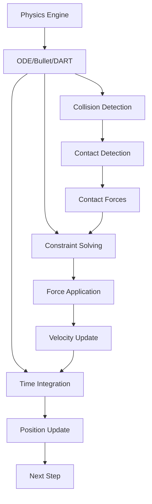

# Lesson 1: Gazebo Physics & Sensors - Physics Engine, Collision Detection, Sensor Modeling

## Learning Objectives

By the end of this lesson, you will be able to:
- Configure Gazebo physics engines for realistic humanoid robot simulation
- Implement collision detection and response for complex humanoid models
- Model and simulate various robot sensors including cameras, LiDAR, and IMU
- Create realistic environments for testing humanoid robot behaviors
- Tune physics parameters for accurate sim-to-real transfer

## Introduction

Gazebo is a powerful, physics-based simulation environment that enables realistic robot simulation with accurate physics, sensors, and environments. For humanoid robots, Gazebo provides the essential capability to test complex behaviors in a safe, controlled environment before deployment to expensive physical hardware. This lesson will explore the physics engine fundamentals, collision detection systems, and sensor modeling techniques that make Gazebo an indispensable tool for humanoid robotics development.

The physics simulation capabilities in Gazebo are crucial for humanoid robots because they must deal with complex dynamics, balance, and interaction with the environment. Accurate physics simulation allows developers to test control algorithms, locomotion patterns, and manipulation strategies in a risk-free environment.

## Gazebo Architecture and Physics Engine

Gazebo's architecture is built around a modular design that separates the physics engine, rendering engine, and sensor systems. This allows for flexible simulation of various robot types and environments.

### Physics Engine Options

Gazebo supports multiple physics engines, each with specific advantages:

- **ODE (Open Dynamics Engine)**: The default and most commonly used engine, suitable for most humanoid robotics applications
- **Bullet**: Provides more robust collision detection and is better for complex contact scenarios
- **DART (Dynamic Animation and Robotics Toolkit)**: Offers advanced features for articulated body simulation

```xml
<!-- World file configuration for physics engine -->
<sdf version="1.7">
  <world name="humanoid_world">
    <physics type="ode">
      <max_step_size>0.001</max_step_size>
      <real_time_factor>1.0</real_time_factor>
      <real_time_update_rate>1000</real_time_update_rate>
      <gravity>0 0 -9.8</gravity>
    </physics>

    <!-- World content here -->
  </world>
</sdf>
```

### Physics Parameters

The physics parameters significantly impact simulation accuracy and performance:

- **max_step_size**: Time step for the physics update (typically 0.001s for humanoid robots)
- **real_time_factor**: Ratio of simulation time to real time (1.0 for real-time)
- **real_time_update_rate**: Frequency of physics updates (Hz)



*Figure 1: Gazebo physics engine workflow showing the iterative process of physics simulation.*

## Collision Detection and Response

For humanoid robots, accurate collision detection is essential for safe and realistic simulation. Gazebo uses sophisticated algorithms to detect collisions between robot links and with the environment.

### Collision Geometries

Different collision geometries offer trade-offs between accuracy and performance:

```xml
<!-- Box collision for simple links -->
<collision name="torso_collision">
  <geometry>
    <box>
      <size>0.3 0.25 0.5</size>
    </box>
  </geometry>
  <surface>
    <friction>
      <ode>
        <mu>0.5</mu>
        <mu2>0.5</mu2>
      </ode>
    </friction>
    <bounce>
      <restitution_coefficient>0.1</restitution_coefficient>
      <threshold>100000</threshold>
    </bounce>
  </surface>
</collision>

<!-- Mesh collision for complex geometries -->
<collision name="foot_collision">
  <geometry>
    <mesh>
      <uri>model://humanoid/meshes/foot_collision.stl</uri>
    </mesh>
  </geometry>
  <max_contacts>10</max_contacts>
</collision>
```

### Contact Sensors

Contact sensors allow detection of physical interactions:

```xml
<!-- Contact sensor for foot-ground interaction -->
<joint name="left_foot_contact_joint" type="fixed">
  <parent>left_foot_link</parent>
  <child>left_foot_contact_sensor_link</child>
</joint>

<link name="left_foot_contact_sensor_link">
  <collision name="left_foot_contact_collision">
    <geometry>
      <cylinder>
        <radius>0.05</radius>
        <length>0.01</length>
      </cylinder>
    </geometry>
    <surface>
      <contact>
        <ode>
          <kp>1e6</kp>  <!-- Contact stiffness -->
          <kd>100</kd>  <!-- Damping coefficient -->
          <max_vel>100.0</max_vel>
          <min_depth>0.001</min_depth>
        </ode>
      </contact>
    </surface>
  </collision>
</link>

<gazebo reference="left_foot_contact_sensor_link">
  <sensor name="left_foot_contact" type="contact">
    <always_on>true</always_on>
    <update_rate>100</update_rate>
    <contact>
      <collision>left_foot_contact_collision</collision>
    </contact>
  </sensor>
</gazebo>
```

## Sensor Modeling in Gazebo

Gazebo provides realistic simulation of various robot sensors, which is crucial for developing perception and control systems that can transfer to real robots.

### Camera Sensors

Camera sensors simulate RGB, depth, and RGB-D cameras:

```xml
<gazebo reference="camera_link">
  <sensor name="camera1" type="camera">
    <update_rate>30.0</update_rate>
    <camera name="head_camera">
      <horizontal_fov>1.047</horizontal_fov> <!-- 60 degrees -->
      <image>
        <width>640</width>
        <height>480</height>
        <format>R8G8B8</format>
      </image>
      <clip>
        <near>0.1</near>
        <far>10.0</far>
      </clip>
      <noise>
        <type>gaussian</type>
        <mean>0.0</mean>
        <stddev>0.007</stddev>
      </noise>
    </camera>
    <plugin name="camera_controller" filename="libgazebo_ros_camera.so">
      <frame_name>camera_optical_frame</frame_name>
      <topic_name>camera/image_raw</topic_name>
      <hack_baseline>0.07</hack_baseline>
    </plugin>
  </sensor>
</gazebo>
```

### Depth Camera Sensors

Depth cameras provide 3D perception capabilities:

```xml
<gazebo reference="depth_camera_link">
  <sensor name="depth_camera" type="depth">
    <update_rate>30.0</update_rate>
    <camera name="depth_head_camera">
      <horizontal_fov>1.047</horizontal_fov>
      <image>
        <width>640</width>
        <height>480</height>
        <format>R8G8B8</format>
      </image>
      <clip>
        <near>0.1</near>
        <far>10.0</far>
      </clip>
    </camera>
    <plugin name="depth_camera_controller" filename="libgazebo_ros_openni_kinect.so">
      <baseline>0.2</baseline>
      <always_on>true</always_on>
      <update_rate>30.0</update_rate>
      <camera_name>camera</camera_name>
      <frame_name>camera_depth_optical_frame</frame_name>
      <point_cloud_topic>depth/points</point_cloud_topic>
      <depth_image_topic>depth/image_raw</depth_image_topic>
      <depth_image_camera_info_topic>depth/camera_info</depth_image_camera_info_topic>
      <image_topic>depth/image_rect_color</image_topic>
      <camera_info_topic>depth/camera_info</camera_info_topic>
    </plugin>
  </sensor>
</gazebo>
```

### LiDAR Sensors

LiDAR sensors provide 2D or 3D distance measurements:

```xml
<gazebo reference="lidar_link">
  <sensor name="lidar_sensor" type="ray">
    <pose>0 0 0 0 0 0</pose>
    <visualize>true</visualize>
    <update_rate>10</update_rate>
    <ray>
      <scan>
        <horizontal>
          <samples>720</samples>
          <resolution>1</resolution>
          <min_angle>-1.570796</min_angle> <!-- -90 degrees -->
          <max_angle>1.570796</max_angle>   <!-- 90 degrees -->
        </horizontal>
      </scan>
      <range>
        <min>0.1</min>
        <max>30.0</max>
        <resolution>0.01</resolution>
      </range>
    </ray>
    <plugin name="lidar_controller" filename="libgazebo_ros_ray_sensor.so">
      <ros>
        <argument>~/out:=scan</argument>
      </ros>
      <output_type>sensor_msgs/LaserScan</output_type>
    </plugin>
  </sensor>
</gazebo>
```

### IMU Sensors

IMU sensors provide orientation and acceleration data:

```xml
<gazebo reference="imu_link">
  <sensor name="imu_sensor" type="imu">
    <always_on>true</always_on>
    <update_rate>100</update_rate>
    <visualize>false</visualize>
    <imu>
      <angular_velocity>
        <x>
          <noise type="gaussian">
            <mean>0.0</mean>
            <stddev>2e-4</stddev>
            <bias_mean>0.0000075</bias_mean>
            <bias_stddev>0.0000008</bias_stddev>
          </noise>
        </x>
        <y>
          <noise type="gaussian">
            <mean>0.0</mean>
            <stddev>2e-4</stddev>
            <bias_mean>0.0000075</bias_mean>
            <bias_stddev>0.0000008</bias_stddev>
          </noise>
        </y>
        <z>
          <noise type="gaussian">
            <mean>0.0</mean>
            <stddev>2e-4</stddev>
            <bias_mean>0.0000075</bias_mean>
            <bias_stddev>0.0000008</bias_stddev>
          </noise>
        </z>
      </angular_velocity>
      <linear_acceleration>
        <x>
          <noise type="gaussian">
            <mean>0.0</mean>
            <stddev>1.7e-2</stddev>
            <bias_mean>0.1</bias_mean>
            <bias_stddev>0.001</bias_stddev>
          </noise>
        </x>
        <y>
          <noise type="gaussian">
            <mean>0.0</mean>
            <stddev>1.7e-2</stddev>
            <bias_mean>0.1</bias_mean>
            <bias_stddev>0.001</bias_stddev>
          </noise>
        </y>
        <z>
          <noise type="gaussian">
            <mean>0.0</mean>
            <stddev>1.7e-2</stddev>
            <bias_mean>0.1</bias_mean>
            <bias_stddev>0.001</bias_stddev>
          </noise>
        </z>
      </linear_acceleration>
    </imu>
  </sensor>
  <plugin name="imu_plugin" filename="libgazebo_ros_imu.so">
    <ros>
      <namespace>/imu</namespace>
      <remapping>~/out:=data</remapping>
    </ros>
    <initial_orientation_as_reference>false</initial_orientation_as_reference>
  </plugin>
</gazebo>
```

## World Creation and Environment Modeling

Creating realistic environments is crucial for testing humanoid robots. Gazebo provides tools for building complex worlds with various terrains, objects, and scenarios.

### Terrain and Ground Planes

```xml
<!-- Simple ground plane -->
<world>
  <include>
    <uri>model://ground_plane</uri>
  </include>

  <!-- Custom terrain -->
  <model name="uneven_terrain">
    <pose>0 0 0 0 0 0</pose>
    <link name="terrain_link">
      <collision name="collision">
        <geometry>
          <heightmap>
            <uri>model://terrain/heightmap.png</uri>
            <size>10 10 2</size>
            <pos>0 0 0</pos>
          </heightmap>
        </geometry>
      </collision>
      <visual name="visual">
        <geometry>
          <heightmap>
            <uri>model://terrain/heightmap.png</uri>
            <size>10 10 2</size>
            <pos>0 0 0</pos>
          </heightmap>
        </geometry>
      </visual>
    </link>
  </model>
</world>
```

### Static and Dynamic Objects

```xml
<!-- Static obstacle -->
<model name="table">
  <static>true</static>
  <link name="table_link">
    <collision name="collision">
      <geometry>
        <box>
          <size>1.0 0.6 0.8</size>
        </box>
      </geometry>
    </collision>
    <visual name="visual">
      <geometry>
        <box>
          <size>1.0 0.6 0.8</size>
        </box>
      </geometry>
      <material>
        <ambient>0.8 0.6 0.4 1</ambient>
        <diffuse>0.8 0.6 0.4 1</diffuse>
      </material>
    </visual>
  </link>
</model>

<!-- Dynamic object that can be manipulated -->
<model name="ball">
  <link name="ball_link">
    <collision name="collision">
      <geometry>
        <sphere>
          <radius>0.1</radius>
        </sphere>
      </geometry>
    </collision>
    <visual name="visual">
      <geometry>
        <sphere>
          <radius>0.1</radius>
        </sphere>
      </geometry>
      <material>
        <ambient>1 0 0 1</ambient>
        <diffuse>1 0 0 1</diffuse>
      </material>
    </visual>
    <inertial>
      <mass>0.5</mass>
      <inertia>
        <ixx>0.001</ixx>
        <iyy>0.001</iyy>
        <izz>0.001</izz>
      </inertia>
    </inertial>
  </link>
</model>
```

## Performance Optimization

For complex humanoid simulations, performance optimization is critical to maintain real-time simulation:

### Level of Detail (LOD)

```xml
<!-- Simplified collision geometry for performance -->
<collision name="simplified_collision">
  <geometry>
    <mesh>
      <uri>model://humanoid/meshes/torso_collision_simple.stl</uri>
    </mesh>
  </geometry>
</collision>

<!-- Detailed visual geometry for rendering -->
<visual name="detailed_visual">
  <geometry>
    <mesh>
      <uri>model://humanoid/meshes/torso_visual.dae</uri>
    </mesh>
  </geometry>
</visual>
```

### Physics Parameters for Performance

```xml
<physics type="ode">
  <max_step_size>0.001</max_step_size>
  <real_time_factor>1.0</real_time_factor>
  <real_time_update_rate>1000</real_time_update_rate>
  <gravity>0 0 -9.8</gravity>

  <!-- ODE-specific parameters -->
  <ode>
    <solver>
      <type>quick</type>
      <iters>10</iters>  <!-- Lower for performance, higher for accuracy -->
      <sor>1.3</sor>
    </solver>
    <constraints>
      <cfm>0.0</cfm>
      <erp>0.2</erp>  <!-- Error reduction parameter -->
      <contact_max_correcting_vel>100.0</contact_max_correcting_vel>
      <contact_surface_layer>0.001</contact_surface_layer>
    </constraints>
  </ode>
</physics>
```

## Hands-on Exercise 2.1: Create a Basic Gazebo Environment

Create a simple Gazebo world with your humanoid robot model and test basic physics:

1. Create a new world file `humanoid_world.world`:
```xml
<?xml version="1.0" ?>
<sdf version="1.7">
  <world name="humanoid_world">
    <!-- Physics engine configuration -->
    <physics type="ode">
      <max_step_size>0.001</max_step_size>
      <real_time_factor>1.0</real_time_factor>
      <real_time_update_rate>1000</real_time_update_rate>
      <gravity>0 0 -9.8</gravity>
    </physics>

    <!-- Include ground plane -->
    <include>
      <uri>model://ground_plane</uri>
    </include>

    <!-- Include sun for lighting -->
    <include>
      <uri>model://sun</uri>
    </include>

    <!-- Spawn your humanoid robot (assuming you have the model) -->
    <include>
      <uri>model://simple_humanoid</uri>
      <pose>0 0 1 0 0 0</pose>
    </include>

    <!-- Add a simple obstacle -->
    <model name="box_obstacle">
      <pose>1 0 0.5 0 0 0</pose>
      <link name="box_link">
        <collision name="collision">
          <geometry>
            <box>
              <size>0.5 0.5 1.0</size>
            </box>
          </geometry>
        </collision>
        <visual name="visual">
          <geometry>
            <box>
              <size>0.5 0.5 1.0</size>
            </box>
          </geometry>
          <material>
            <ambient>0.5 0.5 0.5 1</ambient>
            <diffuse>0.5 0.5 0.5 1</diffuse>
          </material>
        </visual>
        <inertial>
          <mass>1.0</mass>
          <inertia>
            <ixx>0.083</ixx>
            <iyy>0.083</iyy>
            <izz>0.083</izz>
          </inertia>
        </inertial>
      </link>
    </model>
  </world>
</sdf>
```

2. Launch Gazebo with your world:
```bash
gz sim -r humanoid_world.world
```

3. Test physics by applying forces to your robot and observing the response.

## Key Takeaways

- **Physics engines** in Gazebo (ODE, Bullet, DART) provide realistic simulation of robot dynamics
- **Collision detection** is essential for safe and realistic robot-environment interactions
- **Sensor modeling** allows for realistic perception system development and testing
- **Environment modeling** enables comprehensive testing of robot capabilities
- **Performance optimization** is crucial for real-time humanoid robot simulation
- **Physics parameters** must be carefully tuned for accurate sim-to-real transfer

## Reflection Questions

1. How do different physics engines (ODE, Bullet, DART) affect the simulation of humanoid locomotion?
2. What are the trade-offs between using simplified vs. detailed collision geometries?
3. How can sensor noise parameters be tuned to better match real sensor characteristics?
4. What physics parameters are most critical for achieving stable humanoid balance simulation?

## APA Citations

Thrun, S., Burgard, W., & Fox, D. (2005). *Probabilistic robotics*. MIT Press.

Siciliano, B., & Khatib, O. (Eds.). (2016). *Springer handbook of robotics* (2nd ed.). Springer.

Todorov, E., Erez, T., & Tassa, Y. (2012). Mujoco: A physics engine for model-based control. *Proceedings of the IEEE/RSJ International Conference on Intelligent Robots and Systems*, 5026-5033. https://doi.org/10.1109/IROS.2012.6386109

## Summary

This lesson covered the fundamentals of Gazebo physics simulation and sensor modeling for humanoid robots. We explored physics engines, collision detection, sensor simulation, and environment modeling techniques that enable realistic testing of humanoid robot behaviors. Proper configuration of these elements is essential for developing control systems that can successfully transfer from simulation to real robots.

In the next lesson, we'll explore Unity for high-fidelity visualization and human-robot interaction scenarios, complementing the physics-based simulation capabilities we've learned about in this lesson.