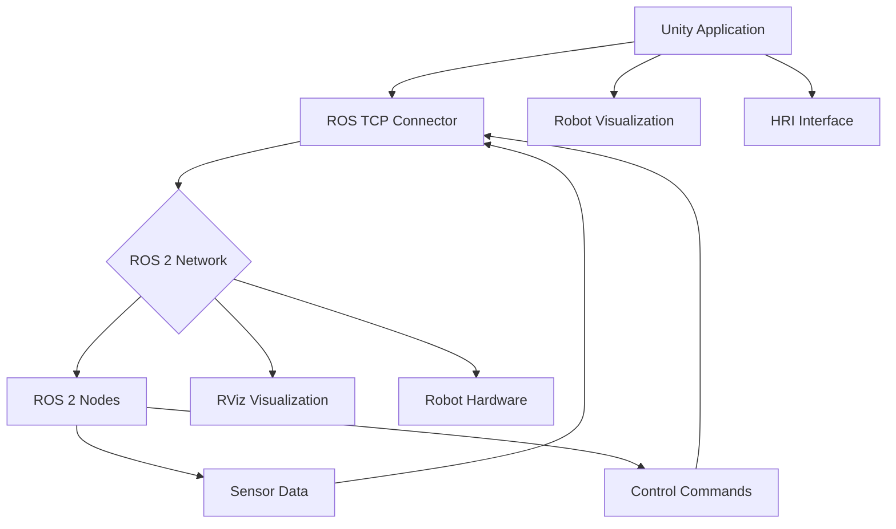

# Lesson 2: Unity Robotics Hub - Human-Robot Interaction, Visualization, Immersive Environments

## Learning Objectives

By the end of this lesson, you will be able to:
- Integrate Unity with ROS 2 for real-time robot simulation and visualization
- Implement human-robot interaction (HRI) interfaces using Unity's UI and input systems
- Create photorealistic environments for humanoid robot simulation and testing
- Develop immersive visualization tools for robot teleoperation and monitoring
- Connect Unity simulation to real robot hardware for digital twin applications

## Introduction

Unity has emerged as a powerful platform for robotics development, particularly for creating high-fidelity visualizations and human-robot interaction (HRI) interfaces. The Unity Robotics Hub provides essential tools and packages that bridge the gap between Unity's real-time 3D capabilities and ROS 2's robotics framework. For humanoid robots, Unity offers unparalleled visualization quality and interaction possibilities that complement physics-based simulation environments like Gazebo.

Unity's real-time rendering capabilities, extensive asset ecosystem, and cross-platform deployment options make it an ideal choice for creating immersive interfaces for humanoid robot operation, monitoring, and interaction. This lesson will explore how to leverage Unity's capabilities for robotics applications, focusing on visualization and HRI aspects that are crucial for humanoid robot systems.

## Unity Robotics Hub Overview

The Unity Robotics Hub is a collection of packages, tools, and resources that facilitate robotics development in Unity. It provides the essential infrastructure for connecting Unity applications to ROS 2 networks.

### Core Components

- **ROS TCP Connector**: Enables communication between Unity and ROS 2 nodes
- **Robotics Library**: Provides utilities for common robotics tasks
- **Simulation Framework**: Tools for creating and managing robot simulations
- **UI Toolkit**: Components for creating HRI interfaces



*Figure 1: Unity Robotics Hub architecture showing the connection between Unity and ROS 2 ecosystem.*

### Installation and Setup

To get started with Unity Robotics Hub:

1. Install Unity Hub and Unity 2022.3 LTS or newer
2. Create a new 3D project
3. Install the Unity Robotics packages via the Package Manager:
   - ROS TCP Connector
   - Unity Robotics Library
   - Unity Simulation (optional)

```csharp
// Example of initializing ROS communication in Unity
using Unity.Robotics.ROSTCPConnector;

public class RobotController : MonoBehaviour
{
    private ROSConnection ros;

    void Start()
    {
        // Connect to ROS
        ros = ROSConnection.GetOrCreateInstance();
        ros.RegisterPublisher<JointStateMsg>("joint_states");
        ros.RegisterSubscriber<JointStateMsg>("joint_commands", OnJointCommand);
    }

    void OnJointCommand(JointStateMsg msg)
    {
        // Process joint commands from ROS
        for (int i = 0; i < msg.name.Count; i++)
        {
            // Update joint positions in Unity
            UpdateJoint(msg.name[i], msg.position[i]);
        }
    }
}
```

## Human-Robot Interaction (HRI) in Unity

Human-Robot Interaction design is crucial for humanoid robots, especially when they operate in human-centered environments. Unity provides powerful tools for creating intuitive and effective HRI interfaces.

### UI Design for Robot Control

Unity's UI system allows for creating sophisticated control interfaces:

```csharp
using UnityEngine;
using UnityEngine.UI;
using Unity.Robotics.ROSTCPConnector.ROSGeometry;

public class RobotControlPanel : MonoBehaviour
{
    [SerializeField] private Button walkButton;
    [SerializeField] private Button stopButton;
    [SerializeField] private Slider speedSlider;
    [SerializeField] private Text statusText;

    private ROSConnection ros;

    void Start()
    {
        ros = ROSConnection.GetOrCreateInstance();

        walkButton.onClick.AddListener(StartWalking);
        stopButton.onClick.AddListener(StopRobot);
        speedSlider.onValueChanged.AddListener(UpdateSpeed);
    }

    void StartWalking()
    {
        // Send command to ROS
        var command = new TwistMsg();
        command.linear.x = speedSlider.value;
        ros.Publish("cmd_vel", command);
        statusText.text = "Robot walking...";
    }

    void StopRobot()
    {
        var command = new TwistMsg();
        command.linear.x = 0;
        command.angular.z = 0;
        ros.Publish("cmd_vel", command);
        statusText.text = "Robot stopped";
    }

    void UpdateSpeed(float speed)
    {
        statusText.text = $"Speed: {speed:F2} m/s";
    }
}
```

### Interactive Robot Manipulation

Unity allows for direct manipulation of robot components in the simulation:

```csharp
using UnityEngine;

public class InteractiveJoint : MonoBehaviour
{
    [SerializeField] private string jointName;
    [SerializeField] private float rotationSpeed = 10f;
    [SerializeField] private float minAngle = -90f;
    [SerializeField] private float maxAngle = 90f;

    private bool isBeingDragged = false;
    private ROSConnection ros;

    void Start()
    {
        ros = ROSConnection.GetOrCreateInstance();
    }

    void OnMouseDown()
    {
        isBeingDragged = true;
    }

    void OnMouseDrag()
    {
        if (isBeingDragged)
        {
            // Calculate rotation based on mouse movement
            Vector3 mouseDelta = new Vector3(Input.GetAxis("Mouse Y"), -Input.GetAxis("Mouse X"), 0) * rotationSpeed * Time.deltaTime;
            transform.Rotate(mouseDelta, Space.Self);

            // Clamp rotation to valid range
            Vector3 currentRotation = transform.localEulerAngles;
            currentRotation.x = Mathf.Clamp(currentRotation.x, minAngle, maxAngle);
            transform.localEulerAngles = currentRotation;

            // Send joint position to ROS
            SendJointPosition();
        }
    }

    void OnMouseUp()
    {
        isBeingDragged = false;
    }

    void SendJointPosition()
    {
        // Calculate joint angle and send to ROS
        float jointAngle = transform.localEulerAngles.x;
        if (jointAngle > 180) jointAngle -= 360; // Convert to -180 to 180 range

        // Publish to ROS (simplified example)
        var jointState = new JointStateMsg();
        jointState.name = new System.Collections.Generic.List<string> { jointName };
        jointState.position = new System.Collections.Generic.List<double> { jointAngle * Mathf.Deg2Rad };
        ros.Publish("joint_commands", jointState);
    }
}
```

## Photorealistic Environment Creation

Unity's rendering capabilities enable the creation of photorealistic environments for humanoid robot simulation and testing.

### Environment Design Principles

When creating environments for humanoid robots, consider:

1. **Scale and Proportions**: Ensure environments match human-scale dimensions
2. **Navigation Spaces**: Design walkable areas with appropriate clearances
3. **Interaction Points**: Place objects at reachable heights and positions
4. **Lighting Conditions**: Simulate realistic lighting for perception testing

### Creating Realistic Materials

```csharp
// Material configuration for realistic robot surfaces
using UnityEngine;

public class RobotMaterialSetup : MonoBehaviour
{
    [Header("Material Properties")]
    [SerializeField] private Material robotBodyMaterial;
    [SerializeField] private Material sensorMaterial;
    [SerializeField] private Material jointMaterial;

    [Header("Visual Effects")]
    [SerializeField] private float metalness = 0.7f;
    [SerializeField] private float smoothness = 0.8f;
    [SerializeField] private Color baseColor = Color.gray;

    void Start()
    {
        ConfigureRobotMaterials();
    }

    void ConfigureRobotMaterials()
    {
        if (robotBodyMaterial != null)
        {
            robotBodyMaterial.SetColor("_BaseColor", baseColor);
            robotBodyMaterial.SetFloat("_Metallic", metalness);
            robotBodyMaterial.SetFloat("_Smoothness", smoothness);
        }

        if (sensorMaterial != null)
        {
            sensorMaterial.SetColor("_BaseColor", Color.black);
            sensorMaterial.SetFloat("_Metallic", 0.9f);
            sensorMaterial.SetFloat("_Smoothness", 0.95f);
        }

        if (jointMaterial != null)
        {
            jointMaterial.SetColor("_BaseColor", Color.blue);
            jointMaterial.SetFloat("_Metallic", 0.6f);
            jointMaterial.SetFloat("_Smoothness", 0.7f);
        }
    }
}
```

### Lighting and Post-Processing

For photorealistic rendering, implement proper lighting and post-processing:

```csharp
using UnityEngine;
using UnityEngine.Rendering;
using UnityEngine.Rendering.Universal;

public class EnvironmentLighting : MonoBehaviour
{
    [Header("Lighting Setup")]
    [SerializeField] private Light mainLight;
    [SerializeField] private Light[] fillLights;
    [SerializeField] private Volume postProcessingVolume;

    [Header("Time of Day")]
    [SerializeField] private float timeOfDay = 12f; // 0-24 hours

    void Update()
    {
        UpdateLightingBasedOnTime();
    }

    void UpdateLightingBasedOnTime()
    {
        // Calculate sun position based on time of day
        float sunAngle = (timeOfDay - 6) * 15; // 15 degrees per hour
        mainLight.transform.rotation = Quaternion.Euler(sunAngle, 0, 0);

        // Adjust light intensity based on time
        float intensity = Mathf.Clamp01(1f - Mathf.Abs(timeOfDay - 12f) / 6f);
        mainLight.intensity = Mathf.Lerp(0.5f, 2f, intensity);
    }
}
```

## Unity-Ros Integration for Digital Twins

Creating a digital twin requires seamless synchronization between the Unity simulation and the real robot or physics simulation.

### Synchronization Techniques

```csharp
using UnityEngine;
using System.Collections.Generic;

public class RobotDigitalTwin : MonoBehaviour
{
    [Header("ROS Topics")]
    [SerializeField] private string jointStatesTopic = "joint_states";
    [SerializeField] private string tfTopic = "tf";

    [Header("Robot Configuration")]
    [SerializeField] private List<Transform> jointTransforms;
    [SerializeField] private List<string> jointNames;

    private Dictionary<string, Transform> jointMap;
    private ROSConnection ros;

    void Start()
    {
        ros = ROSConnection.GetOrCreateInstance();
        ros.RegisterSubscriber<JointStateMsg>(jointStatesTopic, OnJointStateReceived);

        // Create joint mapping
        jointMap = new Dictionary<string, Transform>();
        for (int i = 0; i < jointNames.Count && i < jointTransforms.Count; i++)
        {
            jointMap[jointNames[i]] = jointTransforms[i];
        }
    }

    void OnJointStateReceived(JointStateMsg jointState)
    {
        for (int i = 0; i < jointState.name.Count; i++)
        {
            string jointName = jointState.name[i];
            double jointPosition = jointState.position[i];

            if (jointMap.ContainsKey(jointName))
            {
                Transform jointTransform = jointMap[jointName];

                // Apply joint position (assuming rotational joints)
                jointTransform.localRotation = Quaternion.Euler(
                    0, 0, (float)(jointPosition * Mathf.Rad2Deg)
                );
            }
        }
    }

    // Send commands to real robot
    public void SendJointCommand(string jointName, float position)
    {
        var jointCmd = new JointStateMsg();
        jointCmd.name = new List<string> { jointName };
        jointCmd.position = new List<double> { position };

        ros.Publish("joint_commands", jointCmd);
    }
}
```

### Visualization Tools

Unity provides powerful tools for visualizing robot data and sensor information:

```csharp
using UnityEngine;
using System.Collections.Generic;

public class SensorVisualization : MonoBehaviour
{
    [Header("Laser Scan Visualization")]
    [SerializeField] private GameObject laserScanPrefab;
    [SerializeField] private Transform scanOrigin;
    [SerializeField] private Color scanColor = Color.red;

    [Header("Camera Feed")]
    [SerializeField] private RawImage cameraFeedImage;
    [SerializeField] private string cameraTopic = "camera/image_raw";

    private List<GameObject> scanPoints;
    private ROSConnection ros;

    void Start()
    {
        ros = ROSConnection.GetOrCreateInstance();
        ros.RegisterSubscriber<LaserScanMsg>("scan", OnLaserScanReceived);

        scanPoints = new List<GameObject>();
    }

    void OnLaserScanReceived(LaserScanMsg scan)
    {
        // Clear previous scan points
        foreach (GameObject point in scanPoints)
        {
            Destroy(point);
        }
        scanPoints.Clear();

        // Create new scan points
        for (int i = 0; i < scan.ranges.Count; i++)
        {
            float range = (float)scan.ranges[i];
            if (range < scan.range_max && range > scan.range_min)
            {
                float angle = (float)scan.angle_min + i * (float)scan.angle_increment;

                Vector3 pointPos = scanOrigin.position +
                    new Vector3(
                        range * Mathf.Cos(angle),
                        0,
                        range * Mathf.Sin(angle)
                    );

                GameObject point = Instantiate(laserScanPrefab, pointPos, Quaternion.identity);
                point.GetComponent<Renderer>().material.color = scanColor;
                scanPoints.Add(point);
            }
        }
    }
}
```

## VR/AR Integration for Immersive HRI

Unity's VR and AR capabilities enable immersive interaction with humanoid robots:

```csharp
#if UNITY_EDITOR || UNITY_STANDALONE
using UnityEngine.XR;
using UnityEngine.XR.Interaction.Toolkit;
#endif

public class VRRobotController : MonoBehaviour
{
    [Header("VR Controllers")]
    [SerializeField] private XRNode controllerNode;
    [SerializeField] private XRBaseController leftController;
    [SerializeField] private XRBaseController rightController;

    [Header("Robot Control")]
    [SerializeField] private Transform robotRoot;
    [SerializeField] private float moveSpeed = 1f;
    [SerializeField] private float rotateSpeed = 50f;

    private InputDevice controller;
    private ROSConnection ros;

    void Start()
    {
        ros = ROSConnection.GetOrCreateInstance();
    }

    void Update()
    {
        controller = InputDevices.GetDeviceAtXRNode(controllerNode);

        if (controller.isValid)
        {
            // Get controller input
            Vector2 primaryAxis = Vector2.zero;
            controller.TryGetFeatureValue(CommonUsages.primary2DAxis, out primaryAxis);

            // Move robot based on controller input
            Vector3 movement = new Vector3(primaryAxis.x, 0, primaryAxis.y) * moveSpeed * Time.deltaTime;
            robotRoot.Translate(movement, Space.World);

            // Send movement commands to ROS
            SendRobotCommands(primaryAxis);
        }
    }

    void SendRobotCommands(Vector2 input)
    {
        var twist = new TwistMsg();
        twist.linear.x = input.y * moveSpeed;
        twist.angular.z = input.x * rotateSpeed;

        ros.Publish("cmd_vel", twist);
    }
}
```

## Performance Optimization for Real-time Simulation

For real-time humanoid robot simulation in Unity, performance optimization is crucial:

### Level of Detail (LOD) System

```csharp
using UnityEngine;

[RequireComponent(typeof(LODGroup))]
public class RobotLODController : MonoBehaviour
{
    [Header("LOD Configuration")]
    [SerializeField] private float[] lodDistances = { 10f, 30f, 60f };
    [SerializeField] private Renderer[] highDetailRenderers;
    [SerializeField] private Renderer[] lowDetailRenderers;

    private LODGroup lodGroup;
    private Camera mainCamera;

    void Start()
    {
        lodGroup = GetComponent<LODGroup>();
        mainCamera = Camera.main;

        SetupLOD();
    }

    void SetupLOD()
    {
        LOD[] lods = new LOD[lodDistances.Length];

        for (int i = 0; i < lodDistances.Length; i++)
        {
            float screenRelativeTransitionHeight = lodDistances[i] /
                (mainCamera.farClipPlane * 0.5f);

            // Create combined renderer array for each LOD level
            Renderer[] renderers = GetRenderersForLOD(i);
            lods[i] = new LOD(screenRelativeTransitionHeight, renderers);
        }

        lodGroup.SetLODs(lods);
        lodGroup.RecalculateBounds();
    }

    Renderer[] GetRenderersForLOD(int lodLevel)
    {
        // Return appropriate renderers based on LOD level
        if (lodLevel == 0) return highDetailRenderers; // Highest detail
        else return lowDetailRenderers; // Lower detail
    }
}
```

### Occlusion Culling

```csharp
using UnityEngine;

public class RobotOcclusionCulling : MonoBehaviour
{
    [Header("Occlusion Settings")]
    [SerializeField] private float updateInterval = 0.1f;
    [SerializeField] private LayerMask occlusionMask = -1;

    private WaitForSeconds updateWait;
    private Renderer[] robotRenderers;

    void Start()
    {
        updateWait = new WaitForSeconds(updateInterval);
        robotRenderers = GetComponentsInChildren<Renderer>();

        StartCoroutine(OcclusionCheckRoutine());
    }

    System.Collections.IEnumerator OcclusionCheckRoutine()
    {
        while (true)
        {
            CheckOcclusion();
            yield return updateWait;
        }
    }

    void CheckOcclusion()
    {
        Camera cam = Camera.main;
        foreach (Renderer renderer in robotRenderers)
        {
            if (renderer != null)
            {
                // Check if renderer is visible to camera
                bool isVisible = GeometryUtility.TestPlanesAABB(
                    GeometryUtility.CalculateFrustumPlanes(cam),
                    renderer.bounds
                );

                renderer.enabled = isVisible;
            }
        }
    }
}
```

## Hands-on Exercise 2.2: Create a Unity HRI Interface

Create a Unity scene with a humanoid robot model and implement basic HRI controls:

1. Create a new Unity 3D project
2. Import the Unity Robotics packages via Package Manager
3. Create a basic humanoid robot model (or import a URDF via Unity's URDF Importer)
4. Implement a basic HRI interface with:
   - Robot movement controls
   - Joint position sliders
   - Sensor visualization
   - Basic ROS communication

```csharp
// Example HRI interface controller
using UnityEngine;
using UnityEngine.UI;
using System.Collections.Generic;
using Unity.Robotics.ROSTCPConnector;
using Unity.Robotics.ROSTCPConnector.ROSGeometry;

public class BasicHRIController : MonoBehaviour
{
    [Header("UI Elements")]
    [SerializeField] private Button moveForwardButton;
    [SerializeField] private Button moveBackwardButton;
    [SerializeField] private Button turnLeftButton;
    [SerializeField] private Button turnRightButton;
    [SerializeField] private Slider[] jointSliders;
    [SerializeField] private Text statusText;

    [Header("Robot Configuration")]
    [SerializeField] private List<string> jointNames;
    [SerializeField] private Transform[] jointTransforms;

    private ROSConnection ros;
    private readonly string cmdVelTopic = "cmd_vel";
    private readonly string jointCmdTopic = "joint_commands";

    void Start()
    {
        ros = ROSConnection.GetOrCreateInstance();

        SetupUI();
        statusText.text = "HRI Interface Ready";
    }

    void SetupUI()
    {
        moveForwardButton.onClick.AddListener(() => MoveRobot(1, 0));
        moveBackwardButton.onClick.AddListener(() => MoveRobot(-1, 0));
        turnLeftButton.onClick.AddListener(() => MoveRobot(0, 1));
        turnRightButton.onClick.AddListener(() => MoveRobot(0, -1));

        // Setup joint sliders
        for (int i = 0; i < jointSliders.Length && i < jointNames.Count; i++)
        {
            int index = i; // Capture for closure
            jointSliders[i].onValueChanged.AddListener((value) =>
                UpdateJointPosition(index, value));
        }
    }

    void MoveRobot(float linear, float angular)
    {
        var twist = new TwistMsg();
        twist.linear = new Vector3Msg { x = linear * 0.5, y = 0, z = 0 };
        twist.angular = new Vector3Msg { x = 0, y = 0, z = angular * 0.5 };

        ros.Publish(cmdVelTopic, twist);
        statusText.text = $"Moving: Linear={linear}, Angular={angular}";
    }

    void UpdateJointPosition(int jointIndex, float position)
    {
        if (jointIndex < jointNames.Count && jointIndex < jointTransforms.Length)
        {
            // Update Unity visualization
            jointTransforms[jointIndex].localRotation =
                Quaternion.Euler(0, 0, position * 180);

            // Send to ROS
            var jointState = new JointStateMsg();
            jointState.name = new List<string> { jointNames[jointIndex] };
            jointState.position = new List<double> { position * Mathf.PI };

            ros.Publish(jointCmdTopic, jointState);
        }
    }
}
```

## Key Takeaways

- **Unity Robotics Hub** provides essential tools for connecting Unity to ROS 2 networks
- **Human-Robot Interaction** interfaces can be created using Unity's powerful UI system
- **Photorealistic environments** enable high-fidelity simulation and visualization
- **Digital twin synchronization** requires careful management of data flow between Unity and ROS
- **Performance optimization** is crucial for real-time humanoid robot simulation
- **VR/AR integration** enables immersive HRI experiences for complex robot systems

## Reflection Questions

1. How does Unity's rendering quality compare to traditional robotics simulators for perception development?
2. What are the advantages and disadvantages of using Unity vs. Gazebo for humanoid robot simulation?
3. How can Unity's VR capabilities enhance human-robot interaction for complex tasks?
4. What challenges arise when synchronizing Unity visualizations with real-time robot data?

## APA Citations

Unity Technologies. (2023). *Unity Robotics Hub Documentation*. Retrieved from https://docs.unity3d.com/Packages/com.unity.robotics.hub@latest

Siciliano, B., & Khatib, O. (Eds.). (2016). *Springer handbook of robotics* (2nd ed.). Springer.

Vasquez, D., Sallam, S., Haverporth, C., & Arras, K. O. (2012). Human-aware robot navigation: A survey. *Robotics and Autonomous Systems*, 61(12), 1726-1743. https://doi.org/10.1016/j.robot.2012.09.011

## Summary

This lesson explored Unity Robotics Hub and its applications for human-robot interaction, visualization, and immersive environment creation for humanoid robots. We covered the integration of Unity with ROS 2, HRI interface design, photorealistic environment creation, and digital twin synchronization techniques. Unity's capabilities complement physics-based simulators like Gazebo by providing high-fidelity visualization and interaction possibilities essential for humanoid robot development.

In the next lesson, we'll explore simulated cameras and sensor fusion techniques, building on both the Gazebo physics simulation and Unity visualization capabilities we've learned about.