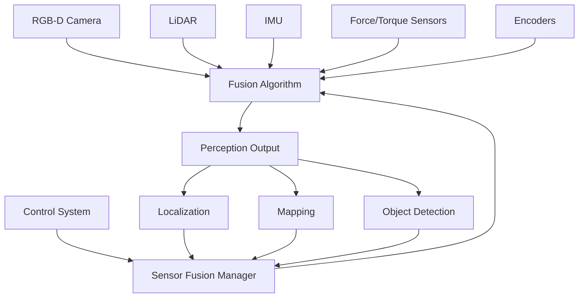

# Lesson 3: Simulated Cameras & Sensor Fusion - RGB-D Cameras, Data Fusion, Perception

## Learning Objectives

By the end of this lesson, you will be able to:
- Implement realistic RGB-D camera simulation in both Gazebo and Unity environments
- Design and implement sensor fusion algorithms combining multiple sensor inputs
- Create perception pipelines that process fused sensor data for humanoid robots
- Evaluate the accuracy and reliability of sensor fusion systems
- Apply sensor fusion techniques to improve robot localization and mapping

## Introduction

Sensor fusion is a critical technology for humanoid robots operating in complex, dynamic environments. By combining data from multiple sensors—cameras, LiDAR, IMU, force/torque sensors, and others—robots can achieve more robust and accurate perception than would be possible with any single sensor modality. This lesson explores the simulation of RGB-D cameras and the implementation of sensor fusion algorithms that enable humanoid robots to understand and navigate their environment effectively.

RGB-D cameras provide both color (RGB) and depth (D) information, making them particularly valuable for humanoid robots that need to perceive and interact with objects in 3D space. The fusion of RGB-D data with other sensor modalities creates a comprehensive understanding of the environment that enables complex manipulation and navigation tasks.

## RGB-D Camera Simulation in Gazebo

RGB-D cameras are essential sensors for humanoid robots, providing both visual and depth information that enables object recognition, scene understanding, and navigation. Gazebo provides realistic simulation of RGB-D cameras with configurable parameters that match real-world sensors.

### Camera Sensor Configuration

```xml
<!-- Simulated RGB-D camera configuration -->
<gazebo reference="rgbd_camera_link">
  <sensor name="rgbd_camera" type="depth">
    <update_rate>30</update_rate>
    <camera name="head_camera">
      <horizontal_fov>1.047</horizontal_fov> <!-- 60 degrees -->
      <image>
        <width>640</width>
        <height>480</height>
        <format>R8G8B8</format>
      </image>
      <clip>
        <near>0.1</near>
        <far>10.0</far>
      </clip>
      <noise>
        <type>gaussian</type>
        <mean>0.0</mean>
        <stddev>0.007</stddev>
      </noise>
    </camera>
    <plugin name="rgbd_camera_controller" filename="libgazebo_ros_openni_kinect.so">
      <baseline>0.2</baseline>
      <always_on>true</always_on>
      <update_rate>30.0</update_rate>
      <camera_name>camera</camera_name>
      <frame_name>camera_depth_optical_frame</frame_name>
      <point_cloud_topic>depth/points</point_cloud_topic>
      <depth_image_topic>depth/image_raw</depth_image_topic>
      <depth_image_camera_info_topic>depth/camera_info</depth_image_camera_info_topic>
      <image_topic>depth/image_rect_color</image_topic>
      <camera_info_topic>depth/camera_info</camera_info_topic>
    </plugin>
  </sensor>
</gazebo>
```

### Camera Intrinsics and Extrinsics

Proper camera calibration is essential for accurate depth estimation and 3D reconstruction:

```xml
<!-- Camera calibration parameters -->
<sensor name="calibrated_camera" type="camera">
  <camera name="calibrated_camera">
    <horizontal_fov>1.047</horizontal_fov>
    <image>
      <width>640</width>
      <height>480</height>
      <format>R8G8B8</format>
    </image>
    <clip>
      <near>0.1</near>
      <far>10.0</far>
    </clip>
    <distortion>
      <k1>0.0</k1>
      <k2>0.0</k2>
      <k3>0.0</k3>
      <p1>0.0</p1>
      <p2>0.0</p2>
      <center>320 240</center>
    </distortion>
  </camera>
</sensor>
```

### Multiple Camera Systems

For humanoid robots, multiple cameras provide enhanced perception capabilities:

```xml
<!-- Stereo camera setup -->
<link name="stereo_camera_left_link">
  <visual>
    <geometry>
      <box size="0.02 0.04 0.02"/>
    </geometry>
  </visual>
</link>

<link name="stereo_camera_right_link">
  <visual>
    <geometry>
      <box size="0.02 0.04 0.02"/>
    </geometry>
  </visual>
</link>

<joint name="stereo_left_joint" type="fixed">
  <parent link="head_link"/>
  <child link="stereo_camera_left_link"/>
  <origin xyz="0.05 0.06 0.0" rpy="0 0 0"/>
</joint>

<joint name="stereo_right_joint" type="fixed">
  <parent link="head_link"/>
  <child link="stereo_camera_right_link"/>
  <origin xyz="0.05 -0.06 0.0" rpy="0 0 0"/>
</joint>

<!-- Left camera -->
<gazebo reference="stereo_camera_left_link">
  <sensor name="stereo_left_camera" type="camera">
    <camera name="left_cam">
      <horizontal_fov>1.047</horizontal_fov>
      <image><width>640</width><height>480</height></image>
      <clip><near>0.1</near><far>10.0</far></clip>
    </camera>
    <plugin name="left_camera_controller" filename="libgazebo_ros_camera.so">
      <frame_name>stereo_camera_left_optical_frame</frame_name>
      <topic_name>stereo/left/image_raw</topic_name>
    </plugin>
  </sensor>
</gazebo>

<!-- Right camera -->
<gazebo reference="stereo_camera_right_link">
  <sensor name="stereo_right_camera" type="camera">
    <camera name="right_cam">
      <horizontal_fov>1.047</horizontal_fov>
      <image><width>640</width><height>480</height></image>
      <clip><near>0.1</near><far>10.0</far></clip>
    </camera>
    <plugin name="right_camera_controller" filename="libgazebo_ros_camera.so">
      <frame_name>stereo_camera_right_optical_frame</frame_name>
      <topic_name>stereo/right/image_raw</topic_name>
    </plugin>
  </sensor>
</gazebo>
```

## RGB-D Camera Simulation in Unity

Unity provides high-quality camera simulation capabilities that can complement Gazebo's physics-based simulation:

```csharp
using UnityEngine;
using Unity.Robotics.ROSTCPConnector;
using ROS2;
using System.Collections;

public class RGBCameraSimulator : MonoBehaviour
{
    [Header("Camera Configuration")]
    [SerializeField] private Camera rgbCamera;
    [SerializeField] private int imageWidth = 640;
    [SerializeField] private int imageHeight = 480;
    [SerializeField] private float maxDepth = 10.0f;

    [Header("ROS Topics")]
    [SerializeField] private string rgbTopic = "/camera/rgb/image_raw";
    [SerializeField] private string depthTopic = "/camera/depth/image_raw";

    private ROSConnection ros;
    private RenderTexture rgbTexture;
    private RenderTexture depthTexture;
    private Texture2D rgbTexture2D;
    private Texture2D depthTexture2D;

    void Start()
    {
        ros = ROSConnection.GetOrCreateInstance();

        SetupCameras();
        StartCoroutine(CaptureImages());
    }

    void SetupCameras()
    {
        // Create render textures for RGB and depth
        rgbTexture = new RenderTexture(imageWidth, imageHeight, 24);
        depthTexture = new RenderTexture(imageWidth, imageHeight, 24);

        rgbCamera.targetTexture = rgbTexture;
        rgbCamera.depth = -1; // Ensure it renders after other cameras

        // Set up depth camera (using Unity's depth buffer)
        GameObject depthCameraGO = new GameObject("Depth Camera");
        depthCameraGO.transform.SetParent(transform);
        depthCameraGO.transform.localPosition = Vector3.zero;
        depthCameraGO.transform.localRotation = Quaternion.identity;

        Camera depthCamera = depthCameraGO.AddComponent<Camera>();
        depthCamera.CopyFrom(rgbCamera);
        depthCamera.targetTexture = depthTexture;
        depthCamera.depth = -1;
        depthCamera.clearFlags = CameraClearFlags.SolidColor;
        depthCamera.backgroundColor = Color.white; // Far depth = white = max distance
    }

    IEnumerator CaptureImages()
    {
        while (true)
        {
            yield return new WaitForEndOfFrame();

            // Capture RGB image
            RenderTexture.active = rgbTexture;
            if (rgbTexture2D == null)
                rgbTexture2D = new Texture2D(imageWidth, imageHeight, TextureFormat.RGB24, false);
            rgbTexture2D.ReadPixels(new Rect(0, 0, imageWidth, imageHeight), 0, 0);
            rgbTexture2D.Apply();

            // Capture depth image
            RenderTexture.active = depthTexture;
            if (depthTexture2D == null)
                depthTexture2D = new Texture2D(imageWidth, imageHeight, TextureFormat.RGB24, false);
            depthTexture2D.ReadPixels(new Rect(0, 0, imageWidth, imageHeight), 0, 0);
            depthTexture2D.Apply();

            // Convert and publish to ROS
            PublishImages();
        }
    }

    void PublishImages()
    {
        // Convert Texture2D to ROS Image message format
        byte[] rgbData = rgbTexture2D.EncodeToJPG();

        // Create and publish RGB image message
        var rgbMsg = new Sensor_msgs.Image();
        rgbMsg.header = new Std_msgs.Header();
        rgbMsg.header.frame_id = "camera_rgb_optical_frame";
        rgbMsg.height = (uint)imageHeight;
        rgbMsg.width = (uint)imageWidth;
        rgbMsg.encoding = "rgb8";
        rgbMsg.is_bigendian = 0;
        rgbMsg.step = (uint)(imageWidth * 3); // 3 bytes per pixel
        rgbMsg.data = rgbData;

        ros.Publish(rgbTopic, rgbMsg);

        // For depth, we would need to convert the depth buffer properly
        // This is a simplified example
        byte[] depthData = depthTexture2D.EncodeToEXR(); // Better for depth data

        var depthMsg = new Sensor_msgs.Image();
        depthMsg.header = new Std_msgs.Header();
        depthMsg.header.frame_id = "camera_depth_optical_frame";
        depthMsg.height = (uint)imageHeight;
        depthMsg.width = (uint)imageWidth;
        depthMsg.encoding = "32FC1"; // 32-bit float per pixel
        depthMsg.is_bigendian = 0;
        depthMsg.step = (uint)(imageWidth * 4); // 4 bytes per float
        depthMsg.data = depthData;

        ros.Publish(depthTopic, depthMsg);
    }
}
```

## Sensor Fusion Fundamentals

Sensor fusion combines data from multiple sensors to produce more accurate, reliable, and comprehensive information than could be achieved by using a single sensor. For humanoid robots, effective sensor fusion is essential for robust perception and navigation.

### Kalman Filter for Sensor Fusion

The Kalman filter is a widely used algorithm for sensor fusion, particularly for combining data from sensors with different characteristics:

```python
import numpy as np

class KalmanFilter:
    def __init__(self, dt, n_states, n_obs):
        self.dt = dt
        self.n_states = n_states  # Number of state variables
        self.n_obs = n_obs        # Number of observations

        # State transition matrix (for constant velocity model)
        self.F = np.eye(n_states)
        for i in range(n_states//2):
            self.F[i, i + n_states//2] = dt

        # Observation matrix
        self.H = np.zeros((n_obs, n_states))
        for i in range(n_obs):
            self.H[i, i] = 1.0

        # Process noise covariance
        self.Q = np.eye(n_states) * 0.1

        # Observation noise covariance
        self.R = np.eye(n_obs) * 1.0

        # Error covariance matrix
        self.P = np.eye(n_states)

        # State vector
        self.x = np.zeros(n_states)

    def predict(self):
        """Prediction step"""
        self.x = self.F @ self.x
        self.P = self.F @ self.P @ self.F.T + self.Q
        return self.x

    def update(self, z):
        """Update step with observation z"""
        # Innovation
        y = z - self.H @ self.x

        # Innovation covariance
        S = self.H @ self.P @ self.H.T + self.R

        # Kalman gain
        K = self.P @ self.H.T @ np.linalg.inv(S)

        # Update state and covariance
        self.x = self.x + K @ y
        self.P = (np.eye(self.n_states) - K @ self.H) @ self.P

        return self.x

# Example usage for fusing IMU and camera data
class RobotPoseEstimator:
    def __init__(self):
        # State: [x, y, z, vx, vy, vz] - position and velocity
        self.kf = KalmanFilter(dt=0.01, n_states=6, n_obs=3)  # 3D position

    def update_with_camera(self, camera_pos):
        """Update with camera-based position estimate"""
        self.kf.update(np.array(camera_pos))

    def update_with_imu(self, acceleration, dt):
        """Update with IMU-based velocity estimate"""
        # Integrate acceleration to get velocity change
        vel_change = np.array(acceleration) * dt
        current_vel = self.kf.x[3:6]  # Current velocity
        new_vel = current_vel + vel_change

        # Update state with new velocity
        self.kf.x[3:6] = new_vel

        # Predict next position
        self.kf.x[:3] += new_vel * self.kf.dt

        return self.kf.x[:3]  # Return position estimate
```

### Particle Filter for Non-linear Systems

For non-linear systems, particle filters provide a robust alternative to Kalman filters:

```python
import numpy as np
import random

class ParticleFilter:
    def __init__(self, n_particles, state_dim, process_noise, measurement_noise):
        self.n_particles = n_particles
        self.state_dim = state_dim
        self.process_noise = process_noise
        self.measurement_noise = measurement_noise

        # Initialize particles randomly
        self.particles = np.random.randn(n_particles, state_dim)
        self.weights = np.ones(n_particles) / n_particles

    def predict(self, control_input):
        """Predict step: move particles according to motion model"""
        # Add process noise to each particle
        noise = np.random.normal(0, self.process_noise, self.particles.shape)
        self.particles += noise

        # Apply motion model (simplified)
        self.particles[:, :3] += control_input[:3]  # Position update
        self.particles[:, 3:] += control_input[3:]  # Velocity update

    def update(self, measurement):
        """Update step: weight particles based on measurement likelihood"""
        # Calculate likelihood of each particle given measurement
        for i in range(self.n_particles):
            # Calculate distance between particle and measurement
            particle_meas = self.particles[i, :len(measurement)]
            diff = measurement - particle_meas

            # Calculate likelihood (Gaussian)
            likelihood = np.exp(-0.5 * np.sum(diff**2) / self.measurement_noise**2)
            self.weights[i] *= likelihood

        # Normalize weights
        self.weights += 1e-300  # Avoid division by zero
        self.weights /= np.sum(self.weights)

    def resample(self):
        """Resample particles based on weights"""
        # Systematic resampling
        indices = []
        cumulative_sum = np.cumsum(self.weights)
        u = np.random.uniform(0, 1/self.n_particles)

        i = 0
        for j in range(self.n_particles):
            while cumulative_sum[i] < u:
                i += 1
            indices.append(i)
            u += 1/self.n_particles

        self.particles = self.particles[indices]
        self.weights = np.ones(self.n_particles) / self.n_particles

    def estimate(self):
        """Get state estimate as weighted average of particles"""
        return np.average(self.particles, axis=0, weights=self.weights)
```

## Multi-Sensor Fusion Architecture

For humanoid robots, a typical sensor fusion architecture combines multiple sensor types:



*Figure 1: Multi-sensor fusion architecture for humanoid robot perception.*

### ROS-based Sensor Fusion Node

```python
#!/usr/bin/env python3

import rclpy
from rclpy.node import Node
from sensor_msgs.msg import Image, PointCloud2, Imu, JointState
from geometry_msgs.msg import PoseStamped
from std_msgs.msg import Header
import numpy as np
from scipy.spatial.transform import Rotation as R

class SensorFusionNode(Node):
    def __init__(self):
        super().__init__('sensor_fusion_node')

        # Subscribers for different sensors
        self.rgb_sub = self.create_subscription(
            Image, '/camera/rgb/image_raw', self.rgb_callback, 10)
        self.depth_sub = self.create_subscription(
            Image, '/camera/depth/image_raw', self.depth_callback, 10)
        self.imu_sub = self.create_subscription(
            Imu, '/imu/data', self.imu_callback, 10)
        self.joint_sub = self.create_subscription(
            JointState, '/joint_states', self.joint_callback, 10)

        # Publisher for fused data
        self.pose_pub = self.create_publisher(PoseStamped, '/robot_pose', 10)
        self.fused_cloud_pub = self.create_publisher(PointCloud2, '/fused_pointcloud', 10)

        # Internal state
        self.latest_rgb = None
        self.latest_depth = None
        self.latest_imu = None
        self.latest_joints = None

        # Timer for fusion processing
        self.timer = self.create_timer(0.033, self.fusion_callback)  # 30Hz

    def rgb_callback(self, msg):
        self.latest_rgb = msg
        self.process_sensor_data('rgb', msg)

    def depth_callback(self, msg):
        self.latest_depth = msg
        self.process_sensor_data('depth', msg)

    def imu_callback(self, msg):
        self.latest_imu = msg
        self.process_sensor_data('imu', msg)

    def joint_callback(self, msg):
        self.latest_joints = msg
        self.process_sensor_data('joints', msg)

    def process_sensor_data(self, sensor_type, msg):
        """Process incoming sensor data"""
        # Convert sensor data to internal representation
        if sensor_type == 'imu':
            # Extract orientation and angular velocity
            orientation = np.array([
                msg.orientation.x,
                msg.orientation.y,
                msg.orientation.z,
                msg.orientation.w
            ])

            angular_vel = np.array([
                msg.angular_velocity.x,
                msg.angular_velocity.y,
                msg.angular_velocity.z
            ])

            # Store processed data
            self.imu_data = {
                'orientation': orientation,
                'angular_vel': angular_vel,
                'linear_acc': np.array([
                    msg.linear_acceleration.x,
                    msg.linear_acceleration.y,
                    msg.linear_acceleration.z
                ])
            }

    def fusion_callback(self):
        """Main fusion processing callback"""
        if all(data is not None for data in
               [self.latest_rgb, self.latest_depth, self.latest_imu, self.latest_joints]):

            # Perform sensor fusion
            fused_pose = self.perform_fusion()

            # Publish results
            pose_msg = PoseStamped()
            pose_msg.header = Header()
            pose_msg.header.stamp = self.get_clock().now().to_msg()
            pose_msg.header.frame_id = 'map'
            pose_msg.pose.position.x = fused_pose[0]
            pose_msg.pose.position.y = fused_pose[1]
            pose_msg.pose.position.z = fused_pose[2]

            self.pose_pub.publish(pose_msg)

    def perform_fusion(self):
        """Perform the actual sensor fusion"""
        # This is where the fusion algorithm would be implemented
        # For example, using a Kalman filter, particle filter, or other method

        # Placeholder: simple weighted average of available data
        pose_estimate = np.zeros(3)

        # Process IMU data for orientation
        if hasattr(self, 'imu_data'):
            # Integrate IMU data for position estimate
            # This is a simplified example
            pass

        # Process camera data for visual odometry
        # Process LiDAR data for localization
        # Combine all estimates with appropriate weights

        return pose_estimate

def main(args=None):
    rclpy.init(args=args)
    node = SensorFusionNode()
    rclpy.spin(node)
    node.destroy_node()
    rclpy.shutdown()

if __name__ == '__main__':
    main()
```

## Perception Pipeline Integration

A complete perception pipeline integrates sensor fusion with higher-level perception tasks:

```python
import cv2
import numpy as np
from scipy.spatial import KDTree
import open3d as o3d

class PerceptionPipeline:
    def __init__(self):
        self.camera_intrinsics = None
        self.fusion_estimator = None
        self.object_detector = None
        self.scene_segmenter = None

    def process_rgbd_data(self, rgb_image, depth_image):
        """Process RGB-D data through the perception pipeline"""
        # Convert depth image to point cloud
        point_cloud = self.depth_to_pointcloud(depth_image, self.camera_intrinsics)

        # Apply sensor fusion for pose estimation
        robot_pose = self.fusion_estimator.estimate_pose()

        # Detect objects in the scene
        objects = self.detect_objects(rgb_image, point_cloud)

        # Segment the scene into navigable and non-navigable areas
        navigable_areas = self.segment_scene(point_cloud, robot_pose)

        return {
            'objects': objects,
            'navigable_areas': navigable_areas,
            'robot_pose': robot_pose,
            'point_cloud': point_cloud
        }

    def depth_to_pointcloud(self, depth_image, intrinsics):
        """Convert depth image to 3D point cloud"""
        height, width = depth_image.shape
        cx, cy = intrinsics['cx'], intrinsics['cy']
        fx, fy = intrinsics['fx'], intrinsics['fy']

        # Generate coordinate grids
        x_grid, y_grid = np.meshgrid(np.arange(width), np.arange(height))

        # Convert to 3D coordinates
        x_3d = (x_grid - cx) * depth_image / fx
        y_3d = (y_grid - cy) * depth_image / fy
        z_3d = depth_image

        # Stack to create point cloud
        points = np.stack([x_3d, y_3d, z_3d], axis=-1)

        # Remove invalid points (where depth is 0 or invalid)
        valid_mask = (z_3d > 0) & (z_3d < 10.0)  # Valid depth range
        valid_points = points[valid_mask]

        return valid_points

    def detect_objects(self, rgb_image, point_cloud):
        """Detect and classify objects in the scene"""
        # Apply object detection to RGB image
        detections = self.object_detector.detect(rgb_image)

        # Associate 3D points with detected objects
        objects = []
        for detection in detections:
            # Get 3D bounding box from point cloud
            bbox_3d = self.get_3d_bbox(detection, point_cloud)

            objects.append({
                'class': detection['class'],
                'confidence': detection['confidence'],
                'bbox_2d': detection['bbox'],
                'bbox_3d': bbox_3d,
                'centroid': np.mean(bbox_3d, axis=0)
            })

        return objects

    def segment_scene(self, point_cloud, robot_pose):
        """Segment scene into navigable and non-navigable areas"""
        # Create KDTree for efficient nearest neighbor search
        tree = KDTree(point_cloud)

        # Define navigable area around robot
        robot_pos = robot_pose[:3]  # Assuming pose is [x, y, z, ...]

        # Find ground plane using RANSAC
        ground_plane = self.estimate_ground_plane(point_cloud)

        # Segment point cloud into ground, obstacles, and free space
        ground_points = self.filter_ground_points(point_cloud, ground_plane)
        obstacle_points = self.filter_obstacle_points(point_cloud, ground_plane)

        return {
            'ground': ground_points,
            'obstacles': obstacle_points,
            'free_space': self.estimate_free_space(obstacle_points)
        }

    def estimate_ground_plane(self, point_cloud, distance_threshold=0.05):
        """Estimate ground plane using RANSAC"""
        pcd = o3d.geometry.PointCloud()
        pcd.points = o3d.utility.Vector3dVector(point_cloud)

        plane_model, inliers = pcd.segment_plane(
            distance_threshold=distance_threshold,
            ransac_n=3,
            num_iterations=1000
        )

        return plane_model
```

## Hands-on Exercise 2.3: Implement a Simple Sensor Fusion System

Create a ROS 2 package that implements a basic sensor fusion system:

1. Create a new package:
```bash
cd ~/ros2_ws/src
ros2 pkg create --build-type ament_python sensor_fusion_tutorial
```

2. Create the sensor fusion node `sensor_fusion_tutorial/sensor_fusion_tutorial/fusion_node.py`:

```python
#!/usr/bin/env python3

import rclpy
from rclpy.node import Node
from sensor_msgs.msg import Imu, Range, JointState
from geometry_msgs.msg import Vector3Stamped, PoseWithCovarianceStamped
from std_msgs.msg import Float64
import numpy as np
from filterpy.kalman import KalmanFilter
from filterpy.common import Q_discrete_white_noise

class SimpleSensorFusion(Node):
    def __init__(self):
        super().__init__('simple_sensor_fusion')

        # Initialize Kalman filter for position estimation
        # State: [x, vx, y, vy, z, vz] - position and velocity in 3D
        self.kf = KalmanFilter(dim_x=6, dim_z=3)

        # State transition matrix (constant velocity model)
        dt = 0.05  # 20Hz update rate
        self.kf.F = np.array([
            [1, dt, 0, 0, 0, 0],
            [0, 1, 0, 0, 0, 0],
            [0, 0, 1, dt, 0, 0],
            [0, 0, 0, 1, 0, 0],
            [0, 0, 0, 0, 1, dt],
            [0, 0, 0, 0, 0, 1]
        ])

        # Measurement function (we can only measure position)
        self.kf.H = np.array([
            [1, 0, 0, 0, 0, 0],
            [0, 0, 1, 0, 0, 0],
            [0, 0, 0, 0, 1, 0]
        ])

        # Covariance matrices
        self.kf.P *= 100  # Initial uncertainty
        self.kf.R = np.eye(3) * 0.1  # Measurement noise
        self.kf.Q = Q_discrete_white_noise(dim=2, dt=dt, var=0.1, block_size=3)

        # Subscriptions
        self.imu_sub = self.create_subscription(
            Imu, '/imu/data', self.imu_callback, 10)
        self.range_sub = self.create_subscription(
            Range, '/range_finder', self.range_callback, 10)
        self.joint_sub = self.create_subscription(
            JointState, '/joint_states', self.joint_callback, 10)

        # Publisher for fused estimate
        self.pose_pub = self.create_publisher(
            PoseWithCovarianceStamped, '/fused_pose', 10)

        # Timer for fusion update
        self.timer = self.create_timer(0.05, self.fusion_update)

        # Sensor data storage
        self.latest_imu = None
        self.latest_range = None
        self.latest_joints = None

        self.get_logger().info('Simple Sensor Fusion Node Started')

    def imu_callback(self, msg):
        self.latest_imu = msg

    def range_callback(self, msg):
        self.latest_range = msg

    def joint_callback(self, msg):
        self.latest_joints = msg

    def fusion_update(self):
        """Main fusion update loop"""
        if self.latest_imu is not None:
            # Extract linear acceleration from IMU
            acc = np.array([
                self.latest_imu.linear_acceleration.x,
                self.latest_imu.linear_acceleration.y,
                self.latest_imu.linear_acceleration.z
            ])

            # Predict state using IMU data
            self.kf.predict()

            # If we have range data, use it as measurement
            if self.latest_range is not None:
                # Convert range to z-position (simplified)
                z_pos = self.latest_range.range
                measurement = np.array([0, 0, z_pos])  # Only using z from range

                # Update filter with measurement
                self.kf.update(measurement)

        # Publish current estimate
        self.publish_estimate()

    def publish_estimate(self):
        """Publish the current state estimate"""
        msg = PoseWithCovarianceStamped()
        msg.header.stamp = self.get_clock().now().to_msg()
        msg.header.frame_id = 'map'

        # Fill pose with current estimate
        state = self.kf.x
        msg.pose.pose.position.x = float(state[0])
        msg.pose.pose.position.y = float(state[2])
        msg.pose.pose.position.z = float(state[4])

        # Fill covariance matrix
        cov_matrix = self.kf.P.flatten().tolist()
        msg.pose.covariance = cov_matrix

        self.pose_pub.publish(msg)

def main(args=None):
    rclpy.init(args=args)
    node = SimpleSensorFusion()
    rclpy.spin(node)
    node.destroy_node()
    rclpy.shutdown()

if __name__ == '__main__':
    main()
```

3. Test the fusion system with simulated sensors:
```bash
# Terminal 1: Start the fusion node
ros2 run sensor_fusion_tutorial fusion_node

# Terminal 2: Publish simulated IMU data
ros2 topic pub /imu/data sensor_msgs/msg/Imu '{linear_acceleration: {x: 0.1, y: 0.0, z: 9.8}, angular_velocity: {x: 0.0, y: 0.0, z: 0.0}, orientation: {w: 1.0}}' -r 20

# Terminal 3: Publish simulated range data
ros2 topic pub /range_finder sensor_msgs/msg/Range '{radiation_type: 0, field_of_view: 0.1, min_range: 0.0, max_range: 10.0, range: 1.5}' -r 10
```

## Key Takeaways

- **RGB-D cameras** provide both color and depth information essential for 3D scene understanding
- **Sensor fusion algorithms** (Kalman filters, particle filters) combine multiple sensor inputs for robust perception
- **Multi-sensor architectures** integrate data from cameras, LiDAR, IMU, and other sensors
- **Perception pipelines** process fused sensor data for higher-level tasks like object detection and scene segmentation
- **Real-time performance** requires careful optimization of fusion algorithms and data processing

## Reflection Questions

1. How does the accuracy of sensor fusion compare to individual sensors in different environmental conditions?
2. What are the computational requirements for real-time sensor fusion on humanoid robot platforms?
3. How can sensor fusion algorithms be made robust to sensor failures or outliers?
4. What role does sensor calibration play in the effectiveness of fusion systems?

## APA Citations

Siciliano, B., & Khatib, O. (Eds.). (2016). *Springer handbook of robotics* (2nd ed.). Springer.

Thrun, S., Burgard, W., & Fox, D. (2005). *Probabilistic robotics*. MIT Press.

Murphy, K. P. (2012). *Machine learning: A probabilistic perspective*. MIT Press.

## Summary

This lesson covered the simulation of RGB-D cameras and the implementation of sensor fusion techniques for humanoid robots. We explored camera simulation in both Gazebo and Unity, learned about Kalman and particle filters for sensor fusion, and implemented a complete perception pipeline. Sensor fusion is essential for humanoid robots to achieve robust perception in complex environments by combining multiple sensor modalities effectively.

In the next module, we'll explore NVIDIA Isaac Sim for photorealistic simulation and Isaac ROS for hardware-accelerated perception, building on the digital twin concepts we've learned in this module.