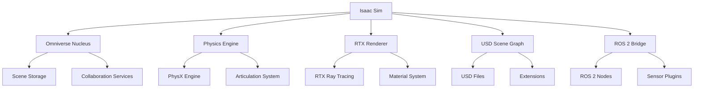

# Lesson 1: Isaac Sim Basics - RTX Rendering, Articulations, USD Format, Synthetic Data

## Learning Objectives

By the end of this lesson, you will be able to:
- Navigate and utilize the NVIDIA Isaac Sim interface for humanoid robot simulation
- Configure RTX rendering for photorealistic visualization and synthetic data generation
- Create and manipulate complex articulation systems for humanoid robots
- Work with USD (Universal Scene Description) format for scene composition
- Generate synthetic training data for perception models using Isaac Sim

## Introduction

NVIDIA Isaac Sim represents a revolutionary approach to robotics simulation, leveraging the power of RTX GPUs to create photorealistic environments and synthetic data for training AI models. For humanoid robots, Isaac Sim provides the capability to generate realistic sensor data, test complex behaviors in diverse environments, and accelerate the development of perception and control systems through synthetic data generation.

Isaac Sim is built on NVIDIA's Omniverse platform, which uses the Universal Scene Description (USD) format as its native scene representation. This enables complex scene composition, collaboration, and interchange between different tools and systems. The platform's RTX rendering capabilities provide physically accurate lighting, materials, and effects that closely match real-world conditions, making it ideal for synthetic data generation and perception system development.

## Isaac Sim Architecture and Components

Isaac Sim is built on NVIDIA's Omniverse platform and consists of several key components that work together to provide a comprehensive simulation environment:

### Core Architecture



*Figure 1: Isaac Sim architecture showing the core components and their relationships.*

### Omniverse Nucleus

Omniverse Nucleus serves as the central server for Isaac Sim, managing scene storage, collaboration services, and multi-user access. It enables real-time collaboration between multiple users and tools, allowing for complex scene composition and shared simulation environments.

### Physics Engine

Isaac Sim utilizes NVIDIA's PhysX engine for physics simulation, providing accurate collision detection, contact resolution, and articulation dynamics. The physics engine is optimized for complex robotic systems with many degrees of freedom, making it ideal for humanoid robot simulation.

## RTX Rendering and Photorealism

NVIDIA Isaac Sim leverages RTX technology to provide photorealistic rendering capabilities that are essential for synthetic data generation and perception system development.

### RTX Ray Tracing

RTX ray tracing provides physically accurate lighting simulation by tracing the path of light rays through the scene. This enables realistic effects such as:

- Global illumination
- Accurate shadows and reflections
- Physically-based materials
- Depth of field and motion blur

```python
# Example of configuring RTX rendering in Isaac Sim
import omni
from omni.isaac.core import World
from omni.isaac.core.utils.stage import add_reference_to_stage
from omni.isaac.core.utils.prims import get_prim_at_path
from pxr import Gf, UsdLux, UsdGeom

def setup_rtx_rendering():
    # Enable RTX rendering
    omni.kit.commands.execute(
        "ChangeSetting",
        path="/rtx/quality/raytracing/enable",
        value=True
    )

    # Configure rendering quality settings
    omni.kit.commands.execute(
        "ChangeSetting",
        path="/rtx/quality/level",
        value=2  # High quality
    )

    # Enable denoising for faster rendering
    omni.kit.commands.execute(
        "ChangeSetting",
        path="/rtx/raytracing/denoise/enable",
        value=True
    )
```

### Material System

The material system in Isaac Sim supports Physically Based Rendering (PBR) materials with realistic properties:

```usd
# USD material definition example
def Material "RobotMaterial"
{
    def Shader "diffuse_shader" (
        info:id = "OmniPBR"
    )
    {
        uniform token info:types = ["bsdf"]
        color3f inputs:diffuse_tint = (0.8, 0.8, 0.8)
        float inputs:metallic = 0.7
        float inputs:roughness = 0.2
        float inputs:clearcoat = 0.5
        float inputs:clearcoat_roughness = 0.1
    }

    token outputs:surface
}
```

### Synthetic Data Generation

RTX rendering enables high-quality synthetic data generation for training perception models:

```python
# Example synthetic data generation pipeline
from omni.isaac.synthetic_utils import SyntheticDataHelper
import numpy as np

class SyntheticDataGenerator:
    def __init__(self, world):
        self.world = world
        self.sd_helper = SyntheticDataHelper()
        self.sd_helper.initialize(sensor_names=["camera", "lidar"])

    def generate_dataset(self, num_samples=1000, output_dir="synthetic_data"):
        for i in range(num_samples):
            # Randomize scene
            self.randomize_scene()

            # Capture sensor data
            rgb_image = self.sd_helper.get_rgb_data("camera")
            depth_image = self.sd_helper.get_depth_data("camera")
            segmentation = self.sd_helper.get_segmentation_data("camera")

            # Save data with ground truth
            self.save_sample(rgb_image, depth_image, segmentation, i, output_dir)

            # Move to next sample
            self.world.step(render=True)

    def randomize_scene(self):
        # Randomize object positions, lighting, materials
        # This creates diverse training data
        pass

    def save_sample(self, rgb, depth, seg, index, output_dir):
        # Save RGB, depth, and segmentation data
        # Include metadata and ground truth annotations
        pass
```

## USD (Universal Scene Description) Format

USD is the native scene description format for Isaac Sim, providing a powerful and flexible way to compose complex scenes.

### USD Fundamentals

USD (Universal Scene Description) is Pixar's scene description format that enables:

- **Scene Composition**: Building complex scenes from modular components
- **Layering**: Combining multiple scene layers with different levels of detail
- **Instancing**: Efficiently representing multiple copies of the same object
- **Variant Sets**: Managing different configurations of the same scene element

### USD Structure for Robotics

```usd
# Example USD file for a humanoid robot
# humanoid.usd

def Xform "HumanoidRobot"
{
    def Xform "Torso"
    {
        def Sphere "Body"
        {
            double radius = 0.15
            color3f xformOp:translate = (0, 0, 0.5)
        }

        def Xform "Head"
        {
            double radius = 0.1
            color3f xformOp:translate = (0, 0, 0.75)
        }
    }

    def Xform "LeftArm"
    {
        def Xform "UpperArm"
        {
            color3f xformOp:translate = (0.3, 0, 0.4)
        }

        def Xform "LowerArm"
        {
            color3f xformOp:translate = (0.5, 0, 0.4)
        }
    }

    def Xform "RightArm"
    {
        def Xform "UpperArm"
        {
            color3f xformOp:translate = (-0.3, 0, 0.4)
        }

        def Xform "LowerArm"
        {
            color3f xformOp:translate = (-0.5, 0, 0.4)
        }
    }
}
```

### Working with USD in Isaac Sim

```python
# Python API for working with USD in Isaac Sim
from pxr import Usd, UsdGeom, Sdf, Gf
from omni.isaac.core.utils.stage import add_reference_to_stage
from omni.isaac.core.utils.prims import get_prim_at_path, define_prim
import omni

def create_robot_scene():
    # Get the current stage
    stage = omni.usd.get_context().get_stage()

    # Create a robot prim
    robot_prim = UsdGeom.Xform.Define(stage, "/World/HumanoidRobot")

    # Add robot components
    torso_prim = UsdGeom.Xform.Define(stage, "/World/HumanoidRobot/Torso")
    head_prim = UsdGeom.Sphere.Define(stage, "/World/HumanoidRobot/Torso/Head")

    # Set properties
    head_prim.GetRadiusAttr().Set(0.1)

    # Create articulation joints
    create_articulation_joints(stage)

def create_articulation_joints(stage):
    # Import articulation schemas
    from omni.isaac.core.utils.prims import create_joint

    # Create revolute joints for humanoid
    create_joint(
        prim_path="/World/HumanoidRobot/Torso/NeckJoint",
        joint_type="Revolute",
        body0="/World/HumanoidRobot/Torso",
        body1="/World/HumanoidRobot/Torso/Head",
        local_joint_axis="Z"
    )
```

## Articulation System

The articulation system in Isaac Sim handles complex kinematic and dynamic relationships between robot links, essential for humanoid robots with many degrees of freedom.

### Articulation Fundamentals

Articulations in Isaac Sim represent:
- Joint constraints between rigid bodies
- Kinematic chains for robot arms and legs
- Complex mechanisms with multiple degrees of freedom
- Closed-loop kinematic chains

### Creating Articulated Robots

```python
# Creating articulated humanoid robot in Isaac Sim
from omni.isaac.core.articulations import Articulation
from omni.isaac.core.utils.nucleus import get_assets_root_path
from omni.isaac.core.utils.stage import add_reference_to_stage
import numpy as np

class HumanoidArticulation(Articulation):
    def __init__(
        self,
        prim_path: str,
        name: str = "humanoid_robot",
        usd_path: str = None,
        position: np.ndarray = np.array([0, 0, 1.0]),
        orientation: np.ndarray = np.array([0, 0, 0, 1])
    ) -> None:
        super().__init__(prim_path=prim_path, name=name,
                        position=position, orientation=orientation)

    def initialize(self, physics_sim_view=None):
        super().initialize(physics_sim_view)

        # Define joint names for humanoid
        self._joint_names = [
            "left_hip_yaw", "left_hip_roll", "left_hip_pitch",
            "left_knee", "left_ankle_pitch", "left_ankle_roll",
            "right_hip_yaw", "right_hip_roll", "right_hip_pitch",
            "right_knee", "right_ankle_pitch", "right_ankle_roll",
            "torso_yaw", "torso_pitch", "torso_roll",
            "left_shoulder_pitch", "left_shoulder_yaw", "left_shoulder_roll",
            "left_elbow", "left_wrist_pitch", "left_wrist_yaw",
            "right_shoulder_pitch", "right_shoulder_yaw", "right_shoulder_roll",
            "right_elbow", "right_wrist_pitch", "right_wrist_yaw"
        ]

        # Get joint handles
        self._joint_indices = self.get_dof_index(self._joint_names)

    def set_joint_positions(self, positions, joint_indices=None):
        """Set joint positions for the humanoid robot"""
        if joint_indices is None:
            joint_indices = self._joint_indices
        super().set_j positions(positions, joint_indices=joint_indices)

    def get_joint_positions(self):
        """Get current joint positions"""
        return super().get_j positions()

# Example usage
def create_humanoid_robot():
    # Create the robot in the scene
    robot = HumanoidArticulation(
        prim_path="/World/HumanoidRobot",
        name="humanoid",
        position=np.array([0, 0, 1.0])
    )

    # Add to world
    world.scene.add(robot)

    # Initialize after physics is initialized
    world.reset()
    robot.initialize(world.physics_sim_view)

    return robot
```

### Articulation Drive Properties

```python
# Configuring joint drives for realistic movement
from omni.isaac.core.utils.prims import get_prim_at_path
from pxr import PhysxSchema, UsdPhysics

def configure_joint_drives(robot_articulation):
    """Configure joint drives for realistic humanoid movement"""

    # Access each joint and configure drive properties
    for joint_name in robot_articulation._joint_names:
        joint_path = f"{robot_articulation.prim_path}/{joint_name}"
        joint_prim = get_prim_at_path(joint_path)

        # Set up joint drives
        if "hip" in joint_name or "knee" in joint_name or "ankle" in joint_name:
            # Leg joints - higher stiffness for support
            stiffness = 1000.0
            damping = 100.0
        else:
            # Arm joints - lower stiffness for flexibility
            stiffness = 500.0
            damping = 50.0

        # Apply drive properties
        joint_prim.GetAttribute("drive:position:stiffness").Set(stiffness)
        joint_prim.GetAttribute("drive:position:damping").Set(damping)
        joint_prim.GetAttribute("drive:position:target").Set(0.0)  # Default position
```

## Synthetic Data Generation Pipeline

Synthetic data generation is one of Isaac Sim's key strengths, enabling the creation of large, diverse datasets for training perception models.

### Camera Setup for Synthetic Data

```python
# Setting up cameras for synthetic data generation
from omni.isaac.sensor import Camera
import carb

class SyntheticDataCamera:
    def __init__(self, prim_path, resolution=(640, 480)):
        self.resolution = resolution

        # Create camera
        self.camera = Camera(
            prim_path=prim_path,
            frequency=30,
            resolution=self.resolution
        )

        # Configure camera properties for photorealism
        self.configure_camera()

    def configure_camera(self):
        # Set camera intrinsics
        self.camera.focal_length = 24.0  # mm
        self.camera.focus_distance = 100.0  # mm
        self.camera.horizontal_aperture = 36.0  # mm

        # Enable depth of field for realism
        self.camera.enable_dof = True
        self.camera.f_stop = 1.4

        # Add sensor noise for realism
        self.camera.add_noise_to_frame = True
        self.camera.noise_mean = 0.0
        self.camera.noise_std = 0.01

    def capture_synthetic_data(self):
        """Capture RGB, depth, and segmentation data"""
        # Get RGB image
        rgb_data = self.camera.get_rgb()

        # Get depth data
        depth_data = self.camera.get_depth()

        # Get segmentation data
        seg_data = self.camera.get_semantic_segmentation()

        return {
            'rgb': rgb_data,
            'depth': depth_data,
            'segmentation': seg_data,
            'camera_pose': self.camera.get_world_pose()
        }
```

### Data Randomization

```python
# Randomization for diverse synthetic data
import random
import numpy as np

class SceneRandomizer:
    def __init__(self, world):
        self.world = world
        self.object_categories = [
            "furniture", "electronics", "kitchen", "office", "decor"
        ]
        self.lighting_conditions = ["indoor", "outdoor", "dusk", "night"]
        self.material_variants = ["metal", "plastic", "wood", "fabric", "glass"]

    def randomize_environment(self):
        """Randomize environment for synthetic data diversity"""

        # Randomize object positions
        self.randomize_object_positions()

        # Randomize lighting
        self.randomize_lighting()

        # Randomize materials
        self.randomize_materials()

        # Randomize weather conditions
        self.randomize_weather()

    def randomize_object_positions(self):
        """Randomize positions of objects in the scene"""
        # Get all movable objects in the scene
        objects = self.get_movable_objects()

        for obj in objects:
            # Random position within bounds
            x = random.uniform(-5, 5)
            y = random.uniform(-5, 5)
            z = random.uniform(0.1, 2.0)

            # Random rotation
            rot_x = random.uniform(-15, 15)
            rot_y = random.uniform(-180, 180)
            rot_z = random.uniform(-15, 15)

            obj.set_world_pose(
                position=np.array([x, y, z]),
                orientation=self.euler_to_quaternion([rot_x, rot_y, rot_z])
            )

    def randomize_lighting(self):
        """Randomize lighting conditions"""
        # Randomize sun position and intensity
        sun_prim = get_prim_at_path("/World/Light/Sun")

        # Random sun direction
        azimuth = random.uniform(0, 360)
        elevation = random.uniform(10, 80)

        # Convert to Cartesian coordinates
        x = np.cos(np.radians(azimuth)) * np.cos(np.radians(elevation))
        y = np.sin(np.radians(azimuth)) * np.cos(np.radians(elevation))
        z = np.sin(np.radians(elevation))

        sun_prim.GetAttribute("xformOp:translate").Set(Gf.Vec3d(x*10, y*10, z*10))

        # Randomize intensity
        intensity = random.uniform(500, 1500)
        sun_prim.GetAttribute("inputs:intensity").Set(intensity)

    def get_movable_objects(self):
        """Get list of movable objects in the scene"""
        # Implementation to find movable objects
        # This would depend on your specific scene setup
        pass

    def euler_to_quaternion(self, euler):
        """Convert Euler angles to quaternion"""
        # Implementation of Euler to quaternion conversion
        pass
```

## Performance Optimization

For complex humanoid simulations in Isaac Sim, performance optimization is crucial:

### Level of Detail Management

```python
# LOD management for complex humanoid robots
class LODManager:
    def __init__(self, robot_articulation):
        self.robot = robot_articulation
        self.lod_distances = [1.0, 3.0, 6.0, 10.0]  # Distance thresholds
        self.current_lod = 0

    def update_lod(self, camera_distance):
        """Update level of detail based on camera distance"""
        new_lod = 0
        for i, dist in enumerate(self.lod_distances):
            if camera_distance > dist:
                new_lod = i + 1
            else:
                break

        if new_lod != self.current_lod:
            self.set_lod_level(new_lod)
            self.current_lod = new_lod

    def set_lod_level(self, lod_level):
        """Apply LOD level to robot geometry"""
        # Simplify geometry based on LOD level
        # Reduce polygon count, hide details, etc.
        pass
```

### Physics Optimization

```python
# Physics optimization for humanoid robots
def optimize_physics_for_humanoid(robot_articulation):
    """Optimize physics properties for humanoid robot"""

    # Adjust solver iterations based on complexity
    physx_scene = robot_articulation._physics_view._physx_scene
    physx_scene.SetSolverType(0)  # PGS solver
    physx_scene.SetSolverPositionIterationCount(8)  # Position iterations
    physx_scene.SetSolverVelocityIterationCount(1)  # Velocity iterations

    # Adjust contact properties
    for link_name in robot_articulation._links:
        link_prim = get_prim_at_path(f"{robot_articulation.prim_path}/{link_name}")

        # Set appropriate friction values
        if "foot" in link_name:
            # Higher friction for feet to prevent slipping
            link_prim.GetAttribute("physics:staticFriction").Set(0.8)
            link_prim.GetAttribute("physics:dynamicFriction").Set(0.7)
        elif "hand" in link_name:
            # Moderate friction for manipulation
            link_prim.GetAttribute("physics:staticFriction").Set(0.5)
            link_prim.GetAttribute("physics:dynamicFriction").Set(0.4)
```

## Hands-on Exercise 3.1: Create a Photorealistic Isaac Sim Environment

Create a complete Isaac Sim environment with a humanoid robot and generate synthetic training data:

1. **Setup Isaac Sim Environment**:
   - Launch Isaac Sim
   - Create a new stage
   - Configure RTX rendering settings

2. **Create Humanoid Robot**:
   ```python
   # Basic humanoid robot creation script
   import omni
   from omni.isaac.core import World
   from omni.isaac.core.utils.stage import add_reference_to_stage
   from omni.isaac.core.utils.nucleus import get_assets_root_path
   import numpy as np

   # Create world
   world = World(stage_units_in_meters=1.0)

   # Add ground plane
   world.scene.add_default_ground_plane()

   # Add a simple humanoid robot (using a sample asset)
   assets_root_path = get_assets_root_path()
   if assets_root_path is None:
       carb.log_error("Could not find Isaac Sim assets folder")
   else:
       robot_asset_path = assets_root_path + "/Isaac/Robots/Franka/franka_alt.usd"
       add_reference_to_stage(
           usd_path=robot_asset_path,
           prim_path="/World/Franka"
       )

   # Reset world to initialize
   world.reset()
   ```

3. **Configure Camera for Data Generation**:
   ```python
   from omni.isaac.sensor import Camera

   # Add a camera to the robot
   camera = Camera(
       prim_path="/World/Franka/panda_hand/Camera",
       frequency=30,
       resolution=(640, 480)
   )
   ```

4. **Generate Synthetic Data**:
   ```python
   # Capture synthetic data
   for i in range(100):  # Generate 100 frames
       # Randomize scene
       # Move robot to different positions
       # Capture RGB, depth, and segmentation data
       rgb_data = camera.get_rgb()
       depth_data = camera.get_depth()
       seg_data = camera.get_semantic_segmentation()

       # Save data
       # Process and store for training

       # Step simulation
       world.step(render=True)
   ```

## Key Takeaways

- **RTX rendering** provides photorealistic visualization and synthetic data generation capabilities
- **USD format** enables flexible scene composition and interchange for complex robotics applications
- **Articulation system** handles complex kinematic and dynamic relationships for humanoid robots
- **Synthetic data generation** accelerates perception model training with diverse, labeled data
- **Performance optimization** is crucial for real-time simulation of complex humanoid robots

## Reflection Questions

1. How does Isaac Sim's RTX rendering compare to traditional simulation environments for perception training?
2. What are the advantages of using USD format for robotics scene composition?
3. How can articulation systems be optimized for humanoid robots with many degrees of freedom?
4. What factors should be considered when designing synthetic data generation pipelines?

## APA Citations

Isaac, N. V. (2023). *NVIDIA Isaac Sim User Guide*. NVIDIA Corporation. Retrieved from https://docs.omniverse.nvidia.com/isaacsim/latest/index.html

NVIDIA Corporation. (2023). *Isaac ROS Documentation*. Retrieved from https://nvidia-isaac-ros.github.io/released/

Siciliano, B., & Khatib, O. (Eds.). (2016). *Springer handbook of robotics* (2nd ed.). Springer.

## Summary

This lesson covered the fundamentals of NVIDIA Isaac Sim, including RTX rendering, USD scene composition, articulation systems, and synthetic data generation. Isaac Sim provides a powerful platform for creating photorealistic simulations and generating synthetic training data for humanoid robot perception systems. The combination of RTX rendering, USD format, and advanced articulation systems makes Isaac Sim an ideal tool for developing AI-powered humanoid robots.

In the next lesson, we'll explore Isaac ROS and Visual SLAM (VSLAM) techniques for real-world perception and navigation.