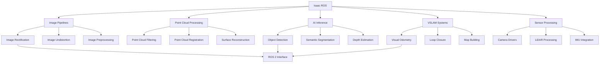

# Lesson 2: Isaac ROS & Perception VSLAM - Hardware-Accelerated Perception, Visual SLAM

## Learning Objectives

By the end of this lesson, you will be able to:
- Install and configure Isaac ROS packages for hardware-accelerated perception
- Implement Visual SLAM (VSLAM) systems for humanoid robot navigation
- Deploy perception pipelines using Isaac ROS for real-time object detection and tracking
- Integrate Isaac ROS with existing ROS 2 navigation systems
- Optimize perception performance using NVIDIA GPU acceleration

## Introduction

Isaac ROS represents NVIDIA's collection of hardware-accelerated perception and navigation packages that run on ROS 2. These packages leverage NVIDIA GPUs to provide real-time processing of sensor data, including image processing, point cloud operations, and AI inference. For humanoid robots, Isaac ROS enables sophisticated perception capabilities that are essential for autonomous operation in complex environments.

Visual SLAM (Simultaneous Localization and Mapping) is a critical technology that allows robots to build maps of unknown environments while simultaneously tracking their location within those maps. Combined with Isaac ROS's hardware acceleration, VSLAM systems can operate in real-time on humanoid robots, enabling autonomous navigation and interaction with the environment.

## Isaac ROS Architecture and Components

Isaac ROS is designed as a collection of modular, hardware-accelerated packages that integrate seamlessly with the ROS 2 ecosystem. Each package is optimized to leverage NVIDIA GPU capabilities for specific perception tasks.

### Core Isaac ROS Packages



*Figure 1: Isaac ROS architecture showing the modular packages and their integration with ROS 2.*

### Hardware Acceleration Framework

Isaac ROS packages utilize NVIDIA's hardware acceleration technologies:
- **CUDA**: For parallel processing on GPU
- **TensorRT**: For optimized AI model inference
- **OpenCV GPU**: For accelerated computer vision operations
- **OpenGL/Vulkan**: For graphics-accelerated operations

## Installation and Setup

### Prerequisites

Before installing Isaac ROS, ensure your system meets the requirements:

```bash
# Check NVIDIA GPU and driver
nvidia-smi

# Verify CUDA installation
nvcc --version

# Check ROS 2 Humble installation
ros2 --version
```

### Installing Isaac ROS

```bash
# Add NVIDIA package repository
curl -sL https://nvidia.github.io/nvidia-ros2-package-repos.deb | sudo apt-key add -
sudo add-apt-repository "deb https://nvidia.github.io/nvidia-ros2/$(lsb_release -cs)/$(dpkg --print-architecture) ."
sudo apt-get update

# Install Isaac ROS packages
sudo apt-get install ros-humble-isaac-ros-perception
sudo apt-get install ros-humble-isaac-ros-nav2
sudo apt-get install ros-humble-isaac-ros-visual-slam
sudo apt-get install ros-humble-isaac-ros-message-bridge
```

### Docker-based Installation (Recommended)

For easier setup and consistency, use Isaac ROS Docker containers:

```bash
# Pull Isaac ROS Docker image
docker pull nvcr.io/nvidia/isaac-ros:latest

# Run Isaac ROS container with GPU support
docker run --gpus all -it --rm \
  --network host \
  --env="DISPLAY" \
  --volume="/tmp/.X11-unix:/tmp/.X11-unix:rw" \
  --name isaac_ros_env \
  nvcr.io/nvidia/isaac-ros:latest
```

## Isaac ROS Perception Pipelines

Isaac ROS provides optimized perception pipelines that leverage GPU acceleration for real-time processing.

### Image Processing Pipeline

```python
#!/usr/bin/env python3

import rclpy
from rclpy.node import Node
from sensor_msgs.msg import Image
from cv_bridge import CvBridge
import cv2
import numpy as np

class IsaacImageProcessor(Node):
    def __init__(self):
        super().__init__('isaac_image_processor')

        # Create subscription to camera feed
        self.subscription = self.create_subscription(
            Image,
            '/camera/image_raw',
            self.image_callback,
            10
        )

        # Create publisher for processed image
        self.publisher = self.create_publisher(
            Image,
            '/camera/image_processed',
            10
        )

        self.bridge = CvBridge()

        # Initialize CUDA for GPU acceleration
        if cv2.cuda.getCudaEnabledDeviceCount() > 0:
            self.cuda_enabled = True
            self.get_logger().info('CUDA acceleration enabled')
        else:
            self.cuda_enabled = False
            self.get_logger().warn('CUDA acceleration not available')

    def image_callback(self, msg):
        # Convert ROS Image to OpenCV
        cv_image = self.bridge.imgmsg_to_cv2(msg, desired_encoding='bgr8')

        # Process image using GPU acceleration if available
        if self.cuda_enabled:
            processed_image = self.gpu_process_image(cv_image)
        else:
            processed_image = self.cpu_process_image(cv_image)

        # Convert back to ROS Image and publish
        processed_msg = self.bridge.cv2_to_imgmsg(processed_image, encoding='bgr8')
        processed_msg.header = msg.header
        self.publisher.publish(processed_msg)

    def gpu_process_image(self, image):
        """Process image using GPU acceleration"""
        # Upload image to GPU
        gpu_image = cv2.cuda_GpuMat()
        gpu_image.upload(image)

        # Apply Gaussian blur on GPU
        gpu_blur = cv2.cuda.GaussianBlur(gpu_image, (0, 0), sigmaX=1.0, sigmaY=1.0)

        # Convert to grayscale on GPU
        gpu_gray = cv2.cuda.cvtColor(gpu_blur, cv2.COLOR_BGR2GRAY)

        # Download result from GPU
        result = gpu_gray.download()

        return result

    def cpu_process_image(self, image):
        """Process image using CPU (fallback)"""
        gray = cv2.cvtColor(image, cv2.COLOR_BGR2GRAY)
        blurred = cv2.GaussianBlur(gray, (5, 5), 1.0)
        return blurred

def main(args=None):
    rclpy.init(args=args)
    processor = IsaacImageProcessor()
    rclpy.spin(processor)
    processor.destroy_node()
    rclpy.shutdown()

if __name__ == '__main__':
    main()
```

### Object Detection with Isaac ROS

```python
#!/usr/bin/env python3

import rclpy
from rclpy.node import Node
from sensor_msgs.msg import Image
from vision_msgs.msg import Detection2DArray, ObjectHypothesisWithPose
from cv_bridge import CvBridge
import torch
import torchvision.transforms as transforms
from PIL import Image as PILImage

class IsaacObjectDetector(Node):
    def __init__(self):
        super().__init__('isaac_object_detector')

        # Load pre-trained model (YOLOv5, Detectron2, etc.)
        self.model = self.load_model()

        # Ensure model runs on GPU if available
        self.device = torch.device('cuda' if torch.cuda.is_available() else 'cpu')
        self.model.to(self.device)
        self.model.eval()

        # Subscriptions and publishers
        self.image_sub = self.create_subscription(
            Image, '/camera/image_raw', self.image_callback, 10)

        self.detection_pub = self.create_publisher(
            Detection2DArray, '/object_detections', 10)

        self.bridge = CvBridge()

    def load_model(self):
        """Load pre-trained object detection model"""
        # Example with YOLOv5
        import yolov5  # Assuming yolov5 package is available
        model = yolov5.load('yolov5s.pt')  # Load model
        return model

    def image_callback(self, msg):
        # Convert ROS Image to PIL Image
        cv_image = self.bridge.imgmsg_to_cv2(msg, desired_encoding='bgr8')
        pil_image = PILImage.fromarray(cv_image)

        # Preprocess image
        transform = transforms.Compose([
            transforms.Resize((640, 640)),
            transforms.ToTensor()
        ])

        input_tensor = transform(pil_image).unsqueeze(0).to(self.device)

        # Run inference
        with torch.no_grad():
            results = self.model(input_tensor)

        # Process results
        detections = self.process_detections(results, msg.header)

        # Publish detections
        self.detection_pub.publish(detections)

    def process_detections(self, results, header):
        """Process detection results and create Detection2DArray message"""
        detections_msg = Detection2DArray()
        detections_msg.header = header

        # Assuming results format from YOLOv5
        for *box, conf, cls in results.xyxy[0].tolist():
            detection = Detection2D()
            detection.header = header

            # Set bounding box
            bbox = BoundingBox2D()
            bbox.center.x = (box[0] + box[2]) / 2.0
            bbox.center.y = (box[1] + box[3]) / 2.0
            bbox.size_x = abs(box[2] - box[0])
            bbox.size_y = abs(box[3] - box[1])
            detection.bbox = bbox

            # Set hypothesis
            hypothesis = ObjectHypothesisWithPose()
            hypothesis.hypothesis.class_id = str(int(cls))
            hypothesis.hypothesis.score = conf
            detection.results.append(hypothesis)

            detections_msg.detections.append(detection)

        return detections_msg

def main(args=None):
    rclpy.init(args=args)
    detector = IsaacObjectDetector()
    rclpy.spin(detector)
    detector.destroy_node()
    rclpy.shutdown()

if __name__ == '__main__':
    main()
```

## Visual SLAM Implementation with Isaac ROS

Visual SLAM is critical for humanoid robots to navigate unknown environments. Isaac ROS provides optimized VSLAM packages that leverage GPU acceleration.

### Isaac ROS VSLAM Node

```python
#!/usr/bin/env python3

import rclpy
from rclpy.node import Node
from sensor_msgs.msg import Image, CameraInfo
from geometry_msgs.msg import PoseStamped
from nav_msgs.msg import Odometry
from visualization_msgs.msg import MarkerArray
import numpy as np
import cv2
from cv_bridge import CvBridge

class IsaacVSLAMNode(Node):
    def __init__(self):
        super().__init__('isaac_vslam')

        # Camera parameters
        self.camera_matrix = None
        self.dist_coeffs = None

        # SLAM components
        self.orb = cv2.cuda.SIFT_create() if cv2.cuda.getCudaEnabledDeviceCount() > 0 else cv2.SIFT_create()
        self.bf = cv2.BFMatcher()
        self.kp_descriptors = []
        self.current_pose = np.eye(4)
        self.map_points = []
        self.frame_count = 0

        # ROS interfaces
        self.image_sub = self.create_subscription(
            Image, '/camera/image_raw', self.image_callback, 10)
        self.info_sub = self.create_subscription(
            CameraInfo, '/camera/camera_info', self.info_callback, 10)

        self.pose_pub = self.create_publisher(PoseStamped, '/slam/pose', 10)
        self.odom_pub = self.create_publisher(Odometry, '/slam/odometry', 10)
        self.map_pub = self.create_publisher(MarkerArray, '/slam/map', 10)

        self.bridge = CvBridge()

    def info_callback(self, msg):
        """Receive camera calibration parameters"""
        self.camera_matrix = np.array(msg.k).reshape(3, 3)
        self.dist_coeffs = np.array(msg.d)

    def image_callback(self, msg):
        """Process incoming camera images for SLAM"""
        if self.camera_matrix is None:
            return

        # Convert ROS Image to OpenCV
        cv_image = self.bridge.imgmsg_to_cv2(msg, desired_encoding='mono8')

        # Feature detection and matching
        new_pose = self.process_frame(cv_image)

        if new_pose is not None:
            self.current_pose = new_pose
            self.publish_pose_and_odom(msg.header)

    def process_frame(self, image):
        """Process a single frame for visual SLAM"""
        # Detect features
        if cv2.cuda.getCudaEnabledDeviceCount() > 0:
            # Use GPU for feature detection if available
            gpu_image = cv2.cuda_GpuMat()
            gpu_image.upload(image)
            keypoints_gpu, descriptors_gpu = self.orb.detectAndCompute(gpu_image, None)
            keypoints = cv2.cuda.downloadKeypoints(keypoints_gpu)
            descriptors = descriptors_gpu.download() if descriptors_gpu is not None else None
        else:
            # Fallback to CPU
            keypoints, descriptors = self.orb.detectAndCompute(image, None)

        if descriptors is None or len(keypoints) < 10:
            return self.current_pose

        # Store current frame data
        current_frame = {
            'keypoints': keypoints,
            'descriptors': descriptors,
            'image': image
        }

        # Match with previous frames
        if len(self.kp_descriptors) > 0:
            prev_frame = self.kp_descriptors[-1]
            matches = self.bf.match(prev_frame['descriptors'], descriptors)

            # Sort matches by distance
            matches = sorted(matches, key=lambda x: x.distance)

            # Extract matched points
            if len(matches) >= 10:
                src_pts = np.float32([prev_frame['keypoints'][m.queryIdx].pt for m in matches]).reshape(-1, 1, 2)
                dst_pts = np.float32([keypoints[m.trainIdx].pt for m in matches]).reshape(-1, 1, 2)

                # Estimate motion using Essential matrix
                E, mask = cv2.findEssentialMat(dst_pts, src_pts, self.camera_matrix,
                                              method=cv2.RANSAC, threshold=1.0)

                if E is not None:
                    # Recover pose
                    _, R, t, _ = cv2.recoverPose(E, src_pts, dst_pts, self.camera_matrix)

                    # Create transformation matrix
                    T = np.eye(4)
                    T[:3, :3] = R
                    T[:3, 3] = t.flatten()

                    # Update current pose
                    new_pose = self.current_pose @ T

                    # Store frame for next iteration
                    self.kp_descriptors.append(current_frame)
                    if len(self.kp_descriptors) > 10:  # Keep only recent frames
                        self.kp_descriptors.pop(0)

                    return new_pose

        # Store frame even if no pose update
        self.kp_descriptors.append(current_frame)
        if len(self.kp_descriptors) > 10:
            self.kp_descriptors.pop(0)

        return self.current_pose

    def publish_pose_and_odom(self, header):
        """Publish pose and odometry messages"""
        # Create and publish PoseStamped
        pose_msg = PoseStamped()
        pose_msg.header = header
        pose_msg.header.frame_id = 'map'

        # Extract position and orientation from transformation matrix
        position = self.current_pose[:3, 3]
        pose_msg.pose.position.x = position[0]
        pose_msg.pose.position.y = position[1]
        pose_msg.pose.position.z = position[2]

        # Convert rotation matrix to quaternion
        R = self.current_pose[:3, :3]
        qw = np.sqrt(1 + R[0,0] + R[1,1] + R[2,2]) / 2
        qx = (R[2,1] - R[1,2]) / (4 * qw)
        qy = (R[0,2] - R[2,0]) / (4 * qw)
        qz = (R[1,0] - R[0,1]) / (4 * qw)

        pose_msg.pose.orientation.x = qx
        pose_msg.pose.orientation.y = qy
        pose_msg.pose.orientation.z = qz
        pose_msg.pose.orientation.w = qw

        self.pose_pub.publish(pose_msg)

        # Create and publish Odometry
        odom_msg = Odometry()
        odom_msg.header = header
        odom_msg.header.frame_id = 'map'
        odom_msg.child_frame_id = 'base_link'
        odom_msg.pose.pose = pose_msg.pose

        self.odom_pub.publish(odom_msg)

def main(args=None):
    rclpy.init(args=args)
    vslam_node = IsaacVSLAMNode()
    rclpy.spin(vslam_node)
    vslam_node.destroy_node()
    rclpy.shutdown()

if __name__ == '__main__':
    main()
```

## Isaac ROS Integration with Nav2

Isaac ROS seamlessly integrates with Nav2 for advanced navigation capabilities:

```python
#!/usr/bin/env python3

import rclpy
from rclpy.node import Node
from geometry_msgs.msg import PoseStamped
from nav2_msgs.action import NavigateToPose
from rclpy.action import ActionClient
import tf2_ros
import numpy as np

class IsaacNav2Integrator(Node):
    def __init__(self):
        super().__init__('isaac_nav2_integrator')

        # Action client for Nav2 navigation
        self.nav_client = ActionClient(self, NavigateToPose, 'navigate_to_pose')

        # TF2 buffer for coordinate transforms
        self.tf_buffer = tf2_ros.Buffer()
        self.tf_listener = tf2_ros.TransformListener(self.tf_buffer, self)

        # SLAM pose subscription
        self.slam_pose_sub = self.create_subscription(
            PoseStamped, '/slam/pose', self.slam_pose_callback, 10)

        # Current robot pose
        self.current_pose = None

    def slam_pose_callback(self, msg):
        """Update current robot pose from SLAM"""
        self.current_pose = msg.pose

    def navigate_to_pose(self, x, y, theta=0.0):
        """Send navigation goal to Nav2"""
        # Wait for action server
        self.nav_client.wait_for_server()

        # Create navigation goal
        goal_msg = NavigateToPose.Goal()
        goal_msg.pose.header.frame_id = 'map'
        goal_msg.pose.header.stamp = self.get_clock().now().to_msg()
        goal_msg.pose.pose.position.x = float(x)
        goal_msg.pose.pose.position.y = float(y)
        goal_msg.pose.pose.position.z = 0.0

        # Convert theta to quaternion
        from math import sin, cos
        s = sin(theta / 2.0)
        c = cos(theta / 2.0)
        goal_msg.pose.pose.orientation.x = 0.0
        goal_msg.pose.pose.orientation.y = 0.0
        goal_msg.pose.pose.orientation.z = s
        goal_msg.pose.pose.orientation.w = c

        # Send goal
        future = self.nav_client.send_goal_async(goal_msg)
        future.add_done_callback(self.goal_response_callback)

    def goal_response_callback(self, future):
        """Handle navigation goal response"""
        goal_handle = future.result()
        if not goal_handle.accepted:
            self.get_logger().info('Goal rejected')
            return

        self.get_logger().info('Goal accepted')
        result_future = goal_handle.get_result_async()
        result_future.add_done_callback(self.get_result_callback)

    def get_result_callback(self, future):
        """Handle navigation result"""
        result = future.result().result
        self.get_logger().info(f'Navigation result: {result}')

def main(args=None):
    rclpy.init(args=args)
    integrator = IsaacNav2Integrator()

    # Example: Navigate to a specific pose
    integrator.navigate_to_pose(5.0, 5.0, 0.0)

    rclpy.spin(integrator)
    integrator.destroy_node()
    rclpy.shutdown()

if __name__ == '__main__':
    main()
```

## Performance Optimization with Isaac ROS

To maximize the benefits of Isaac ROS, proper optimization is essential:

### GPU Memory Management

```python
import torch
import gc

class OptimizedIsaacNode(Node):
    def __init__(self):
        super().__init__('optimized_isaac_node')

        # Set GPU memory fraction if needed
        if torch.cuda.is_available():
            # Limit GPU memory usage to prevent OOM errors
            torch.cuda.set_per_process_memory_fraction(0.8)  # Use 80% of GPU memory

    def cleanup_gpu_memory(self):
        """Clean up GPU memory"""
        if torch.cuda.is_available():
            torch.cuda.empty_cache()
            gc.collect()
```

### Pipeline Optimization

```python
# Optimized perception pipeline using Isaac ROS extensions
from rclpy.qos import QoSProfile, ReliabilityPolicy, HistoryPolicy

class OptimizedPerceptionPipeline(Node):
    def __init__(self):
        super().__init__('optimized_perception_pipeline')

        # Define QoS profiles for optimal performance
        qos_profile = QoSProfile(
            depth=1,
            reliability=ReliabilityPolicy.BEST_EFFORT,
            history=HistoryPolicy.KEEP_LAST
        )

        # Create optimized subscriptions
        self.image_sub = self.create_subscription(
            Image,
            '/camera/image_raw',
            self.optimized_image_callback,
            qos_profile
        )

    def optimized_image_callback(self, msg):
        """Optimized image processing callback"""
        # Skip frames if processing is behind
        if hasattr(self, '_processing') and self._processing:
            return  # Skip this frame

        self._processing = True
        try:
            # Process image
            self.process_image(msg)
        finally:
            self._processing = False
```

## Isaac ROS Launch Files

Create launch files to properly configure Isaac ROS components:

```xml
<!-- isaac_perception.launch.py -->
from launch import LaunchDescription
from launch_ros.actions import Node
from launch.actions import DeclareLaunchArgument
from launch.substitutions import LaunchConfiguration
from ament_index_python.packages import get_package_share_directory
import os

def generate_launch_description():
    # Declare launch arguments
    use_sim_time = LaunchConfiguration('use_sim_time', default='false')

    # Isaac ROS Image Pipeline
    image_pipeline = Node(
        package='isaac_ros_image_pipeline',
        executable='isaac_ros_image_pipeline',
        name='image_pipeline',
        parameters=[
            {'use_sim_time': use_sim_time},
            {'input_width': 640},
            {'input_height': 480},
            {'output_width': 640},
            {'output_height': 480}
        ],
        remappings=[
            ('image_raw', '/camera/image_raw'),
            ('image_rect', '/camera/image_rect')
        ]
    )

    # Isaac ROS VSLAM
    vslam_node = Node(
        package='isaac_ros_visual_slam',
        executable='isaac_ros_visual_slam_node',
        name='visual_slam',
        parameters=[
            {'use_sim_time': use_sim_time},
            {'enable_occupancy_map': True},
            {'occupancy_map_resolution': 0.05},
            {'occupancy_map_size': 100}
        ],
        remappings=[
            ('/visual_slam/image', '/camera/image_rect'),
            ('/visual_slam/camera_info', '/camera/camera_info')
        ]
    )

    # Isaac ROS Object Detection
    detection_node = Node(
        package='isaac_ros_detectnet',
        executable='isaac_ros_detectnet',
        name='object_detection',
        parameters=[
            {'use_sim_time': use_sim_time},
            {'model_name': 'detectnet_coco'},
            {'confidence_threshold': 0.5}
        ],
        remappings=[
            ('image', '/camera/image_rect'),
            ('detections', '/object_detections')
        ]
    )

    return LaunchDescription([
        image_pipeline,
        vslam_node,
        detection_node
    ])
```

## Hands-on Exercise 3.2: Deploy Isaac ROS Perception Pipeline

Create a complete Isaac ROS perception system with VSLAM:

1. **Install Isaac ROS packages**:
```bash
# Install Isaac ROS perception packages
sudo apt install ros-humble-isaac-ros-perception
sudo apt install ros-humble-isaac-ros-visual-slam
```

2. **Create a perception pipeline launch file**:
```python
# perception_pipeline.launch.py
from launch import LaunchDescription
from launch_ros.actions import Node

def generate_launch_description():
    return LaunchDescription([
        # Image processing node
        Node(
            package='isaac_ros_image_proc',
            executable='isaac_ros_image_proc',
            name='image_proc',
            parameters=[{'use_sim_time': True}],
            remappings=[('image_raw', '/camera/image_raw')]
        ),

        # VSLAM node
        Node(
            package='isaac_ros_visual_slam',
            executable='visual_slam_node',
            name='visual_slam',
            parameters=[{'use_sim_time': True}],
            remappings=[
                ('/visual_slam/image', '/camera/image_rect'),
                ('/visual_slam/camera_info', '/camera/camera_info')
            ]
        )
    ])
```

3. **Launch the pipeline**:
```bash
# Terminal 1: Launch perception pipeline
ros2 launch perception_pipeline.launch.py

# Terminal 2: View results
rviz2

# Terminal 3: Publish test images (if not using real camera)
ros2 topic pub /camera/image_raw sensor_msgs/msg/Image --field header.frame_id=camera
```

## Key Takeaways

- **Isaac ROS** provides hardware-accelerated perception packages optimized for NVIDIA GPUs
- **Visual SLAM** enables real-time mapping and localization for humanoid robot navigation
- **GPU acceleration** significantly improves processing performance for perception tasks
- **Nav2 integration** allows seamless combination of perception and navigation systems
- **Performance optimization** is crucial for real-time operation on humanoid robots

## Reflection Questions

1. How does GPU acceleration in Isaac ROS compare to CPU-based perception systems?
2. What are the advantages of using VSLAM over traditional wheel odometry for humanoid robots?
3. How can Isaac ROS perception pipelines be optimized for different computational constraints?
4. What challenges arise when integrating VSLAM with humanoid robot locomotion systems?

## APA Citations

NVIDIA Corporation. (2023). *Isaac ROS Documentation*. Retrieved from https://nvidia-isaac-ros.github.io/released/

Siciliano, B., & Khatib, O. (Eds.). (2016). *Springer handbook of robotics* (2nd ed.). Springer.

Thrun, S., Burgard, W., & Fox, D. (2005). *Probabilistic robotics*. MIT Press.

## Summary

This lesson covered Isaac ROS and Visual SLAM implementation for humanoid robots. We explored Isaac ROS architecture, installation, perception pipelines, and VSLAM systems that leverage GPU acceleration for real-time processing. The integration of Isaac ROS with Nav2 enables sophisticated perception and navigation capabilities essential for autonomous humanoid robot operation.

In the next lesson, we'll explore Nav2 path planning specifically designed for humanoid robots, building on the perception and SLAM capabilities we've learned about.