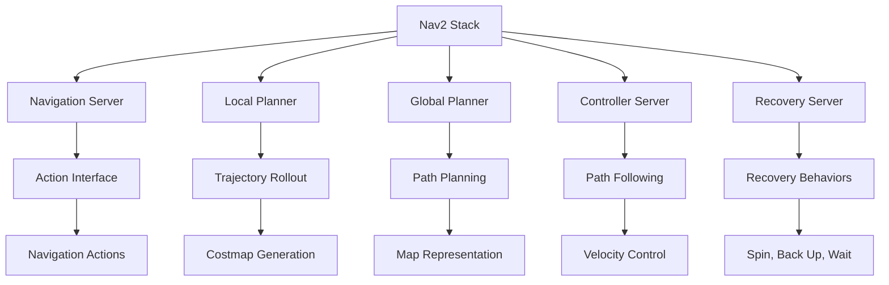

# Lesson 3: Nav2 Path Planning for Humanoids - Biped Locomotion, Path Planning, Navigation

## Learning Objectives

By the end of this lesson, you will be able to:
- Configure Nav2 for humanoid-specific navigation requirements and constraints
- Implement path planning algorithms that account for biped locomotion kinematics
- Design navigation behaviors that maintain humanoid robot balance and stability
- Integrate perception data from Isaac ROS with Nav2 for autonomous navigation
- Optimize navigation parameters for humanoid robot dynamics and safety

## Introduction

Navigation in Nav2 (Navigation 2) is the standard navigation stack for mobile robots in ROS 2, providing path planning, obstacle avoidance, and localization capabilities. For humanoid robots, Nav2 requires specialized configuration to account for the unique challenges of bipedal locomotion, balance constraints, and complex kinematics. Unlike wheeled robots that can move in any direction with simple differential or holonomic drives, humanoid robots must navigate while maintaining balance, considering their multi-link structure, joint limits, and the need for stable foot placement.

This lesson explores how to adapt Nav2 for humanoid robot navigation, addressing the specific requirements of bipedal locomotion, balance maintenance, and the integration with perception systems learned in previous lessons. We'll cover the configuration of Nav2 for humanoid-specific constraints, path planning algorithms that consider humanoid kinematics, and safety considerations for autonomous humanoid navigation.

## Nav2 Architecture for Humanoid Robots

The Nav2 stack consists of several key components that must be adapted for humanoid robot navigation:

### Standard Nav2 Components



*Figure 1: Standard Nav2 architecture showing the main components and their relationships.*

### Humanoid-Specific Modifications

For humanoid robots, several Nav2 components require modification:

1. **Local Planner**: Must consider biped kinematics and balance constraints
2. **Global Planner**: Should account for terrain traversability and foot placement
3. **Controller**: Needs to generate footstep plans rather than simple velocity commands
4. **Costmap**: Should include balance and stability considerations
5. **Recovery Behaviors**: Must be safe for humanoid robots with balance constraints

## Humanoid-Specific Navigation Configuration

### Costmap Configuration for Humanoids

The costmap in Nav2 needs to account for humanoid-specific requirements:

```yaml
# costmap_common_params_humanoid.yaml
global_costmap:
  global_frame: map
  robot_base_frame: base_link
  update_frequency: 5.0
  publish_frequency: 2.0
  transform_tolerance: 0.5
  resolution: 0.05  # Higher resolution for precise foot placement

  plugins:
    - {name: static_layer, type: "nav2_costmap_2d::StaticLayer"}
    - {name: obstacle_layer, type: "nav2_costmap_2d::ObstacleLayer"}
    - {name: inflation_layer, type: "nav2_costmap_2d::InflationLayer"}

  static_layer:
    map_subscribe_transient_local: true

  obstacle_layer:
    enabled: true
    observation_sources: scan
    scan:
      topic: /scan
      max_obstacle_height: 2.0  # Humanoid height consideration
      clearing: true
      marking: true
      data_type: "LaserScan"
      inf_is_valid: true

  inflation_layer:
    enabled: true
    cost_scaling_factor: 3.0  # Higher inflation for humanoid safety
    inflation_radius: 0.8     # Larger safety margin for biped locomotion
    inflate_to_robot_footprint: false  # Consider full body dynamics

  robot_radius: 0.3  # Consider humanoid width for collision avoidance

local_costmap:
  global_frame: odom
  robot_base_frame: base_link
  update_frequency: 10.0
  publish_frequency: 5.0
  resolution: 0.025  # Even higher resolution for local planning
  width: 6.0
  height: 6.0
  origin_x: -3.0
  origin_y: -3.0
  rolling_window: true

  plugins:
    - {name: static_layer, type: "nav2_costmap_2d::StaticLayer"}
    - {name: obstacle_layer, type: "nav2_costmap_2d::ObstacleLayer"}
    - {name: inflation_layer, type: "nav2_costmap_2d::InflationLayer"}

  inflation_layer:
    enabled: true
    cost_scaling_factor: 5.0  # Higher scaling for local safety
    inflation_radius: 0.5
```

### Global Planner Configuration

The global planner needs to account for humanoid-specific path requirements:

```yaml
# global_planner_params_humanoid.yaml
bt_navigator:
  ros__parameters:
    use_sim_time: false
    global_frame: map
    robot_base_frame: base_link
    odom_topic: /odom
    bt_loop_duration: 10
    default_server_timeout: 20
    enable_groot_monitoring: true
    groot_zmq_publisher_port: 1666
    groot_zmq_server_port: 1667
    # Specify the behavior tree XML to use
    default_nav_through_poses_bt_xml: "navigate_w_replanning_and_recovery.xml"
    default_nav_to_pose_bt_xml: "navigate_w_replanning_and_recovery.xml"

    # Recovery nodes
    recovery_plugins: ["spin", "backup", "wait"]
    spin:
      plugin: "nav2_recoveries/Spin"
    backup:
      plugin: "nav2_recoveries/BackUp"
    wait:
      plugin: "nav2_recoveries/Wait"

    # Navigator parameters
    navigate_to_pose:
      plugin: "nav2_navfn_planner/NavfnPlanner"
      tolerance: 0.5  # Larger tolerance for humanoid navigation
      use_astar: false
      allow_unknown: true

global_costmap_client:
  ros__parameters:
    use_sim_time: false

global_costmap_rclcpp_node:
  ros__parameters:
    use_sim_time: false
```

## Humanoid Path Planning Algorithms

### Footstep Planning for Biped Locomotion

Humanoid navigation requires specialized path planning that considers footstep sequences:

```python
#!/usr/bin/env python3

import rclpy
from rclpy.node import Node
from geometry_msgs.msg import PoseStamped, Point
from nav_msgs.msg import Path
from visualization_msgs.msg import Marker, MarkerArray
import numpy as np
from scipy.spatial import KDTree
import math

class FootstepPlanner(Node):
    def __init__(self):
        super().__init__('footstep_planner')

        # Publishers for path and footsteps
        self.path_pub = self.create_publisher(Path, '/humanoid_global_plan', 10)
        self.footsteps_pub = self.create_publisher(MarkerArray, '/footsteps_visualization', 10)

        # Footstep parameters
        self.step_length = 0.3  # Maximum step length for humanoid
        self.step_width = 0.2   # Lateral step distance
        self.max_turn = math.radians(30)  # Maximum turning angle per step

    def plan_footsteps(self, start_pose, goal_pose):
        """Plan a sequence of footsteps for humanoid navigation"""
        # Calculate straight-line path
        dx = goal_pose.position.x - start_pose.position.x
        dy = goal_pose.position.y - start_pose.position.y
        distance = math.sqrt(dx*dx + dy*dy)
        angle = math.atan2(dy, dx)

        # Generate footsteps along the path
        footsteps = []
        current_x = start_pose.position.x
        current_y = start_pose.position.y
        current_yaw = self.quaternion_to_yaw(start_pose.orientation)

        step_count = int(distance / self.step_length) + 1

        for i in range(step_count):
            # Calculate next step position
            step_x = current_x + min(self.step_length, distance - i * self.step_length) * math.cos(angle)
            step_y = current_y + min(self.step_length, distance - i * self.step_length) * math.sin(angle)

            # Alternate between left and right foot
            if i % 2 == 0:
                # Left foot step
                foot_offset_x = 0.0
                foot_offset_y = self.step_width / 2.0
            else:
                # Right foot step
                foot_offset_x = 0.0
                foot_offset_y = -self.step_width / 2.0

            # Apply offset in robot's frame
            rotated_offset_x = foot_offset_x * math.cos(current_yaw) - foot_offset_y * math.sin(current_yaw)
            rotated_offset_y = foot_offset_x * math.sin(current_yaw) + foot_offset_y * math.cos(current_yaw)

            foot_pose = PoseStamped()
            foot_pose.header.frame_id = 'map'
            foot_pose.pose.position.x = step_x + rotated_offset_x
            foot_pose.pose.position.y = step_y + rotated_offset_y
            foot_pose.pose.position.z = 0.0  # Ground level

            # Set orientation to match path direction
            foot_pose.pose.orientation = self.yaw_to_quaternion(angle)

            footsteps.append(foot_pose)

            # Update current position
            current_x = step_x
            current_y = step_y
            current_yaw = angle

        return footsteps

    def quaternion_to_yaw(self, orientation):
        """Convert quaternion to yaw angle"""
        siny_cosp = 2 * (orientation.w * orientation.z + orientation.x * orientation.y)
        cosy_cosp = 1 - 2 * (orientation.y * orientation.y + orientation.z * orientation.z)
        return math.atan2(siny_cosp, cosy_cosp)

    def yaw_to_quaternion(self, yaw):
        """Convert yaw angle to quaternion"""
        from geometry_msgs.msg import Quaternion
        q = Quaternion()
        q.z = math.sin(yaw / 2.0)
        q.w = math.cos(yaw / 2.0)
        return q

    def create_path_from_footsteps(self, footsteps):
        """Create a Path message from footsteps for visualization"""
        path = Path()
        path.header.frame_id = 'map'

        for footstep in footsteps:
            path.poses.append(footstep)

        return path

    def visualize_footsteps(self, footsteps):
        """Create visualization markers for footsteps"""
        marker_array = MarkerArray()

        for i, footstep in enumerate(footsteps):
            # Create marker for each footstep
            marker = Marker()
            marker.header.frame_id = 'map'
            marker.header.stamp = self.get_clock().now().to_msg()
            marker.ns = 'footsteps'
            marker.id = i
            marker.type = Marker.CYLINDER
            marker.action = Marker.ADD

            marker.pose = footstep.pose
            marker.pose.position.z = 0.02  # Slightly above ground

            # Size based on foot size
            marker.scale.x = 0.15  # Foot length
            marker.scale.y = 0.1   # Foot width
            marker.scale.z = 0.01  # Height

            # Color based on foot (left=blue, right=red)
            if i % 2 == 0:
                marker.color.r = 0.0
                marker.color.g = 0.0
                marker.color.b = 1.0  # Blue for left foot
            else:
                marker.color.r = 1.0
                marker.color.g = 0.0
                marker.color.b = 0.0  # Red for right foot

            marker.color.a = 0.7

            marker_array.markers.append(marker)

        return marker_array
```

### Balance-Aware Path Planning

Humanoid robots must maintain balance during navigation, which affects path planning:

```python
class BalanceAwarePlanner(Node):
    def __init__(self):
        super().__init__('balance_aware_planner')

        # Balance constraints
        self.max_lean_angle = math.radians(15)  # Maximum lean angle
        self.com_height = 0.8  # Center of mass height
        self.foot_support_polygon = self.calculate_support_polygon()

    def calculate_support_polygon(self):
        """Calculate the support polygon for biped stability"""
        # For a biped, the support polygon is the convex hull of both feet
        # This is a simplified version - real implementation would be more complex
        support_points = [
            Point(x=0.1, y=0.1, z=0),   # Left foot front
            Point(x=0.1, y=-0.1, z=0),  # Left foot back
            Point(x=0.1, y=0.1, z=0),   # Right foot front
            Point(x=0.1, y=-0.1, z=0)   # Right foot back
        ]
        return support_points

    def check_balance_feasibility(self, path, robot_state):
        """Check if a path is feasible given balance constraints"""
        for pose in path.poses:
            # Calculate center of mass projection
            com_proj = self.project_com_to_ground(robot_state, pose)

            # Check if COM projection is within support polygon
            if not self.is_point_in_support_polygon(com_proj):
                return False, "Path violates balance constraints"

            # Check turning rate limits
            if self.calculate_turn_rate(pose, robot_state) > self.max_turn_rate:
                return False, "Turning rate exceeds humanoid capabilities"

        return True, "Path is balance-feasible"

    def project_com_to_ground(self, robot_state, target_pose):
        """Project center of mass to ground plane"""
        # Simplified COM projection
        com_proj = Point()
        com_proj.x = target_pose.pose.position.x
        com_proj.y = target_pose.pose.position.y
        com_proj.z = 0.0  # Ground level
        return com_proj

    def is_point_in_support_polygon(self, point):
        """Check if a point is within the support polygon"""
        # This would implement a proper point-in-polygon algorithm
        # For now, return True as a placeholder
        return True
```

## Humanoid Navigation Controller

The navigation controller for humanoid robots needs to generate footstep plans rather than simple velocity commands:

```python
#!/usr/bin/env python3

import rclpy
from rclpy.node import Node
from geometry_msgs.msg import Twist, PoseStamped
from nav_msgs.msg import Odometry
from sensor_msgs.msg import JointState
from trajectory_msgs.msg import JointTrajectory, JointTrajectoryPoint
from builtin_interfaces.msg import Duration
import numpy as np
import math

class HumanoidNavigationController(Node):
    def __init__(self):
        super().__init__('humanoid_navigation_controller')

        # Publishers for navigation commands
        self.trajectory_pub = self.create_publisher(
            JointTrajectory, '/joint_trajectory_controller/joint_trajectory', 10)
        self.odom_sub = self.create_subscription(
            Odometry, '/odom', self.odom_callback, 10)
        self.joint_state_sub = self.create_subscription(
            JointState, '/joint_states', self.joint_state_callback, 10)

        # Navigation parameters
        self.linear_vel = 0.3  # m/s
        self.angular_vel = 0.5  # rad/s
        self.step_height = 0.05  # Foot lift height
        self.step_duration = 0.8  # Time per step

        # Robot state
        self.current_pose = None
        self.current_joint_positions = {}
        self.target_pose = None
        self.navigation_active = False

        # Timer for control loop
        self.control_timer = self.create_timer(0.1, self.control_loop)

    def odom_callback(self, msg):
        """Update robot pose from odometry"""
        self.current_pose = msg.pose.pose

    def joint_state_callback(self, msg):
        """Update joint positions"""
        for name, pos in zip(msg.name, msg.position):
            self.current_joint_positions[name] = pos

    def set_navigation_target(self, target_pose):
        """Set navigation target"""
        self.target_pose = target_pose
        self.navigation_active = True

    def control_loop(self):
        """Main control loop for humanoid navigation"""
        if not self.navigation_active or self.target_pose is None:
            return

        if self.current_pose is None:
            return

        # Calculate distance and angle to target
        dx = self.target_pose.position.x - self.current_pose.position.x
        dy = self.target_pose.position.y - self.current_pose.position.y
        distance = math.sqrt(dx*dx + dy*dy)
        target_angle = math.atan2(dy, dx)

        # Calculate current robot angle
        current_angle = self.quaternion_to_yaw(self.current_pose.orientation)

        # Check if reached target
        if distance < 0.2:  # 20cm tolerance
            self.navigation_active = False
            self.stop_navigation()
            return

        # Generate footstep trajectory
        self.execute_footstep_trajectory(target_angle, distance)

    def execute_footstep_trajectory(self, target_angle, distance):
        """Execute a single footstep trajectory"""
        # Calculate step direction
        step_angle = target_angle  # Simplified - in reality, this would be more complex

        # Create joint trajectory for step
        trajectory = JointTrajectory()
        trajectory.joint_names = [
            'left_hip_yaw', 'left_hip_roll', 'left_hip_pitch',
            'left_knee', 'left_ankle_pitch', 'left_ankle_roll',
            'right_hip_yaw', 'right_hip_roll', 'right_hip_pitch',
            'right_knee', 'right_ankle_pitch', 'right_ankle_roll'
        ]

        # Generate trajectory points for the step
        num_points = 20  # Number of intermediate points
        for i in range(num_points + 1):
            point = JointTrajectoryPoint()

            # Calculate intermediate joint positions for the step
            progress = i / num_points

            # Simplified joint position calculation
            # In reality, this would involve inverse kinematics
            # and balance maintenance calculations
            joint_positions = self.calculate_step_joints(progress, step_angle)

            point.positions = joint_positions
            point.time_from_start = Duration(
                sec=0,
                nanosec=int(progress * self.step_duration * 1e9)
            )

            # Add velocity and acceleration for smoother motion
            if i > 0:
                prev_positions = trajectory.points[-1].positions
                dt = self.step_duration / num_points
                velocities = [(pos - prev) / dt for pos, prev in zip(joint_positions, prev_positions)]
                point.velocities = velocities

            trajectory.points.append(point)

        # Publish the trajectory
        self.trajectory_pub.publish(trajectory)

    def calculate_step_joints(self, progress, step_direction):
        """Calculate joint positions for a step at given progress"""
        # This is a simplified implementation
        # Real implementation would use inverse kinematics and
        # consider balance, step dynamics, and robot kinematics

        # Base joint positions (standing pose)
        joints = [0.0] * 12  # 12 joints for left and right legs

        # Apply step motion based on progress
        if progress < 0.3:  # Lift phase
            # Lift swing foot
            if progress / 0.3 < 0.5:  # First half of lift
                joints[3] = -0.3 * (progress / 0.3) * 2  # Left knee
                joints[9] = -0.3 * (progress / 0.3) * 2  # Right knee
            else:  # Second half of lift
                joints[3] = -0.3 + 0.3 * ((progress / 0.3) - 0.5) * 2  # Left knee
                joints[9] = -0.3 + 0.3 * ((progress / 0.3) - 0.5) * 2  # Right knee

        elif progress > 0.7:  # Lower phase
            # Lower swing foot
            lower_progress = (progress - 0.7) / 0.3
            joints[3] = 0.3 - 0.3 * lower_progress  # Left knee
            joints[9] = 0.3 - 0.3 * lower_progress  # Right knee

        else:  # Swing phase
            # Swing foot forward
            joints[0] = step_direction * (progress - 0.3) / 0.4  # Left hip yaw
            joints[6] = -step_direction * (progress - 0.3) / 0.4  # Right hip yaw

        return joints

    def stop_navigation(self):
        """Stop navigation and return to standing pose"""
        # Publish zero joint positions to stop
        trajectory = JointTrajectory()
        trajectory.joint_names = [
            'left_hip_yaw', 'left_hip_roll', 'left_hip_pitch',
            'left_knee', 'left_ankle_pitch', 'left_ankle_roll',
            'right_hip_yaw', 'right_hip_roll', 'right_hip_pitch',
            'right_knee', 'right_ankle_pitch', 'right_ankle_roll'
        ]

        point = JointTrajectoryPoint()
        point.positions = [0.0] * 12  # Return to zero position
        point.time_from_start = Duration(sec=1, nanosec=0)

        trajectory.points.append(point)
        self.trajectory_pub.publish(trajectory)

    def quaternion_to_yaw(self, orientation):
        """Convert quaternion to yaw angle"""
        siny_cosp = 2 * (orientation.w * orientation.z + orientation.x * orientation.y)
        cosy_cosp = 1 - 2 * (orientation.y * orientation.y + orientation.z * orientation.z)
        return math.atan2(siny_cosp, cosy_cosp)
```

## Integration with Perception Systems

Humanoid navigation must integrate with perception systems for obstacle avoidance and safe navigation:

```python
#!/usr/bin/env python3

import rclpy
from rclpy.node import Node
from sensor_msgs.msg import LaserScan, PointCloud2
from visualization_msgs.msg import MarkerArray
from geometry_msgs.msg import Point
from std_msgs.msg import Bool
import numpy as np
from sensor_msgs_py import point_cloud2
from scipy.spatial import KDTree

class HumanoidPerceptionIntegrator(Node):
    def __init__(self):
        super().__init__('humanoid_perception_integrator')

        # Subscriptions for perception data
        self.scan_sub = self.create_subscription(
            LaserScan, '/scan', self.scan_callback, 10)
        self.pointcloud_sub = self.create_subscription(
            PointCloud2, '/points', self.pointcloud_callback, 10)

        # Publishers for navigation safety
        self.safety_pub = self.create_publisher(Bool, '/navigation_safety', 10)
        self.obstacle_viz_pub = self.create_publisher(MarkerArray, '/obstacles', 10)

        # Perception processing parameters
        self.safety_distance = 0.5  # Minimum safe distance
        self.humanoid_width = 0.6   # Width of humanoid for collision checking
        self.scan_tree = None

    def scan_callback(self, msg):
        """Process laser scan data for obstacle detection"""
        # Convert scan to points
        angles = np.arange(msg.angle_min, msg.angle_max, msg.angle_increment)
        ranges = np.array(msg.ranges)

        # Filter out invalid ranges
        valid_mask = (ranges > msg.range_min) & (ranges < msg.range_max)
        valid_angles = angles[valid_mask]
        valid_ranges = ranges[valid_mask]

        # Convert to Cartesian coordinates
        x_points = valid_ranges * np.cos(valid_angles)
        y_points = valid_ranges * np.sin(valid_angles)

        # Create KDTree for fast nearest neighbor search
        points = np.column_stack((x_points, y_points))
        if len(points) > 0:
            self.scan_tree = KDTree(points)

        # Check for obstacles in path
        self.check_path_safety()

    def pointcloud_callback(self, msg):
        """Process point cloud data for 3D obstacle detection"""
        # Extract points from point cloud
        points_list = []
        for point in point_cloud2.read_points(msg, field_names=("x", "y", "z"), skip_nans=True):
            points_list.append([point[0], point[1], point[2]])

        if points_list:
            self.pointcloud_points = np.array(points_list)

    def check_path_safety(self):
        """Check if the planned path is safe from obstacles"""
        if self.scan_tree is None:
            return

        # Check safety in front of robot (simplified)
        # In reality, this would check along the entire planned path
        safety_check_points = self.generate_safety_check_positions()

        min_distance = float('inf')
        for point in safety_check_points:
            if self.scan_tree is not None:
                distance, _ = self.scan_tree.query([point[0], point[1]])
                min_distance = min(min_distance, distance)

        # Publish safety status
        safety_msg = Bool()
        safety_msg.data = min_distance > self.safety_distance
        self.safety_pub.publish(safety_msg)

        # Visualize obstacles if too close
        if min_distance <= self.safety_distance:
            self.visualize_obstacles()

    def generate_safety_check_positions(self):
        """Generate positions to check for obstacles along path"""
        # Generate points along potential walking path
        check_positions = []
        for step in range(10):  # Check next 10 potential steps
            step_distance = step * 0.3  # 30cm per step
            for angle in [-0.2, 0, 0.2]:  # Check left, center, right
                x = step_distance * math.cos(angle)
                y = step_distance * math.sin(angle)
                check_positions.append([x, y])

        return check_positions

    def visualize_obstacles(self):
        """Visualize detected obstacles"""
        marker_array = MarkerArray()

        if self.scan_tree is not None:
            # Create markers for each obstacle point
            points = self.scan_tree.data
            for i, point in enumerate(points):
                if np.linalg.norm(point) < self.safety_distance:
                    marker = Marker()
                    marker.header.frame_id = 'base_link'
                    marker.header.stamp = self.get_clock().now().to_msg()
                    marker.ns = 'obstacles'
                    marker.id = i
                    marker.type = Marker.SPHERE
                    marker.action = Marker.ADD

                    marker.pose.position.x = point[0]
                    marker.pose.position.y = point[1]
                    marker.pose.position.z = 0.1  # Height above ground

                    marker.scale.x = 0.1
                    marker.scale.y = 0.1
                    marker.scale.z = 0.2

                    marker.color.r = 1.0
                    marker.color.g = 0.0
                    marker.color.b = 0.0
                    marker.color.a = 0.8

                    marker_array.markers.append(marker)

        self.obstacle_viz_pub.publish(marker_array)
```

## Safety and Recovery Behaviors

Humanoid robots require specialized safety and recovery behaviors due to their balance constraints:

```python
class HumanoidRecoveryBehaviors(Node):
    def __init__(self):
        super().__init__('humanoid_recovery_behaviors')

        # Recovery behavior parameters
        self.balance_threshold = 0.2  # Balance error threshold
        self.max_recovery_attempts = 3
        self.recovery_timeout = 10.0

        # Publishers for recovery actions
        self.balance_pub = self.create_publisher(Bool, '/balance_control', 10)
        self.emergency_stop_pub = self.create_publisher(Bool, '/emergency_stop', 10)

        # Balance monitoring
        self.balance_monitor = self.create_timer(0.1, self.check_balance)

    def check_balance(self):
        """Monitor robot balance and trigger recovery if needed"""
        # In a real implementation, this would check IMU data,
        # foot pressure sensors, or other balance indicators
        balance_error = self.calculate_balance_error()

        if balance_error > self.balance_threshold:
            self.trigger_balance_recovery()

    def calculate_balance_error(self):
        """Calculate balance error from sensor data"""
        # Simplified balance error calculation
        # In reality, this would use IMU, joint encoders, and other sensors
        return 0.0  # Placeholder

    def trigger_balance_recovery(self):
        """Trigger balance recovery behavior"""
        self.get_logger().warn('Balance recovery triggered')

        # Enable balance control
        balance_msg = Bool()
        balance_msg.data = True
        self.balance_pub.publish(balance_msg)

        # Stop navigation
        stop_msg = Bool()
        stop_msg.data = True
        self.emergency_stop_pub.publish(stop_msg)

        # Wait for balance recovery
        recovery_start = self.get_clock().now()
        while (self.get_clock().now() - recovery_start).nanoseconds / 1e9 < self.recovery_timeout:
            current_error = self.calculate_balance_error()
            if current_error < self.balance_threshold * 0.5:
                # Balance recovered
                self.get_logger().info('Balance recovered')
                balance_msg.data = False
                self.balance_pub.publish(balance_msg)
                return

        # If recovery failed, request human intervention
        self.get_logger().error('Balance recovery failed - requesting assistance')
```

## Navigation Launch Configuration

Create a complete launch file for humanoid navigation:

```python
# humanoid_navigation.launch.py
from launch import LaunchDescription
from launch_ros.actions import Node
from launch.actions import DeclareLaunchArgument, IncludeLaunchDescription
from launch.substitutions import LaunchConfiguration, PathJoinSubstitution
from launch.launch_description_sources import PythonLaunchDescriptionSource
from ament_index_python.packages import get_package_share_directory
import os

def generate_launch_description():
    # Launch arguments
    use_sim_time = LaunchConfiguration('use_sim_time', default='false')
    params_file = LaunchConfiguration('params_file')

    # Costmap parameters
    costmap_params = PathJoinSubstitution([
        get_package_share_directory('humanoid_navigation'),
        'config',
        'costmap_common_params_humanoid.yaml'
    ])

    # Global planner parameters
    planner_params = PathJoinSubstitution([
        get_package_share_directory('humanoid_navigation'),
        'config',
        'global_planner_params_humanoid.yaml'
    ])

    # Navigation server
    navigation_server = Node(
        package='nav2_navigation',
        executable='navigation_server',
        name='navigation_server',
        parameters=[
            costmap_params,
            planner_params,
            {'use_sim_time': use_sim_time}
        ],
        output='screen'
    )

    # Local planner
    local_planner = Node(
        package='nav2_navigation',
        executable='local_planner',
        name='local_planner',
        parameters=[
            costmap_params,
            {'use_sim_time': use_sim_time}
        ],
        output='screen'
    )

    # Footstep planner
    footstep_planner = Node(
        package='humanoid_navigation',
        executable='footstep_planner',
        name='footstep_planner',
        parameters=[{'use_sim_time': use_sim_time}],
        output='screen'
    )

    # Humanoid controller
    humanoid_controller = Node(
        package='humanoid_navigation',
        executable='humanoid_navigation_controller',
        name='humanoid_controller',
        parameters=[{'use_sim_time': use_sim_time}],
        output='screen'
    )

    # Perception integrator
    perception_integrator = Node(
        package='humanoid_navigation',
        executable='perception_integrator',
        name='perception_integrator',
        parameters=[{'use_sim_time': use_sim_time}],
        output='screen'
    )

    # Recovery behaviors
    recovery_behaviors = Node(
        package='humanoid_navigation',
        executable='recovery_behaviors',
        name='recovery_behaviors',
        parameters=[{'use_sim_time': use_sim_time}],
        output='screen'
    )

    return LaunchDescription([
        navigation_server,
        local_planner,
        footstep_planner,
        humanoid_controller,
        perception_integrator,
        recovery_behaviors
    ])
```

## Hands-on Exercise 3.3: Configure Nav2 for Humanoid Navigation

Create a complete Nav2 configuration for humanoid robot navigation:

1. **Create configuration files**:
```bash
# Create configuration directory
mkdir -p ~/ros2_ws/src/humanoid_navigation/config

# Create costmap configuration (as shown in previous examples)
# Create planner configuration (as shown in previous examples)
```

2. **Implement the navigation nodes**:
```python
# Create the Python files for each component:
# - footstep_planner.py
# - humanoid_controller.py
# - perception_integrator.py
# - recovery_behaviors.py
```

3. **Test the navigation system**:
```bash
# Terminal 1: Launch navigation stack
ros2 launch humanoid_navigation.launch.py

# Terminal 2: Send navigation goal
ros2 action send_goal /navigate_to_pose nav2_msgs/action/NavigateToPose "{pose: {position: {x: 5.0, y: 5.0, z: 0.0}, orientation: {z: 0.0, w: 1.0}}}"

# Terminal 3: Visualize in RViz
rviz2
```

## Key Takeaways

- **Humanoid navigation** requires specialized path planning that considers biped kinematics and balance constraints
- **Footstep planning** is essential for humanoid locomotion, unlike simple velocity commands for wheeled robots
- **Balance awareness** must be integrated into path planning and execution for safe humanoid navigation
- **Perception integration** enables obstacle avoidance while maintaining humanoid-specific constraints
- **Safety and recovery** behaviors are critical for humanoid robots with balance limitations

## Reflection Questions

1. How does footstep planning differ from traditional path planning for wheeled robots?
2. What balance constraints must be considered when planning paths for humanoid robots?
3. How can Nav2 be modified to account for humanoid-specific kinematic constraints?
4. What safety measures are essential for autonomous humanoid navigation in human environments?

## APA Citations

Kuffner, J., & LaValle, S. M. (2000). RRT-connect: An efficient approach to single-query path planning. *Proceedings of the IEEE International Conference on Robotics and Automation*, 995-1001. https://doi.org/10.1109/ROBOT.2000.844730

Siciliano, B., & Khatib, O. (Eds.). (2016). *Springer handbook of robotics* (2nd ed.). Springer.

Englsberger, J., Ott, C., & Dietrich, A. (2014). Three-dimensional bipedal walking control using Divergent Component of Motion. *Proceedings of the IEEE/RSJ International Conference on Intelligent Robots and Systems (IROS)*, 895-902. https://doi.org/10.1109/IROS.2014.6942666

## Summary

This lesson covered Nav2 path planning specifically designed for humanoid robots, addressing the unique challenges of bipedal locomotion, balance constraints, and humanoid-specific navigation requirements. We explored specialized configurations, footstep planning algorithms, balance-aware path planning, and integration with perception systems. The combination of these elements enables safe and effective navigation for humanoid robots in complex environments.

In the next module, we'll explore Vision-Language-Action (VLA) systems that integrate perception, language understanding, and physical action for advanced humanoid robot capabilities.