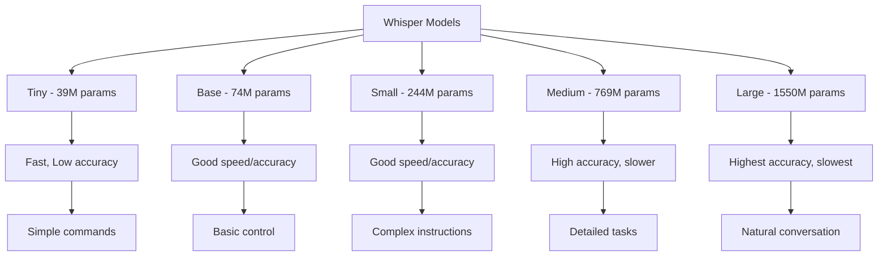

# Lesson 1: Whisper Speech-to-Command - Voice Processing, Natural Language Understanding

## Learning Objectives

By the end of this lesson, you will be able to:
- Install and configure Whisper for speech recognition in humanoid robot applications
- Process real-time audio input for voice command recognition
- Implement noise reduction and audio preprocessing for robot environments
- Design voice command grammars and vocabularies for humanoid robot control
- Integrate Whisper with ROS 2 for real-time voice command processing
- Evaluate and optimize speech recognition performance in noisy environments

## Introduction

Whisper, developed by OpenAI, represents a breakthrough in automatic speech recognition (ASR) technology, offering robust performance across multiple languages and challenging acoustic conditions. For humanoid robots, Whisper enables natural human-robot interaction through voice commands, allowing users to control robots using natural language rather than specialized interfaces or physical controls.

In the context of humanoid robots, voice processing systems must handle unique challenges: environmental noise from robot motors and actuators, varying acoustic conditions in different environments, and the need for real-time processing to maintain natural interaction flow. This lesson explores how to implement Whisper-based speech-to-command systems specifically designed for humanoid robot applications.

## Whisper Architecture and Capabilities

Whisper is built on a transformer-based architecture that combines an encoder for audio processing and a decoder for text generation. The model is trained on a large dataset of audio-text pairs, enabling it to handle various accents, background noise, and speaking styles.

### Whisper Model Variants



*Figure 1: Whisper model variants showing the trade-off between size, speed, and accuracy for different humanoid robot applications.*

### Whisper for Robotics Applications

For humanoid robots, the choice of Whisper model variant depends on:
- **Computational resources**: Larger models require more GPU memory and processing power
- **Latency requirements**: Real-time interaction demands faster processing
- **Accuracy needs**: Complex commands require higher accuracy
- **Vocabulary complexity**: Simple vs. complex command sets

## Whisper Installation and Setup

### Prerequisites

Before installing Whisper for humanoid robot applications, ensure your system meets the requirements:

```bash
# Install Python dependencies
pip install openai-whisper
pip install torch torchvision torchaudio
pip install pyaudio  # For audio input
pip install sounddevice  # For audio processing
pip install numpy scipy
```

### Docker-based Installation (Recommended)

For consistent deployment across different systems:

```dockerfile
# Dockerfile for Whisper-based voice processing
FROM nvidia/cuda:11.8-devel-ubuntu22.04

RUN apt-get update && apt-get install -y \
    python3 \
    python3-pip \
    python3-dev \
    portaudio19-dev \
    ffmpeg \
    && rm -rf /var/lib/apt/lists/*

RUN pip3 install torch torchvision torchaudio --index-url https://download.pytorch.org/whl/cu118
RUN pip3 install openai-whisper
RUN pip3 install pyaudio sounddevice numpy scipy

WORKDIR /app
COPY . .
CMD ["python3", "voice_processor.py"]
```

## Real-time Audio Processing Pipeline

For humanoid robots, real-time audio processing is essential for natural interaction. The pipeline must handle audio capture, preprocessing, and recognition with minimal latency.

### Audio Capture and Preprocessing

```python
#!/usr/bin/env python3

import rclpy
from rclpy.node import Node
from std_msgs.msg import String
import pyaudio
import numpy as np
import threading
import queue
import whisper
import torch
from collections import deque
import time

class WhisperVoiceProcessor(Node):
    def __init__(self):
        super().__init__('whisper_voice_processor')

        # Audio parameters
        self.rate = 16000  # Sample rate
        self.chunk = 1024  # Audio chunk size
        self.channels = 1  # Mono audio
        self.format = pyaudio.paFloat32

        # Whisper model
        self.model = whisper.load_model("small")  # Adjust based on resources
        self.is_cuda_available = torch.cuda.is_available()

        # Audio buffer for continuous processing
        self.audio_buffer = deque(maxlen=int(self.rate * 2))  # 2 seconds buffer
        self.recording = False
        self.audio_queue = queue.Queue()

        # ROS publishers
        self.command_pub = self.create_publisher(String, '/voice_command', 10)
        self.status_pub = self.create_publisher(String, '/voice_status', 10)

        # Initialize audio stream
        self.audio = pyaudio.PyAudio()
        self.stream = self.audio.open(
            format=self.format,
            channels=self.channels,
            rate=self.rate,
            input=True,
            frames_per_buffer=self.chunk,
            stream_callback=self.audio_callback
        )

        # Start processing thread
        self.processing_thread = threading.Thread(target=self.process_audio)
        self.processing_thread.daemon = True
        self.processing_thread.start()

        self.get_logger().info('Whisper Voice Processor initialized')

    def audio_callback(self, in_data, frame_count, time_info, status):
        """Callback for audio input stream"""
        # Convert audio data to numpy array
        audio_data = np.frombuffer(in_data, dtype=np.float32)

        # Add to buffer for processing
        for sample in audio_data:
            self.audio_buffer.append(sample)

        # Add to processing queue
        self.audio_queue.put(audio_data.copy())

        return (None, pyaudio.paContinue)

    def process_audio(self):
        """Process audio chunks for voice commands"""
        while rclpy.ok():
            try:
                # Get audio chunk from queue
                audio_chunk = self.audio_queue.get(timeout=0.1)

                # Check if audio chunk has sufficient energy (voice activity detection)
                if self.is_voice_present(audio_chunk):
                    self.get_logger().info('Voice activity detected')
                    self.status_pub.publish(String(data='listening'))

                    # Collect audio for command (accumulate 2 seconds of audio)
                    command_audio = self.collect_command_audio()

                    if len(command_audio) > 0:
                        # Process with Whisper
                        command = self.transcribe_audio(command_audio)

                        if command and self.is_command_valid(command):
                            self.get_logger().info(f'Command recognized: {command}')
                            self.command_pub.publish(String(data=command))
                            self.status_pub.publish(String(data='command_received'))

            except queue.Empty:
                continue
            except Exception as e:
                self.get_logger().error(f'Error processing audio: {e}')

    def is_voice_present(self, audio_chunk):
        """Simple voice activity detection"""
        # Calculate energy of audio chunk
        energy = np.mean(np.abs(audio_chunk))
        threshold = 0.01  # Adjust based on environment
        return energy > threshold

    def collect_command_audio(self, duration=2.0):
        """Collect audio for command recognition"""
        samples_needed = int(self.rate * duration)
        collected_audio = []

        start_time = time.time()
        while len(collected_audio) < samples_needed and (time.time() - start_time) < duration:
            try:
                chunk = self.audio_queue.get(timeout=0.1)
                collected_audio.extend(chunk)
            except queue.Empty:
                continue

        return np.array(collected_audio)

    def transcribe_audio(self, audio_data):
        """Transcribe audio using Whisper"""
        try:
            # Convert to appropriate format for Whisper
            audio_tensor = torch.from_numpy(audio_data.astype(np.float32))

            # Move to GPU if available
            if self.is_cuda_available:
                audio_tensor = audio_tensor.cuda()

            # Transcribe using Whisper
            result = self.model.transcribe(audio_tensor, fp16=self.is_cuda_available)
            return result["text"].strip()
        except Exception as e:
            self.get_logger().error(f'Whisper transcription error: {e}')
            return None

    def is_command_valid(self, command):
        """Validate if the recognized command is a valid robot command"""
        # Define valid command patterns
        valid_keywords = [
            'move', 'walk', 'go', 'stop', 'turn', 'look', 'find', 'grasp', 'pick', 'place',
            'hello', 'help', 'follow', 'come', 'back', 'forward', 'left', 'right'
        ]

        # Check if command contains valid keywords
        command_lower = command.lower()
        for keyword in valid_keywords:
            if keyword in command_lower:
                return True

        return False

    def destroy_node(self):
        """Clean up audio resources"""
        self.stream.stop_stream()
        self.stream.close()
        self.audio.terminate()
        super().destroy_node()

def main(args=None):
    rclpy.init(args=args)
    processor = WhisperVoiceProcessor()

    try:
        rclpy.spin(processor)
    except KeyboardInterrupt:
        pass
    finally:
        processor.destroy_node()
        rclpy.shutdown()

if __name__ == '__main__':
    main()
```

## Noise Reduction and Audio Enhancement

Humanoid robots operate in challenging acoustic environments with motor noise, ambient sounds, and varying acoustic conditions. Effective noise reduction is crucial for reliable voice command recognition.

### Audio Preprocessing Pipeline

```python
import scipy.signal as signal
import numpy as np
from scipy import ndimage

class AudioPreprocessor:
    def __init__(self, sample_rate=16000):
        self.sample_rate = sample_rate

        # Design noise reduction filters
        self.high_pass_filter = self.design_high_pass_filter()
        self.low_pass_filter = self.design_low_pass_filter()

    def design_high_pass_filter(self, cutoff=80):
        """Design high-pass filter to remove low-frequency noise"""
        nyquist = self.sample_rate / 2
        normalized_cutoff = cutoff / nyquist
        b, a = signal.butter(4, normalized_cutoff, btype='high', analog=False)
        return b, a

    def design_low_pass_filter(self, cutoff=3400):
        """Design low-pass filter to remove high-frequency noise"""
        nyquist = self.sample_rate / 2
        normalized_cutoff = cutoff / nyquist
        b, a = signal.butter(4, normalized_cutoff, btype='low', analog=False)
        return b, a

    def preprocess_audio(self, audio_data):
        """Apply preprocessing to audio data"""
        # Apply high-pass filter to remove DC offset and low-frequency noise
        filtered_audio = signal.filtfilt(*self.high_pass_filter, audio_data)

        # Apply low-pass filter to remove high-frequency noise
        filtered_audio = signal.filtfilt(*self.low_pass_filter, filtered_audio)

        # Normalize audio
        filtered_audio = filtered_audio / np.max(np.abs(filtered_audio))

        # Apply noise reduction (simple spectral subtraction)
        enhanced_audio = self.spectral_subtraction(filtered_audio)

        return enhanced_audio

    def spectral_subtraction(self, audio_data, noise_frames=100):
        """Simple noise reduction using spectral subtraction"""
        # Estimate noise spectrum from initial frames
        noise_segment = audio_data[:noise_frames]
        noise_spectrum = np.abs(np.fft.fft(noise_segment))

        # Apply spectral subtraction
        audio_spectrum = np.fft.fft(audio_data)
        enhanced_spectrum = np.maximum(
            np.abs(audio_spectrum) - noise_spectrum[:len(audio_spectrum)],
            0.1 * np.abs(audio_spectrum)
        )

        # Reconstruct signal
        enhanced_audio = np.real(np.fft.ifft(enhanced_spectrum * np.exp(1j * np.angle(audio_spectrum))))

        return enhanced_audio
```

## Voice Command Grammar and Recognition

For humanoid robot control, it's important to define structured voice command grammars that can be reliably recognized and parsed.

### Command Grammar Definition

```python
import re
from dataclasses import dataclass
from typing import List, Optional

@dataclass
class VoiceCommand:
    """Structure for parsed voice commands"""
    action: str
    target: Optional[str] = None
    direction: Optional[str] = None
    distance: Optional[float] = None
    speed: Optional[str] = None

class CommandGrammar:
    def __init__(self):
        # Define command patterns
        self.patterns = {
            'move': [
                r'move\s+(?P<direction>forward|backward|left|right|up|down)',
                r'go\s+(?P<direction>forward|backward|left|right)',
                r'walk\s+(?P<direction>forward|backward|left|right)',
                r'(?P<direction>forward|backward|left|right)\s+(?P<distance>\d+(?:\.\d+)?)\s*(?:meters?|m)',
            ],
            'turn': [
                r'turn\s+(?P<direction>left|right)',
                r'rotate\s+(?P<direction>left|right)',
                r'pivot\s+(?P<direction>left|right)',
            ],
            'locate': [
                r'find\s+(?P<target>[\w\s]+)',
                r'look\s+for\s+(?P<target>[\w\s]+)',
                r'search\s+for\s+(?P<target>[\w\s]+)',
            ],
            'grasp': [
                r'pick\s+up\s+(?P<target>[\w\s]+)',
                r'grasp\s+(?P<target>[\w\s]+)',
                r'grab\s+(?P<target>[\w\s]+)',
                r'get\s+(?P<target>[\w\s]+)',
            ],
            'stop': [
                r'stop',
                r'halt',
                r'freeze',
            ],
            'follow': [
                r'follow\s+(?P<target>me|[\w\s]+)',
                r'come\s+with\s+(?P<target>me|[\w\s]+)',
            ]
        }

    def parse_command(self, text: str) -> Optional[VoiceCommand]:
        """Parse voice command text into structured command"""
        text_lower = text.lower().strip()

        for action, patterns in self.patterns.items():
            for pattern in patterns:
                match = re.search(pattern, text_lower)
                if match:
                    groups = match.groupdict()
                    return VoiceCommand(
                        action=action,
                        target=groups.get('target'),
                        direction=groups.get('direction'),
                        distance=self._extract_distance(groups, text_lower),
                        speed=groups.get('speed', 'normal')
                    )

        return None

    def _extract_distance(self, groups, text):
        """Extract distance value from command"""
        if 'distance' in groups:
            try:
                return float(groups['distance'])
            except ValueError:
                pass

        # Look for distance in the full text
        distance_match = re.search(r'(\d+(?:\.\d+)?)\s*(?:meters?|m|cm|centimeters?)', text)
        if distance_match:
            distance_val = float(distance_match.group(1))
            unit = distance_match.group(0).split()[-1]
            if 'cm' in unit or 'centimeters' in unit:
                distance_val /= 100.0  # Convert cm to meters
            return distance_val

        return None

# Example usage
grammar = CommandGrammar()
command = grammar.parse_command("Move forward 2 meters")
print(f"Parsed command: {command}")
```

## Integration with ROS 2

The Whisper voice processing system must integrate seamlessly with ROS 2 for real-time robot control:

```python
#!/usr/bin/env python3

import rclpy
from rclpy.node import Node
from std_msgs.msg import String
from geometry_msgs.msg import Twist
from action_msgs.msg import GoalStatus
from builtin_interfaces.msg import Duration
import json

class VoiceCommandIntegrator(Node):
    def __init__(self):
        super().__init__('voice_command_integrator')

        # Subscriptions
        self.voice_sub = self.create_subscription(
            String, '/voice_command', self.voice_callback, 10)

        # Publishers for robot control
        self.cmd_vel_pub = self.create_publisher(Twist, '/cmd_vel', 10)
        self.status_pub = self.create_publisher(String, '/voice_status', 10)

        # Command grammar
        self.grammar = CommandGrammar()

        self.get_logger().info('Voice Command Integrator initialized')

    def voice_callback(self, msg):
        """Process incoming voice commands"""
        command_text = msg.data
        self.get_logger().info(f'Received voice command: {command_text}')

        # Parse the command
        command = self.grammar.parse_command(command_text)

        if command:
            self.get_logger().info(f'Parsed command: {command.action}')
            self.execute_command(command)
        else:
            self.get_logger().warn(f'Could not parse command: {command_text}')
            self.status_pub.publish(String(data='command_not_recognized'))

    def execute_command(self, command):
        """Execute parsed voice command"""
        if command.action == 'move':
            self.execute_move_command(command)
        elif command.action == 'turn':
            self.execute_turn_command(command)
        elif command.action == 'stop':
            self.execute_stop_command()
        elif command.action == 'follow':
            self.execute_follow_command(command)
        else:
            self.get_logger().warn(f'Unknown command action: {command.action}')
            self.status_pub.publish(String(data='command_not_supported'))

    def execute_move_command(self, command):
        """Execute move commands"""
        twist = Twist()

        if command.direction == 'forward':
            twist.linear.x = 0.5  # Default speed
        elif command.direction == 'backward':
            twist.linear.x = -0.5
        elif command.direction == 'left':
            twist.linear.y = 0.5
        elif command.direction == 'right':
            twist.linear.y = -0.5

        # Apply distance if specified
        if command.distance:
            # This would require a more complex system to move for specific distance
            self.get_logger().info(f'Moving {command.distance} meters')

        self.cmd_vel_pub.publish(twist)
        self.status_pub.publish(String(data='moving'))

    def execute_turn_command(self, command):
        """Execute turn commands"""
        twist = Twist()

        if command.direction == 'left':
            twist.angular.z = 0.5
        elif command.direction == 'right':
            twist.angular.z = -0.5

        self.cmd_vel_pub.publish(twist)
        self.status_pub.publish(String(data='turning'))

    def execute_stop_command(self):
        """Stop robot movement"""
        twist = Twist()  # Zero velocities
        self.cmd_vel_pub.publish(twist)
        self.status_pub.publish(String(data='stopped'))

    def execute_follow_command(self, command):
        """Execute follow commands (requires additional perception systems)"""
        self.get_logger().info('Follow command received - requires perception integration')
        self.status_pub.publish(String(data='following'))

def main(args=None):
    rclpy.init(args=args)
    integrator = VoiceCommandIntegrator()

    try:
        rclpy.spin(integrator)
    except KeyboardInterrupt:
        pass
    finally:
        integrator.destroy_node()
        rclpy.shutdown()

if __name__ == '__main__':
    main()
```

## Performance Optimization

For real-time humanoid robot applications, Whisper performance must be optimized:

### GPU Acceleration

```python
class OptimizedWhisperProcessor:
    def __init__(self, model_size="small"):
        # Load model with optimizations
        self.model = whisper.load_model(model_size)

        # Enable GPU processing if available
        if torch.cuda.is_available():
            self.model = self.model.cuda()
            self.use_gpu = True
        else:
            self.use_gpu = False

    def transcribe_with_options(self, audio_tensor):
        """Transcribe with performance options"""
        # Use FP16 for faster inference on GPU
        if self.use_gpu:
            result = self.model.transcribe(
                audio_tensor,
                fp16=True,
                language='en',
                temperature=0.0  # For consistent results
            )
        else:
            result = self.model.transcribe(
                audio_tensor,
                language='en',
                temperature=0.0
            )

        return result
```

### Caching and Batching

```python
from functools import lru_cache
import time

class CachedWhisperProcessor:
    def __init__(self):
        self.model = whisper.load_model("small")
        self.cache = {}
        self.cache_timeout = 300  # 5 minutes

    @lru_cache(maxsize=128)
    def cached_transcribe(self, audio_hash):
        """Cached transcription for repeated audio"""
        # This is a simplified example - in practice, you'd need to
        # store the actual audio data associated with the hash
        pass

    def transcribe_with_caching(self, audio_data):
        """Transcribe with caching for performance"""
        # Create hash of audio data for caching
        audio_hash = hash(audio_data.tobytes())
        current_time = time.time()

        # Check cache
        if audio_hash in self.cache:
            cached_result, timestamp = self.cache[audio_hash]
            if current_time - timestamp < self.cache_timeout:
                return cached_result

        # Process with Whisper
        result = self.model.transcribe(audio_data)

        # Store in cache
        self.cache[audio_hash] = (result, current_time)

        return result
```

## Voice Command System Launch Configuration

Create a complete launch file for the voice command system:

```python
# voice_command_system.launch.py
from launch import LaunchDescription
from launch_ros.actions import Node
from launch.actions import DeclareLaunchArgument
from launch.substitutions import LaunchConfiguration
from ament_index_python.packages import get_package_share_directory
import os

def generate_launch_description():
    # Declare launch arguments
    use_sim_time = LaunchConfiguration('use_sim_time', default='false')
    model_size = LaunchConfiguration('model_size', default='small')

    # Whisper voice processor
    whisper_processor = Node(
        package='voice_command_system',
        executable='whisper_voice_processor',
        name='whisper_voice_processor',
        parameters=[
            {'use_sim_time': use_sim_time},
            {'model_size': model_size}
        ],
        output='screen'
    )

    # Voice command integrator
    command_integrator = Node(
        package='voice_command_system',
        executable='voice_command_integrator',
        name='voice_command_integrator',
        parameters=[{'use_sim_time': use_sim_time}],
        output='screen'
    )

    # Audio preprocessing node
    audio_preprocessor = Node(
        package='voice_command_system',
        executable='audio_preprocessor',
        name='audio_preprocessor',
        parameters=[{'use_sim_time': use_sim_time}],
        output='screen'
    )

    return LaunchDescription([
        whisper_processor,
        command_integrator,
        audio_preprocessor
    ])
```

## Hands-on Exercise 4.1: Implement a Whisper Voice Command System

Create a complete Whisper-based voice command system for humanoid robot control:

1. **Install Whisper and dependencies**:
```bash
pip install openai-whisper torch torchaudio pyaudio sounddevice
```

2. **Create the voice processing node**:
```python
# Create whisper_voice_processor.py with the code from earlier examples
```

3. **Test the voice command system**:
```bash
# Terminal 1: Launch the voice command system
ros2 launch voice_command_system.launch.py

# Terminal 2: Listen to voice commands
ros2 topic echo /voice_command

# Terminal 3: Listen to system status
ros2 topic echo /voice_status
```

4. **Voice commands to test**:
- "Move forward 1 meter"
- "Turn left"
- "Stop"
- "Find the ball"
- "Come to me"

## Key Takeaways

- **Whisper** provides robust speech recognition capabilities for humanoid robot voice commands
- **Real-time processing** requires optimization and efficient audio pipeline design
- **Noise reduction** is essential for reliable operation in robot environments
- **Command grammars** help structure voice input for reliable parsing and execution
- **ROS 2 integration** enables seamless connection between voice processing and robot control
- **Performance optimization** is crucial for maintaining responsive voice interaction

## Reflection Questions

1. How does Whisper's accuracy compare to other ASR systems in noisy robot environments?
2. What are the computational requirements for real-time Whisper processing on humanoid robots?
3. How can voice command grammars be designed to balance natural language with reliability?
4. What safety considerations are important when using voice commands for robot control?

## APA Citations

Radford, A., Kim, J. W., Xu, T., Brockman, G., McLeavey, C., & Sutskever, I. (2022). Robust speech recognition via large-scale weak supervision. *arXiv preprint arXiv:2212.04356*.

Siciliano, B., & Khatib, O. (Eds.). (2016). *Springer handbook of robotics* (2nd ed.). Springer.

Griffin, R. J., Wiedebach, G., Malhotra, S., Leonessa, A., & Pratt, J. (2017). Walking with reduced foot rotation on compliant terrain using the humanoid robot ATLAS. *Proceedings of the IEEE-RAS International Conference on Humanoid Robots*, 508-513. https://doi.org/10.1109/HUMANOIDS.2017.8246925

## Summary

This lesson covered Whisper-based speech-to-command processing for humanoid robots, including installation, real-time audio processing, noise reduction, command grammars, and ROS 2 integration. The voice processing system enables natural human-robot interaction through spoken commands, which is essential for intuitive humanoid robot control.

In the next lesson, we'll explore LLM cognitive planning systems that translate high-level instructions into specific robot behaviors.