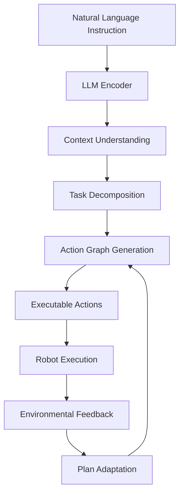

# Lesson 2: LLM Cognitive Planning - Action Graphs, Task Decomposition, Planning

## Learning Objectives

By the end of this lesson, you will be able to:
- Design and implement LLM-based cognitive planning systems for humanoid robots
- Create action graphs that decompose complex tasks into executable robot behaviors
- Engineer effective prompts for robotic planning and control using LLMs
- Integrate LLM cognitive planning with ROS 2 action servers and behavior trees
- Evaluate and optimize cognitive planning performance for real-time robot applications
- Implement task decomposition strategies for complex humanoid robot behaviors

## Introduction

Large Language Models (LLMs) represent a paradigm shift in robotic cognitive planning, enabling robots to understand and execute complex, high-level instructions expressed in natural language. For humanoid robots, LLM cognitive planning bridges the gap between human communication and robotic action, allowing robots to interpret abstract goals and decompose them into sequences of specific behaviors.

Cognitive planning with LLMs involves several key components: understanding natural language instructions, decomposing complex tasks into manageable subtasks, generating executable action sequences, and adapting plans based on environmental feedback. This lesson explores how to implement these capabilities using modern LLMs and integrate them with humanoid robot control systems.

## LLM Architecture for Cognitive Planning

### Transformer-Based Reasoning

LLMs use transformer architectures that excel at understanding context and generating structured outputs. For cognitive planning, this means they can:

- Parse complex natural language instructions
- Maintain context across multiple planning steps
- Generate structured action sequences
- Adapt plans based on new information



*Figure 1: LLM cognitive planning architecture showing the flow from natural language to robot actions with environmental feedback.*

### Planning-Specific LLM Considerations

For cognitive planning applications, several factors affect LLM performance:

- **Structured Output**: LLMs need to generate well-structured action sequences
- **Domain Knowledge**: Models need to understand robot capabilities and constraints
- **Context Length**: Complex tasks may require long planning horizons
- **Reliability**: Planning outputs must be consistent and predictable

## Action Graph Representation

Action graphs provide a structured representation of tasks and their dependencies, enabling complex task decomposition and execution planning.

### Action Graph Structure

```python
#!/usr/bin/env python3

import rclpy
from rclpy.node import Node
from std_msgs.msg import String
from action_msgs.msg import GoalStatus
from typing import List, Dict, Any, Optional
from enum import Enum
from dataclasses import dataclass
import json

class ActionStatus(Enum):
    PENDING = "pending"
    RUNNING = "running"
    SUCCESS = "success"
    FAILED = "failed"
    CANCELLED = "cancelled"

@dataclass
class ActionNode:
    """Represents a single action in the action graph"""
    id: str
    name: str
    action_type: str  # e.g., "navigation", "manipulation", "perception"
    parameters: Dict[str, Any]
    prerequisites: List[str]  # IDs of actions that must complete first
    dependencies: List[str]   # IDs of actions that depend on this one
    status: ActionStatus = ActionStatus.PENDING
    result: Optional[Any] = None

class ActionGraph:
    """Represents a graph of interconnected actions"""
    def __init__(self):
        self.nodes: Dict[str, ActionNode] = {}
        self.start_nodes: List[str] = []  # Nodes with no prerequisites
        self.end_nodes: List[str] = []    # Nodes that no other nodes depend on

    def add_node(self, node: ActionNode):
        """Add a node to the action graph"""
        self.nodes[node.id] = node

        # Update start and end nodes
        if not node.prerequisites:
            if node.id not in self.start_nodes:
                self.start_nodes.append(node.id)

        # Check if this node is an end node
        is_end = True
        for other_node in self.nodes.values():
            if node.id in other_node.prerequisites:
                is_end = False
                break

        if is_end and node.id not in self.end_nodes:
            self.end_nodes.append(node.id)

    def get_ready_actions(self, completed_actions: List[str]) -> List[ActionNode]:
        """Get actions that are ready to execute"""
        ready = []
        for node_id, node in self.nodes.items():
            if node.status == ActionStatus.PENDING:
                # Check if all prerequisites are completed
                all_prereqs_met = True
                for prereq in node.prerequisites:
                    if prereq not in completed_actions:
                        all_prereqs_met = False
                        break

                if all_prereqs_met:
                    ready.append(node)

        return ready

    def update_node_status(self, node_id: str, status: ActionStatus, result: Any = None):
        """Update the status of a node"""
        if node_id in self.nodes:
            self.nodes[node_id].status = status
            if result is not None:
                self.nodes[node_id].result = result

    def is_complete(self) -> bool:
        """Check if all nodes are completed"""
        for node in self.nodes.values():
            if node.status not in [ActionStatus.SUCCESS, ActionStatus.FAILED]:
                return False
        return True

    def get_execution_order(self) -> List[str]:
        """Get a valid execution order for the graph"""
        # Topological sort implementation
        visited = set()
        order = []

        def dfs(node_id):
            if node_id in visited:
                return
            visited.add(node_id)

            node = self.nodes[node_id]
            for dep_id in node.dependencies:
                if dep_id in self.nodes:
                    dfs(dep_id)

            order.append(node_id)

        for start_node in self.start_nodes:
            dfs(start_node)

        return order
```

### Action Graph Generation with LLMs

```python
import openai
import json
from typing import Dict, List

class LLMActionGraphGenerator:
    def __init__(self, api_key: str, model: str = "gpt-3.5-turbo"):
        openai.api_key = api_key
        self.model = model
        self.robot_capabilities = self.get_robot_capabilities()

    def get_robot_capabilities(self) -> Dict:
        """Define what the robot can do"""
        return {
            "navigation": {
                "move_to": {
                    "parameters": ["location", "speed"],
                    "description": "Move the robot to a specified location"
                },
                "turn": {
                    "parameters": ["direction", "angle"],
                    "description": "Turn the robot in a specified direction"
                }
            },
            "manipulation": {
                "pick_up": {
                    "parameters": ["object", "location"],
                    "description": "Pick up an object from a location"
                },
                "place": {
                    "parameters": ["object", "location"],
                    "description": "Place an object at a location"
                },
                "grasp": {
                    "parameters": ["object", "grasp_type"],
                    "description": "Grasp an object"
                }
            },
            "perception": {
                "detect_object": {
                    "parameters": ["object_type", "search_area"],
                    "description": "Detect objects of a specific type in an area"
                },
                "identify": {
                    "parameters": ["target", "properties"],
                    "description": "Identify specific properties of a target"
                }
            }
        }

    def generate_action_graph(self, instruction: str) -> ActionGraph:
        """Generate an action graph from a natural language instruction"""
        prompt = self.create_planning_prompt(instruction)

        response = openai.ChatCompletion.create(
            model=self.model,
            messages=[
                {"role": "system", "content": self.get_system_prompt()},
                {"role": "user", "content": prompt}
            ],
            temperature=0.1,  # Low temperature for consistent outputs
            functions=[
                {
                    "name": "create_action_graph",
                    "description": "Create an action graph for the robot to execute",
                    "parameters": {
                        "type": "object",
                        "properties": {
                            "actions": {
                                "type": "array",
                                "items": {
                                    "type": "object",
                                    "properties": {
                                        "id": {"type": "string"},
                                        "name": {"type": "string"},
                                        "action_type": {"type": "string"},
                                        "parameters": {"type": "object"},
                                        "prerequisites": {
                                            "type": "array",
                                            "items": {"type": "string"}
                                        }
                                    },
                                    "required": ["id", "name", "action_type", "parameters"]
                                }
                            }
                        },
                        "required": ["actions"]
                    }
                }
            ],
            function_call={"name": "create_action_graph"}
        )

        # Parse the response
        function_call = response.choices[0].message.function_call
        if function_call:
            graph_data = json.loads(function_call.arguments)
            return self.create_action_graph_from_data(graph_data)

        return ActionGraph()

    def create_planning_prompt(self, instruction: str) -> str:
        """Create a prompt for the LLM to generate an action graph"""
        return f"""
        Instruction: {instruction}

        Robot Capabilities:
        {json.dumps(self.robot_capabilities, indent=2)}

        Please create an action graph to execute this instruction. The graph should:
        1. Break down the task into specific, executable actions
        2. Define dependencies between actions
        3. Use only the robot capabilities listed above
        4. Ensure the actions are in a logical order
        5. Include all necessary parameters for each action

        Create the action graph with appropriate prerequisite relationships.
        """

    def get_system_prompt(self) -> str:
        """System prompt for the LLM"""
        return """
        You are an expert robot cognitive planner. Your task is to break down natural language instructions into executable action graphs for humanoid robots.

        Each action should be specific, executable, and use the provided robot capabilities. Define proper dependencies between actions where one action must complete before another can start. Always ensure the action graph represents a valid plan that achieves the given instruction.
        """

    def create_action_graph_from_data(self, graph_data: Dict) -> ActionGraph:
        """Create an ActionGraph from LLM response data"""
        graph = ActionGraph()

        for action_data in graph_data["actions"]:
            node = ActionNode(
                id=action_data["id"],
                name=action_data["name"],
                action_type=action_data["action_type"],
                parameters=action_data.get("parameters", {}),
                prerequisites=action_data.get("prerequisites", []),
                dependencies=[]  # Will be filled in based on prerequisites
            )
            graph.add_node(node)

        # Fill in dependencies based on prerequisites
        for node_id, node in graph.nodes.items():
            for prereq_id in node.prerequisites:
                if prereq_id in graph.nodes:
                    graph.nodes[prereq_id].dependencies.append(node_id)

        return graph
```

## Cognitive Planning Node Implementation

```python
#!/usr/bin/env python3

import rclpy
from rclpy.node import Node
from std_msgs.msg import String
from geometry_msgs.msg import PoseStamped
from action_msgs.msg import GoalStatus
from rclpy.action import ActionClient
from rclpy.callback_groups import ReentrantCallbackGroup
from rclpy.executors import MultiThreadedExecutor
import threading
import time
from typing import Dict, Any

class CognitivePlannerNode(Node):
    def __init__(self):
        super().__init__('cognitive_planner')

        # Publishers and subscribers
        self.instruction_sub = self.create_subscription(
            String, '/natural_language_instruction', self.instruction_callback, 10)
        self.status_pub = self.create_publisher(String, '/cognitive_planner_status', 10)
        self.action_status_pub = self.create_publisher(String, '/action_status', 10)

        # Action clients for different robot capabilities
        self.nav_client = ActionClient(self, NavigateToPose, 'navigate_to_pose')
        self.manipulation_client = ActionClient(self, ManipulateObject, 'manipulate_object')
        self.perception_client = ActionClient(self, DetectObjects, 'detect_objects')

        # Planning components
        self.graph_generator = LLMActionGraphGenerator(api_key="your-api-key")
        self.current_graph = None
        self.completed_actions = []
        self.execution_thread = None
        self.planning_lock = threading.Lock()

        # Planning parameters
        self.max_replanning_attempts = 3
        self.action_timeout = 30.0  # seconds

        self.get_logger().info('Cognitive Planner Node initialized')

    def instruction_callback(self, msg):
        """Process natural language instruction"""
        instruction = msg.data
        self.get_logger().info(f'Received instruction: {instruction}')

        # Generate action graph
        try:
            with self.planning_lock:
                self.current_graph = self.graph_generator.generate_action_graph(instruction)

                if not self.current_graph.nodes:
                    self.get_logger().error('Failed to generate action graph')
                    self.status_pub.publish(String(data='planning_failed'))
                    return

                self.get_logger().info(f'Generated action graph with {len(self.current_graph.nodes)} actions')
                self.status_pub.publish(String(data='planning_completed'))

                # Start execution
                self.completed_actions = []
                self.execute_action_graph()

        except Exception as e:
            self.get_logger().error(f'Error generating action graph: {e}')
            self.status_pub.publish(String(data='planning_error'))

    def execute_action_graph(self):
        """Execute the action graph"""
        if self.execution_thread and self.execution_thread.is_alive():
            self.get_logger().warn('Execution already in progress')
            return

        self.execution_thread = threading.Thread(target=self._execute_graph)
        self.execution_thread.daemon = True
        self.execution_thread.start()

    def _execute_graph(self):
        """Execute the action graph in a separate thread"""
        while not self.current_graph.is_complete():
            # Get ready actions
            ready_actions = self.current_graph.get_ready_actions(self.completed_actions)

            if not ready_actions:
                # Check if we're waiting for actions to complete
                time.sleep(0.1)
                continue

            # Execute ready actions
            for action_node in ready_actions:
                if action_node.status == ActionStatus.PENDING:
                    self.execute_action(action_node)

            # Check for timeout
            time.sleep(0.1)

        self.get_logger().info('Action graph execution completed')
        self.status_pub.publish(String(data='execution_completed'))

    def execute_action(self, action_node: ActionNode):
        """Execute a single action"""
        self.get_logger().info(f'Executing action: {action_node.name}')
        self.current_graph.update_node_status(action_node.id, ActionStatus.RUNNING)
        self.action_status_pub.publish(String(data=f'executing_{action_node.id}'))

        try:
            # Route to appropriate action handler based on type
            if action_node.action_type == 'navigation':
                success = self.execute_navigation_action(action_node)
            elif action_node.action_type == 'manipulation':
                success = self.execute_manipulation_action(action_node)
            elif action_node.action_type == 'perception':
                success = self.execute_perception_action(action_node)
            else:
                self.get_logger().error(f'Unknown action type: {action_node.action_type}')
                success = False

            # Update status
            if success:
                self.current_graph.update_node_status(action_node.id, ActionStatus.SUCCESS)
                self.completed_actions.append(action_node.id)
                self.action_status_pub.publish(String(data=f'success_{action_node.id}'))
            else:
                self.current_graph.update_node_status(action_node.id, ActionStatus.FAILED)
                self.action_status_pub.publish(String(data=f'failed_{action_node.id}'))

        except Exception as e:
            self.get_logger().error(f'Error executing action {action_node.id}: {e}')
            self.current_graph.update_node_status(action_node.id, ActionStatus.FAILED)
            self.action_status_pub.publish(String(data=f'error_{action_node.id}'))

    def execute_navigation_action(self, action_node: ActionNode):
        """Execute navigation action"""
        # Extract parameters
        location = action_node.parameters.get('location')
        speed = action_node.parameters.get('speed', 0.5)

        if not location:
            self.get_logger().error('Navigation action missing location parameter')
            return False

        # Create navigation goal
        goal_msg = NavigateToPose.Goal()
        goal_msg.pose.header.frame_id = 'map'
        goal_msg.pose.pose.position.x = float(location.get('x', 0.0))
        goal_msg.pose.pose.position.y = float(location.get('y', 0.0))
        goal_msg.pose.pose.position.z = float(location.get('z', 0.0))

        # Set orientation (assuming facing forward)
        goal_msg.pose.pose.orientation.w = 1.0

        # Send goal
        self.nav_client.wait_for_server()
        future = self.nav_client.send_goal_async(goal_msg)
        future.add_done_callback(lambda f: self.navigation_done_callback(f, action_node.id))

        # Wait for result with timeout
        start_time = time.time()
        while time.time() - start_time < self.action_timeout:
            if action_node.status == ActionStatus.SUCCESS or action_node.status == ActionStatus.FAILED:
                return action_node.status == ActionStatus.SUCCESS
            time.sleep(0.1)

        # Timeout
        self.get_logger().warn(f'Navigation action {action_node.id} timed out')
        return False

    def execute_manipulation_action(self, action_node: ActionNode):
        """Execute manipulation action"""
        # Similar to navigation but for manipulation tasks
        # Implementation would depend on specific manipulation capabilities
        self.get_logger().info(f'Executing manipulation: {action_node.parameters}')
        # For now, return success
        return True

    def execute_perception_action(self, action_node: ActionNode):
        """Execute perception action"""
        # Similar to navigation but for perception tasks
        self.get_logger().info(f'Executing perception: {action_node.parameters}')
        # For now, return success
        return True

    def navigation_done_callback(self, future, action_id):
        """Handle navigation action completion"""
        try:
            goal_handle = future.result()
            if goal_handle.accepted:
                result_future = goal_handle.get_result_async()
                result_future.add_done_callback(
                    lambda f: self.navigation_result_callback(f, action_id)
                )
            else:
                self.get_logger().error(f'Navigation goal for action {action_id} was rejected')
                self.current_graph.update_node_status(action_id, ActionStatus.FAILED)
        except Exception as e:
            self.get_logger().error(f'Error in navigation callback: {e}')
            self.current_graph.update_node_status(action_id, ActionStatus.FAILED)

    def navigation_result_callback(self, future, action_id):
        """Handle navigation result"""
        try:
            result = future.result().result
            if result:
                self.current_graph.update_node_status(action_id, ActionStatus.SUCCESS)
                self.completed_actions.append(action_id)
            else:
                self.current_graph.update_node_status(action_id, ActionStatus.FAILED)
        except Exception as e:
            self.get_logger().error(f'Error in navigation result callback: {e}')
            self.current_graph.update_node_status(action_id, ActionStatus.FAILED)

def main(args=None):
    rclpy.init(args=args)
    planner = CognitivePlannerNode()

    # Use multi-threaded executor to handle callbacks
    executor = MultiThreadedExecutor()
    executor.add_node(planner)

    try:
        executor.spin()
    except KeyboardInterrupt:
        pass
    finally:
        planner.destroy_node()
        rclpy.shutdown()

if __name__ == '__main__':
    main()
```

## Prompt Engineering for Robotic Planning

Effective prompt engineering is crucial for getting reliable outputs from LLMs for robotic planning:

### System Prompt Design

```python
class PromptEngineer:
    def __init__(self):
        self.base_system_prompt = """
        You are an expert robotic cognitive planner. Your task is to decompose natural language instructions into executable action sequences for humanoid robots.

        Guidelines:
        1. Always use the robot's available capabilities
        2. Create logical action dependencies
        3. Include all necessary parameters for each action
        4. Consider robot safety and physical constraints
        5. Handle ambiguous instructions by making reasonable assumptions
        6. Break down complex tasks into simple, executable steps
        """

    def create_task_decomposition_prompt(self, instruction: str, context: Dict = None) -> str:
        """Create a prompt for task decomposition"""
        context_str = json.dumps(context, indent=2) if context else "No additional context provided"

        return f"""
        {self.base_system_prompt}

        Natural Language Instruction: {instruction}

        Robot Context:
        {context_str}

        Available Capabilities:
        - Navigation: move_to(location), turn(direction)
        - Manipulation: pick_up(object), place(object, location), grasp(object)
        - Perception: detect_object(type, area), identify(target)

        Please decompose this instruction into a sequence of executable actions with proper dependencies.
        Each action should have:
        - A unique ID
        - A descriptive name
        - An action type (navigation, manipulation, perception)
        - Required parameters
        - Prerequisites (other actions that must complete first)

        Output the action graph in JSON format.
        """

    def create_safety_aware_prompt(self, instruction: str) -> str:
        """Create a safety-aware planning prompt"""
        return f"""
        {self.base_system_prompt}

        SAFETY CONSTRAINTS (CRITICAL):
        - Always check for obstacles before navigation
        - Verify object stability before manipulation
        - Maintain balance during all movements
        - Respect human safety zones
        - Avoid dangerous areas

        Instruction: {instruction}

        Decompose this task with safety considerations integrated into the action sequence.
        Include safety checks as separate actions where appropriate.
        """

    def create_context_aware_prompt(self, instruction: str, world_state: Dict) -> str:
        """Create a context-aware planning prompt"""
        return f"""
        {self.base_system_prompt}

        Current World State:
        {json.dumps(world_state, indent=2)}

        Instruction: {instruction}

        Generate an action graph that takes the current world state into account.
        Consider object locations, robot position, and environmental conditions.
        """
```

## Task Decomposition Strategies

### Hierarchical Task Networks (HTN)

```python
class HTNPlanner:
    def __init__(self):
        self.methods = self.define_methods()
        self.operators = self.define_operators()

    def define_methods(self):
        """Define methods for decomposing high-level tasks"""
        return {
            'fetch_object': [
                # Method 1: Navigate to object, then grasp
                [
                    {'action': 'navigate_to', 'params': {'target': 'object_location'}},
                    {'action': 'grasp_object', 'params': {'object': 'target_object'}}
                ],
                # Method 2: Ask for object if not visible
                [
                    {'action': 'search_for_object', 'params': {'object': 'target_object'}},
                    {'action': 'request_assistance', 'params': {'request': 'locate_object'}}
                ]
            ],
            'serve_beverage': [
                # Method: Go to kitchen, get beverage, bring to person
                [
                    {'action': 'navigate_to', 'params': {'target': 'kitchen'}},
                    {'action': 'pick_up', 'params': {'object': 'beverage'}},
                    {'action': 'navigate_to', 'params': {'target': 'person_location'}},
                    {'action': 'place', 'params': {'object': 'beverage', 'location': 'person_hand'}}
                ]
            ]
        }

    def define_operators(self):
        """Define primitive operators (leaf actions)"""
        return {
            'navigate_to': {
                'preconditions': ['robot_operational', 'path_clear'],
                'effects': ['robot_at_location']
            },
            'grasp_object': {
                'preconditions': ['object_reachable', 'gripper_free'],
                'effects': ['object_grasped', 'gripper_occupied']
            },
            'pick_up': {
                'preconditions': ['object_detectable', 'arm_free'],
                'effects': ['object_held']
            }
        }

    def decompose_task(self, task_name: str, params: Dict) -> List[Dict]:
        """Decompose a high-level task using HTN methods"""
        if task_name in self.methods:
            # Use the first available method for simplicity
            # In practice, you'd evaluate conditions to choose the best method
            method = self.methods[task_name][0]

            # Substitute parameters
            instantiated_method = []
            for action in method:
                instantiated_action = action.copy()
                for key, value in instantiated_action['params'].items():
                    if isinstance(value, str) and value in params:
                        instantiated_action['params'][key] = params[value]
                instantiated_method.append(instantiated_action)

            return instantiated_method

        # If no method exists, return as primitive action
        return [{'action': task_name, 'params': params}]
```

## Integration with Behavior Trees

LLM cognitive planning can be integrated with behavior trees for more sophisticated control:

```python
class LLMBehaviorTreeIntegrator:
    def __init__(self):
        self.llm_planner = LLMActionGraphGenerator(api_key="your-api-key")
        self.behavior_tree = None

    def create_adaptive_behavior_tree(self, instruction: str) -> Dict:
        """Create a behavior tree based on LLM-generated action graph"""
        # Generate action graph from instruction
        action_graph = self.llm_planner.generate_action_graph(instruction)

        # Convert to behavior tree structure
        bt_root = {
            "type": "sequence",
            "children": []
        }

        # Get execution order from action graph
        execution_order = action_graph.get_execution_order()

        for action_id in execution_order:
            if action_id in action_graph.nodes:
                node = action_graph.nodes[action_id]
                bt_action = self.convert_to_bt_node(node)
                bt_root["children"].append(bt_action)

        return bt_root

    def convert_to_bt_node(self, action_node: ActionNode) -> Dict:
        """Convert an action graph node to a behavior tree node"""
        return {
            "type": "action",
            "name": action_node.name,
            "action_type": action_node.action_type,
            "parameters": action_node.parameters,
            "id": action_node.id
        }
```

## Performance Optimization

For real-time cognitive planning, performance optimization is crucial:

### Caching and Pre-computation

```python
from functools import lru_cache
import pickle
import hashlib

class OptimizedLLMPlanner:
    def __init__(self, api_key: str):
        self.api_key = api_key
        self.cache = {}
        self.cache_size = 1000
        self.cache_timeout = 3600  # 1 hour

    @lru_cache(maxsize=128)
    def cached_plan_generation(self, instruction_hash: str, instruction: str) -> ActionGraph:
        """Cached LLM planning to avoid repeated API calls"""
        # This would call the LLM to generate the action graph
        # Implementation depends on specific LLM provider
        pass

    def get_cached_plan(self, instruction: str) -> Optional[ActionGraph]:
        """Get cached plan or generate new one"""
        instruction_hash = hashlib.md5(instruction.encode()).hexdigest()

        if instruction_hash in self.cache:
            plan, timestamp = self.cache[instruction_hash]
            if time.time() - timestamp < self.cache_timeout:
                return plan

        # Generate new plan
        plan = self.generate_plan(instruction)

        # Store in cache
        if len(self.cache) >= self.cache_size:
            # Remove oldest entry
            oldest_key = min(self.cache.keys(), key=lambda k: self.cache[k][1])
            del self.cache[oldest_key]

        self.cache[instruction_hash] = (plan, time.time())
        return plan

    def generate_plan(self, instruction: str) -> ActionGraph:
        """Generate a new plan using LLM"""
        # Implementation would call LLM API
        # For now, return empty graph
        return ActionGraph()
```

## Hands-on Exercise 4.2: Implement an LLM Cognitive Planning System

Create a complete LLM-based cognitive planning system:

1. **Set up the LLM planning node**:
```python
# Install required packages
pip install openai torch transformers
```

2. **Create the cognitive planner**:
```python
# cognitive_planner.py - Implementation from earlier examples
```

3. **Test the system with various instructions**:
```bash
# Terminal 1: Launch the cognitive planner
ros2 run cognitive_planning cognitive_planner_node

# Terminal 2: Send test instructions
ros2 topic pub /natural_language_instruction std_msgs/String "data: 'Go to the kitchen and bring me a cup'"

# Terminal 3: Monitor status
ros2 topic echo /cognitive_planner_status
ros2 topic echo /action_status
```

4. **Implement a simple action server for testing**:
```python
#!/usr/bin/env python3

import rclpy
from rclpy.action import ActionServer
from rclpy.node import Node
from your_interfaces.action import NavigateToPose  # Define your action interface

class MockActionServer(Node):
    def __init__(self):
        super().__init__('mock_action_server')
        self._action_server = ActionServer(
            self,
            NavigateToPose,
            'navigate_to_pose',
            self.execute_callback)

    def execute_callback(self, goal_handle):
        self.get_logger().info('Executing navigation goal...')
        # Simulate navigation
        feedback_msg = NavigateToPose.Feedback()

        # Send feedback
        for i in range(0, 100, 10):
            feedback_msg.progress = i
            goal_handle.publish_feedback(feedback_msg)
            time.sleep(0.5)

        goal_handle.succeed()
        result = NavigateToPose.Result()
        result.success = True
        return result

def main(args=None):
    rclpy.init(args=args)
    server = MockActionServer()
    rclpy.spin(server)
    server.destroy_node()
    rclpy.shutdown()

if __name__ == '__main__':
    main()
```

## Key Takeaways

- **LLM cognitive planning** enables natural language task decomposition for humanoid robots
- **Action graphs** provide structured representation of tasks and their dependencies
- **Prompt engineering** is crucial for reliable LLM outputs in robotic applications
- **Task decomposition strategies** help break down complex instructions into executable actions
- **Performance optimization** is essential for real-time cognitive planning
- **Integration with behavior trees** enables sophisticated control architectures

## Reflection Questions

1. How can LLM cognitive planning be made more reliable for safety-critical robot applications?
2. What are the limitations of current LLMs for robotic planning and how can they be addressed?
3. How does the quality of prompt engineering affect the performance of cognitive planning systems?
4. What strategies can be used to handle ambiguous or underspecified natural language instructions?

## APA Citations

Vaswani, A., Shazeer, N., Parmar, N., Uszkoreit, J., Jones, L., Gomez, A. N., ... & Polosukhin, I. (2017). Attention is all you need. *Advances in Neural Information Processing Systems*, 30, 5998-6008.

Brown, T., Mann, B., Ryder, N., Subbiah, M., Kaplan, J. D., Dhariwal, P., ... & Amodei, D. (2020). Language models are few-shot learners. *Advances in Neural Information Processing Systems*, 33, 1877-1901.

Siciliano, B., & Khatib, O. (Eds.). (2016). *Springer handbook of robotics* (2nd ed.). Springer.

## Summary

This lesson covered LLM cognitive planning systems for humanoid robots, including action graph representation, task decomposition strategies, prompt engineering, and integration with behavior trees. LLM-based cognitive planning enables robots to understand and execute complex natural language instructions by decomposing them into structured action sequences. The combination of LLMs with structured planning approaches provides a powerful framework for intelligent robot behavior.

In the next lesson, we'll explore the complete integration of all VLA components into a full digital humanoid agent.