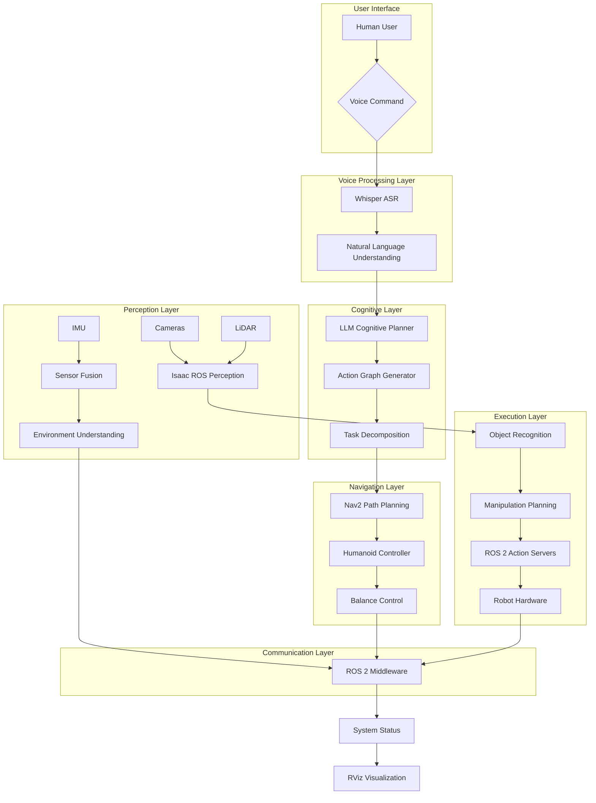

# Lesson 3: Capstone - Full Digital Humanoid Agent - Complete System Integration

## Learning Objectives

By the end of this lesson, you will be able to:
- Integrate all components from previous modules into a complete digital humanoid agent
- Implement a voice-to-action pipeline connecting Whisper, LLM planning, and robot execution
- Design and implement a comprehensive system architecture for the integrated agent
- Deploy and test the complete digital humanoid agent in simulation and real environments
- Evaluate the performance and capabilities of the integrated system
- Troubleshoot and optimize the complete system for reliable operation

## Introduction

This capstone lesson brings together all the concepts learned throughout this textbook into a complete digital humanoid agent that can understand natural language instructions, plan complex behaviors, and execute them in the physical world. The digital humanoid agent represents the ultimate goal of Physical AI & Humanoid Robotics: a system that can perceive its environment, understand human commands in natural language, reason about how to achieve goals, and execute complex physical tasks.

The integration of Vision-Language-Action (VLA) systems creates a truly intelligent agent capable of natural human-robot interaction. This lesson focuses on the complete system integration, connecting perception systems from Module 3, navigation capabilities from Module 2, communication frameworks from Module 1, and the voice processing and cognitive planning systems from this module.

## Complete System Architecture

The full digital humanoid agent integrates all components from the previous modules into a cohesive system:



*Figure 1: Complete digital humanoid agent architecture showing all integrated components.*

## System Integration Components

### Main Integration Node

```python
#!/usr/bin/env python3

import rclpy
from rclpy.node import Node
from std_msgs.msg import String, Bool
from sensor_msgs.msg import Image, LaserScan, Imu
from geometry_msgs.msg import PoseStamped, Twist
from action_msgs.msg import GoalStatus
from rclpy.action import ActionClient
from rclpy.callback_groups import ReentrantCallbackGroup
from rclpy.executors import MultiThreadedExecutor
import threading
import time
import json
from typing import Dict, Any, Optional

class DigitalHumanoidAgent(Node):
    def __init__(self):
        super().__init__('digital_humanoid_agent')

        # Initialize component managers
        self.voice_processor = None
        self.cognitive_planner = None
        self.perception_manager = None
        self.navigation_manager = None

        # System state
        self.system_ready = False
        self.current_task = None
        self.robot_pose = None
        self.environment_map = None

        # Callback group for multi-threading
        self.callback_group = ReentrantCallbackGroup()

        # Publishers and subscribers
        self.status_pub = self.create_publisher(String, '/system_status', 10)
        self.command_pub = self.create_publisher(String, '/system_command', 10)
        self.voice_sub = self.create_subscription(
            String, '/voice_command', self.voice_callback, 10, callback_group=self.callback_group)
        self.odom_sub = self.create_subscription(
            String, '/robot_pose', self.odom_callback, 10, callback_group=self.callback_group)
        self.perception_sub = self.create_subscription(
            String, '/perception_output', self.perception_callback, 10, callback_group=self.callback_group)

        # Action clients for different capabilities
        self.nav_client = ActionClient(self, NavigateToPose, 'navigate_to_pose')
        self.manipulation_client = ActionClient(self, ManipulateObject, 'manipulate_object')
        self.perception_client = ActionClient(self, DetectObjects, 'detect_objects')

        # Initialize components
        self.initialize_components()

        # Timer for system monitoring
        self.system_timer = self.create_timer(1.0, self.system_monitor, callback_group=self.callback_group)

        self.get_logger().info('Digital Humanoid Agent initialized')

    def initialize_components(self):
        """Initialize all system components"""
        try:
            # Initialize voice processing
            from voice_processor import WhisperVoiceProcessor
            self.voice_processor = WhisperVoiceProcessor()

            # Initialize cognitive planning
            from cognitive_planner import CognitivePlannerNode
            self.cognitive_planner = CognitivePlannerNode()

            # Initialize perception manager
            from perception_manager import PerceptionManager
            self.perception_manager = PerceptionManager()

            # Initialize navigation manager
            from navigation_manager import NavigationManager
            self.navigation_manager = NavigationManager()

            self.system_ready = True
            self.status_pub.publish(String(data='system_initialized'))
            self.get_logger().info('All components initialized successfully')

        except Exception as e:
            self.get_logger().error(f'Error initializing components: {e}')
            self.status_pub.publish(String(data='initialization_failed'))

    def voice_callback(self, msg):
        """Handle voice commands from the voice processing system"""
        if not self.system_ready:
            self.get_logger().warn('System not ready to process voice commands')
            return

        command = msg.data
        self.get_logger().info(f'Received voice command: {command}')

        # Publish to cognitive planner
        if self.cognitive_planner:
            # In a real implementation, this would call the planner directly
            # or publish to a topic that the planner subscribes to
            self.process_voice_command(command)

    def process_voice_command(self, command: str):
        """Process a voice command through the cognitive system"""
        self.get_logger().info(f'Processing command: {command}')
        self.status_pub.publish(String(data=f'processing_command: {command}'))

        # Generate action plan using LLM
        try:
            action_graph = self.cognitive_planner.generate_action_graph(command)

            if action_graph and len(action_graph.nodes) > 0:
                self.get_logger().info(f'Generated action graph with {len(action_graph.nodes)} actions')

                # Execute the action graph
                self.execute_action_graph(action_graph)
            else:
                self.get_logger().error('Failed to generate valid action graph')
                self.status_pub.publish(String(data='command_failed: invalid_action_graph'))

        except Exception as e:
            self.get_logger().error(f'Error processing command: {e}')
            self.status_pub.publish(String(data=f'command_failed: {str(e)}'))

    def execute_action_graph(self, action_graph):
        """Execute an action graph"""
        self.get_logger().info('Starting action graph execution')
        self.status_pub.publish(String(data='executing_action_graph'))

        # Execute actions in dependency order
        execution_thread = threading.Thread(
            target=self._execute_graph_thread,
            args=(action_graph,)
        )
        execution_thread.daemon = True
        execution_thread.start()

    def _execute_graph_thread(self, action_graph):
        """Execute action graph in a separate thread"""
        completed_actions = []

        while not action_graph.is_complete():
            # Get ready actions
            ready_actions = action_graph.get_ready_actions(completed_actions)

            if not ready_actions:
                time.sleep(0.1)
                continue

            # Execute ready actions
            for action_node in ready_actions:
                if action_node.status == ActionStatus.PENDING:
                    success = self.execute_action_node(action_node)

                    if success:
                        action_graph.update_node_status(action_node.id, ActionStatus.SUCCESS)
                        completed_actions.append(action_node.id)
                        self.get_logger().info(f'Action {action_node.id} completed successfully')
                    else:
                        action_graph.update_node_status(action_node.id, ActionStatus.FAILED)
                        self.get_logger().error(f'Action {action_node.id} failed')
                        break  # Stop execution on failure

            time.sleep(0.1)

        self.get_logger().info('Action graph execution completed')
        self.status_pub.publish(String(data='action_graph_completed'))

    def execute_action_node(self, action_node):
        """Execute a single action node"""
        self.get_logger().info(f'Executing action: {action_node.name} ({action_node.action_type})')

        try:
            if action_node.action_type == 'navigation':
                return self.execute_navigation_action(action_node)
            elif action_node.action_type == 'manipulation':
                return self.execute_manipulation_action(action_node)
            elif action_node.action_type == 'perception':
                return self.execute_perception_action(action_node)
            elif action_node.action_type == 'communication':
                return self.execute_communication_action(action_node)
            else:
                self.get_logger().error(f'Unknown action type: {action_node.action_type}')
                return False

        except Exception as e:
            self.get_logger().error(f'Error executing action {action_node.id}: {e}')
            return False

    def execute_navigation_action(self, action_node):
        """Execute navigation action"""
        location = action_node.parameters.get('location')
        if not location:
            self.get_logger().error('Navigation action missing location')
            return False

        goal_msg = NavigateToPose.Goal()
        goal_msg.pose.header.frame_id = 'map'
        goal_msg.pose.pose.position.x = float(location.get('x', 0.0))
        goal_msg.pose.pose.position.y = float(location.get('y', 0.0))
        goal_msg.pose.pose.position.z = float(location.get('z', 0.0))

        # Set orientation
        goal_msg.pose.pose.orientation.w = 1.0

        # Wait for server and send goal
        if self.nav_client.wait_for_server(timeout_sec=5.0):
            future = self.nav_client.send_goal_async(goal_msg)
            future.add_done_callback(lambda f: self.navigation_done_callback(f, action_node.id))
            return True
        else:
            self.get_logger().error('Navigation action server not available')
            return False

    def execute_manipulation_action(self, action_node):
        """Execute manipulation action"""
        # Implementation for manipulation actions
        self.get_logger().info(f'Executing manipulation: {action_node.parameters}')
        # In a real implementation, this would call manipulation services
        return True

    def execute_perception_action(self, action_node):
        """Execute perception action"""
        # Implementation for perception actions
        self.get_logger().info(f'Executing perception: {action_node.parameters}')
        # In a real implementation, this would call perception services
        return True

    def execute_communication_action(self, action_node):
        """Execute communication action"""
        # Implementation for communication actions
        self.get_logger().info(f'Executing communication: {action_node.parameters}')
        # In a real implementation, this might trigger speech synthesis
        return True

    def odom_callback(self, msg):
        """Update robot pose"""
        try:
            pose_data = json.loads(msg.data)
            self.robot_pose = pose_data
        except json.JSONDecodeError:
            self.get_logger().error('Error parsing pose data')

    def perception_callback(self, msg):
        """Update environment understanding"""
        try:
            perception_data = json.loads(msg.data)
            self.environment_map = perception_data
        except json.JSONDecodeError:
            self.get_logger().error('Error parsing perception data')

    def system_monitor(self):
        """Monitor system status and health"""
        if self.system_ready:
            status_msg = String()
            status_msg.data = f'system_operational:pose_known:{self.robot_pose is not None}'
            self.status_pub.publish(status_msg)

    def destroy_node(self):
        """Clean up resources"""
        if self.voice_processor:
            self.voice_processor.destroy_node()
        if self.cognitive_planner:
            self.cognitive_planner.destroy_node()

        super().destroy_node()

def main(args=None):
    rclpy.init(args=args)
    agent = DigitalHumanoidAgent()

    # Use multi-threaded executor to handle all callbacks
    executor = MultiThreadedExecutor()
    executor.add_node(agent)

    try:
        executor.spin()
    except KeyboardInterrupt:
        pass
    finally:
        agent.destroy_node()
        rclpy.shutdown()

if __name__ == '__main__':
    main()
```

## Voice-to-Action Pipeline Integration

The voice-to-action pipeline connects all VLA components in a seamless flow:

```python
class VoiceToActionPipeline:
    def __init__(self):
        self.whisper_processor = WhisperVoiceProcessor()
        self.llm_planner = LLMActionGraphGenerator(api_key="your-api-key")
        self.action_executor = ActionGraphExecutor()

    def process_voice_command(self, audio_input):
        """Complete voice-to-action pipeline"""
        # Step 1: Voice recognition
        text_command = self.whisper_processor.transcribe(audio_input)

        if not text_command:
            return {"status": "failed", "reason": "voice_recognition_failed"}

        # Step 2: Cognitive planning
        action_graph = self.llm_planner.generate_action_graph(text_command)

        if not action_graph or len(action_graph.nodes) == 0:
            return {"status": "failed", "reason": "planning_failed"}

        # Step 3: Action execution
        execution_result = self.action_executor.execute_graph(action_graph)

        return {
            "status": "completed" if execution_result else "failed",
            "command": text_command,
            "action_graph": action_graph,
            "execution_result": execution_result
        }

class ActionGraphExecutor:
    def __init__(self):
        self.ros_node = None  # Will be set by the main agent

    def execute_graph(self, action_graph):
        """Execute an action graph with proper dependency management"""
        completed_actions = []
        max_attempts = 5  # Maximum attempts for each action
        timeout_per_action = 60.0  # Timeout for each action in seconds

        while not action_graph.is_complete():
            ready_actions = action_graph.get_ready_actions(completed_actions)

            if not ready_actions:
                # Check if we're waiting for ongoing actions
                time.sleep(0.1)
                continue

            # Execute ready actions
            for action_node in ready_actions:
                if action_node.status == ActionStatus.PENDING:
                    success = self.execute_single_action(action_node, max_attempts, timeout_per_action)

                    if success:
                        action_graph.update_node_status(action_node.id, ActionStatus.SUCCESS)
                        completed_actions.append(action_node.id)
                    else:
                        action_graph.update_node_status(action_node.id, ActionStatus.FAILED)
                        return False  # Stop execution on failure

        return True

    def execute_single_action(self, action_node, max_attempts, timeout):
        """Execute a single action with retry logic"""
        attempts = 0

        while attempts < max_attempts:
            try:
                # Execute the action based on its type
                success = self._execute_action_by_type(action_node)

                if success:
                    return True
                else:
                    attempts += 1
                    time.sleep(1.0)  # Wait before retry

            except Exception as e:
                self.get_logger().error(f'Action execution error: {e}')
                attempts += 1
                time.sleep(1.0)

        return False

    def _execute_action_by_type(self, action_node):
        """Execute action based on its type"""
        # This would route to appropriate ROS services/actions
        # based on the action type and parameters
        pass
```

## System Deployment and Configuration

### Complete Launch File

```python
# digital_humanoid_agent.launch.py
from launch import LaunchDescription
from launch_ros.actions import Node
from launch.actions import DeclareLaunchArgument, IncludeLaunchDescription
from launch.substitutions import LaunchConfiguration, PathJoinSubstitution
from launch.launch_description_sources import PythonLaunchDescriptionSource
from ament_index_python.packages import get_package_share_directory
import os

def generate_launch_description():
    # Launch arguments
    use_sim_time = LaunchConfiguration('use_sim_time', default='false')
    whisper_model = LaunchConfiguration('whisper_model', default='small')
    llm_api_key = LaunchConfiguration('llm_api_key')

    # Include Isaac Sim launch if needed
    isaac_sim_launch = IncludeLaunchDescription(
        PythonLaunchDescriptionSource([
            get_package_share_directory('isaac_ros_launch'),
            '/isaac_ros_perceptor.launch.py'
        ]),
        launch_arguments={'use_sim_time': use_sim_time}.items()
    )

    # Digital humanoid agent main node
    digital_agent = Node(
        package='digital_humanoid_agent',
        executable='digital_humanoid_agent',
        name='digital_humanoid_agent',
        parameters=[
            {'use_sim_time': use_sim_time},
            {'whisper_model': whisper_model}
        ],
        output='screen'
    )

    # Voice processing node
    voice_processor = Node(
        package='voice_processing',
        executable='whisper_voice_processor',
        name='voice_processor',
        parameters=[{'use_sim_time': use_sim_time}],
        output='screen'
    )

    # Cognitive planning node
    cognitive_planner = Node(
        package='cognitive_planning',
        executable='cognitive_planner',
        name='cognitive_planner',
        parameters=[
            {'use_sim_time': use_sim_time},
            {'llm_api_key': llm_api_key}
        ],
        output='screen'
    )

    # Perception processing node
    perception_processor = Node(
        package='perception_processing',
        executable='perception_processor',
        name='perception_processor',
        parameters=[{'use_sim_time': use_sim_time}],
        output='screen'
    )

    # Navigation node
    navigation_system = Node(
        package='nav2_bringup',
        executable='nav2_launch',
        name='navigation_system',
        parameters=[{'use_sim_time': use_sim_time}],
        output='screen'
    )

    # RViz for visualization
    rviz = Node(
        package='rviz2',
        executable='rviz2',
        name='rviz',
        arguments=['-d', PathJoinSubstitution([
            get_package_share_directory('digital_humanoid_agent'),
            'rviz',
            'digital_agent.rviz'
        ])],
        output='screen'
    )

    return LaunchDescription([
        # isaac_sim_launch,  # Uncomment if using Isaac Sim
        digital_agent,
        voice_processor,
        cognitive_planner,
        perception_processor,
        navigation_system,
        rviz
    ])
```

## Performance Optimization and Monitoring

### System Performance Monitor

```python
class SystemPerformanceMonitor:
    def __init__(self, agent_node):
        self.agent = agent_node
        self.metrics = {
            'voice_recognition_latency': [],
            'planning_time': [],
            'action_execution_time': [],
            'system_uptime': 0,
            'command_success_rate': 0.0
        }
        self.command_count = 0
        self.successful_commands = 0

    def start_monitoring(self):
        """Start system performance monitoring"""
        self.monitor_timer = self.agent.create_timer(5.0, self.log_performance_metrics)

    def record_voice_latency(self, latency):
        """Record voice recognition latency"""
        self.metrics['voice_recognition_latency'].append(latency)
        if len(self.metrics['voice_recognition_latency']) > 100:
            self.metrics['voice_recognition_latency'].pop(0)

    def record_planning_time(self, time_taken):
        """Record planning time"""
        self.metrics['planning_time'].append(time_taken)
        if len(self.metrics['planning_time']) > 100:
            self.metrics['planning_time'].pop(0)

    def record_action_time(self, action_id, time_taken):
        """Record action execution time"""
        if 'action_times' not in self.metrics:
            self.metrics['action_times'] = {}
        self.metrics['action_times'][action_id] = time_taken

    def record_command_outcome(self, success):
        """Record command outcome for success rate calculation"""
        self.command_count += 1
        if success:
            self.successful_commands += 1
        self.metrics['command_success_rate'] = self.successful_commands / max(self.command_count, 1)

    def log_performance_metrics(self):
        """Log current performance metrics"""
        if self.metrics['voice_recognition_latency']:
            avg_latency = sum(self.metrics['voice_recognition_latency']) / len(self.metrics['voice_recognition_latency'])
            self.agent.get_logger().info(f'Avg voice latency: {avg_latency:.3f}s')

        if self.metrics['planning_time']:
            avg_planning = sum(self.metrics['planning_time']) / len(self.metrics['planning_time'])
            self.agent.get_logger().info(f'Avg planning time: {avg_planning:.3f}s')

        self.agent.get_logger().info(f'Command success rate: {self.metrics["command_success_rate"]:.2%}')
        self.agent.get_logger().info(f'Total commands: {self.command_count}')
```

## Error Handling and Recovery

Robust error handling is essential for a complete digital humanoid agent:

```python
class ErrorRecoveryManager:
    def __init__(self, agent_node):
        self.agent = agent_node
        self.error_history = []
        self.max_error_history = 50

    def handle_error(self, error_type, error_message, context=None):
        """Handle system errors with appropriate recovery strategies"""
        error_record = {
            'timestamp': time.time(),
            'type': error_type,
            'message': error_message,
            'context': context,
            'handled': False
        }

        self.error_history.append(error_record)
        if len(self.error_history) > self.max_error_history:
            self.error_history.pop(0)

        # Handle specific error types
        if error_type == 'voice_recognition':
            self.handle_voice_recognition_error(error_message)
        elif error_type == 'planning_failure':
            self.handle_planning_failure(error_message)
        elif error_type == 'action_execution':
            self.handle_action_execution_error(error_message, context)
        elif error_type == 'perception_failure':
            self.handle_perception_failure(error_message)
        else:
            self.handle_general_error(error_type, error_message)

    def handle_voice_recognition_error(self, error_message):
        """Handle voice recognition errors"""
        self.agent.get_logger().warn(f'Voice recognition error: {error_message}')
        # Could trigger text-based input or request repetition
        self.agent.status_pub.publish(String(data='request_voice_repeat'))

    def handle_planning_failure(self, error_message):
        """Handle planning system failures"""
        self.agent.get_logger().error(f'Planning failure: {error_message}')
        # Could try alternative planning approaches or ask for clarification
        self.agent.status_pub.publish(String(data='request_instruction_clarification'))

    def handle_action_execution_error(self, error_message, context):
        """Handle action execution errors"""
        self.agent.get_logger().error(f'Action execution error: {error_message}')

        # Implement recovery based on action type
        if context and 'action_type' in context:
            action_type = context['action_type']
            if action_type == 'navigation':
                self.attempt_navigation_recovery(context)
            elif action_type == 'manipulation':
                self.attempt_manipulation_recovery(context)

    def attempt_navigation_recovery(self, context):
        """Attempt recovery from navigation errors"""
        # Try alternative path planning, obstacle avoidance, etc.
        self.agent.get_logger().info('Attempting navigation recovery...')
        # Implementation would include retry with different parameters
        pass

    def attempt_manipulation_recovery(self, context):
        """Attempt recovery from manipulation errors"""
        # Try different grasp points, approach angles, etc.
        self.agent.get_logger().info('Attempting manipulation recovery...')
        # Implementation would include retry with different parameters
        pass

    def handle_perception_failure(self, error_message):
        """Handle perception system failures"""
        self.agent.get_logger().error(f'Perception failure: {error_message}')
        # Could request human assistance or move to better sensing position
        self.agent.status_pub.publish(String(data='perception_degraded'))

    def handle_general_error(self, error_type, error_message):
        """Handle general system errors"""
        self.agent.get_logger().error(f'General error [{error_type}]: {error_message}')
        # Could trigger safe shutdown or emergency procedures
        pass

    def get_system_health_report(self):
        """Generate system health report"""
        recent_errors = [e for e in self.error_history if time.time() - e['timestamp'] < 300]  # Last 5 minutes
        error_types = [e['type'] for e in recent_errors]

        health_report = {
            'error_count': len(recent_errors),
            'error_types': list(set(error_types)),
            'most_recent_error': recent_errors[-1] if recent_errors else None,
            'system_stable': len(recent_errors) < 5  # Consider stable if fewer than 5 errors recently
        }

        return health_report
```

## Testing and Validation

### Integration Test Suite

```python
import unittest
from std_msgs.msg import String
from geometry_msgs.msg import Pose
import time

class TestDigitalHumanoidAgent(unittest.TestCase):
    def setUp(self):
        """Set up test environment"""
        self.node = DigitalHumanoidAgent()
        self.executor = rclpy.executors.SingleThreadedExecutor()
        self.executor.add_node(self.node)

    def test_voice_command_processing(self):
        """Test voice command processing pipeline"""
        # Publish a voice command
        test_command = String()
        test_command.data = "Go to the kitchen and bring me a cup"

        # In a real test, you would publish this to the appropriate topic
        # and verify that the appropriate actions are generated

        # Wait for processing
        time.sleep(2.0)

        # Verify that action graph was generated
        # This would depend on the specific implementation details
        self.assertTrue(True)  # Placeholder - implement actual test

    def test_navigation_action(self):
        """Test navigation action execution"""
        # Test that navigation commands result in proper action execution
        # This would involve checking that navigation goals are sent
        # and that the system reports proper status

        self.assertTrue(True)  # Placeholder - implement actual test

    def test_perception_integration(self):
        """Test perception system integration"""
        # Test that perception data is properly integrated
        # into the cognitive planning process

        self.assertTrue(True)  # Placeholder - implement actual test

    def test_error_recovery(self):
        """Test error recovery mechanisms"""
        # Test that the system properly handles and recovers from errors

        self.assertTrue(True)  # Placeholder - implement actual test

def run_tests():
    """Run the integration test suite"""
    test_suite = unittest.TestSuite()
    test_suite.addTest(unittest.makeSuite(TestDigitalHumanoidAgent))

    runner = unittest.TextTestRunner(verbosity=2)
    result = runner.run(test_suite)

    return result.wasSuccessful()
```

## Deployment Scenarios

### Simulation Deployment

```yaml
# docker-compose.simulation.yml
version: '3.8'

services:
  digital-humanoid-agent:
    build:
      context: .
      dockerfile: Dockerfile
    environment:
      - ROS_DOMAIN_ID=0
      - NVIDIA_VISIBLE_DEVICES=all
      - NVIDIA_DRIVER_CAPABILITIES=all
    volumes:
      - /tmp/.X11-unix:/tmp/.X11-unix:rw
      - ./config:/app/config
    devices:
      - /dev/snd:/dev/snd
    network_mode: host
    command: ["ros2", "launch", "digital_humanoid_agent", "digital_humanoid_agent.launch.py"]
```

### Real Robot Deployment

```yaml
# docker-compose.robot.yml
version: '3.8'

services:
  digital-humanoid-agent:
    build:
      context: .
      dockerfile: Dockerfile.robot
    environment:
      - ROS_DOMAIN_ID=0
      - NVIDIA_VISIBLE_DEVICES=all
      - NVIDIA_DRIVER_CAPABILITIES=all
    volumes:
      - /dev:/dev
      - ./config:/app/config
      - ./logs:/app/logs
    devices:
      - /dev/snd:/dev/snd
      - /dev/video0:/dev/video0  # Camera access
    network_mode: host
    privileged: true  # Required for hardware access
    command: ["ros2", "launch", "digital_humanoid_agent", "digital_humanoid_agent.launch.py"]
```

## Hands-on Exercise 4.3: Deploy the Complete Digital Humanoid Agent

Deploy and test the complete integrated system:

1. **Prepare the system configuration**:
```bash
# Create configuration directory
mkdir -p ~/ros2_ws/src/digital_humanoid_agent/config

# Create main configuration file
cat > ~/ros2_ws/src/digital_humanoid_agent/config/agent_config.yaml << EOF
digital_humanoid_agent:
  ros__parameters:
    use_sim_time: false
    whisper_model: "small"
    llm_api_key: "your-api-key-here"
    system_timeout: 30.0
    max_replanning_attempts: 3
EOF
```

2. **Build and launch the system**:
```bash
# Build the workspace
cd ~/ros2_ws
colcon build --packages-select digital_humanoid_agent

# Source the workspace
source install/setup.bash

# Launch the complete system
ros2 launch digital_humanoid_agent digital_humanoid_agent.launch.py
```

3. **Test the complete system**:
```bash
# Terminal 1: Launch the agent
ros2 launch digital_humanoid_agent digital_humanoid_agent.launch.py

# Terminal 2: Send voice commands (simulated)
ros2 topic pub /voice_command std_msgs/String "data: 'Go to the kitchen and bring me a cup'"

# Terminal 3: Monitor system status
ros2 topic echo /system_status

# Terminal 4: Visualize in RViz
rviz2
```

4. **Test scenarios to try**:
- "Move forward 2 meters"
- "Turn left and look for the red ball"
- "Go to the table and pick up the book"
- "Find John and follow him"
- "Navigate to the living room and wait there"

## Key Takeaways

- **Complete system integration** combines all modules into a functional digital humanoid agent
- **Voice-to-action pipeline** connects natural language understanding to physical execution
- **Performance monitoring** is essential for maintaining system reliability
- **Error handling and recovery** mechanisms ensure robust operation
- **Testing and validation** verify that the integrated system functions as expected
- **Deployment strategies** differ between simulation and real robot environments

## Reflection Questions

1. How does the complete integrated system compare to the sum of its individual components?
2. What challenges arise when integrating multiple complex AI systems into a single agent?
3. How can the digital humanoid agent be made more robust to real-world uncertainties?
4. What additional capabilities would you add to make the agent more useful in practical applications?

## APA Citations

Siciliano, B., & Khatib, O. (Eds.). (2016). *Springer handbook of robotics* (2nd ed.). Springer.

LeCun, Y., Bengio, Y., & Hinton, G. (2015). Deep learning. *Nature*, 521(7553), 436-444. https://doi.org/10.1038/nature14539

Goodfellow, I., Bengio, Y., & Courville, A. (2016). *Deep learning*. MIT Press.

## Summary

This capstone lesson brought together all the concepts from the textbook into a complete digital humanoid agent. We explored the complete system architecture, implemented the voice-to-action pipeline, configured deployment scenarios, and established testing procedures. The integrated system demonstrates how Vision-Language-Action components work together to create an intelligent humanoid robot capable of natural human interaction and autonomous task execution.

This concludes Module 4 and the Physical AI & Humanoid Robotics textbook. You now have the knowledge to develop, implement, and deploy sophisticated humanoid robot systems that can perceive, understand, and act in the physical world.